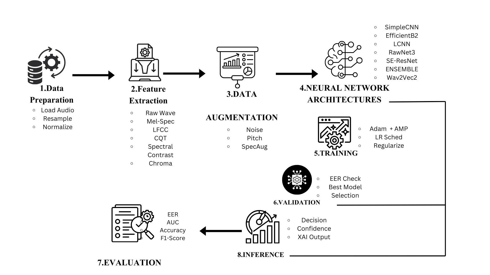
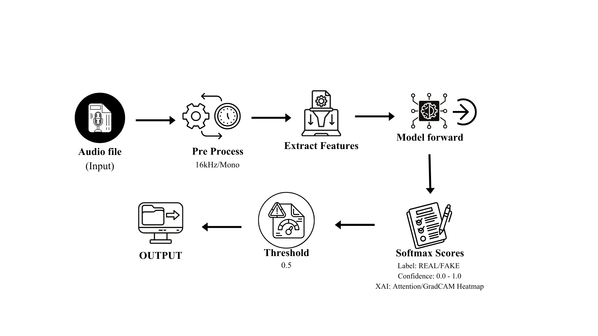

## System Architecture Overview



## Inference Pipeline



## 1. Data Preparation and Preprocessing

### 1.1 Dataset Description

The system was developed and evaluated using the "Fake-or-Real" dataset, which consists of bonafide (genuine human) and spoofed (synthetically generated) audio recordings. The dataset is organized into training, validation, and testing partitions, with balanced representation of both classes to facilitate unbiased model learning.

### 1.2 Audio Loading and Standardization

All audio samples undergo standardized preprocessing to ensure consistency across the pipeline. Audio files are loaded using the `soundfile` library, which provides automatic format detection and efficient decoding for multiple audio formats including WAV, FLAC, and MP3.
The preprocessing pipeline consists of the following operations:
**Step 1: Format Conversion**
**Step 2: Mono Conversion**
**Step 3: Resampling**
The sampling rate was selected based on the Nyquist-Shannon sampling theorem, which ensures adequate representation of speech frequencies (typically below 8 kHz) while maintaining computational tractability.

### 1.3 Fixed-Length Segmentation

To facilitate batch processing and ensure consistent input dimensions for neural network training, all audio signals are processed to a fixed length of 64,600 samples, corresponding to approximately 4.04 seconds at 16 kHz sampling rate. This duration was empirically determined to capture sufficient contextual information for classification while maintaining computational efficiency.

For audio segments shorter than the target length ($L < 64600$), we employ a repetition-based padding technique.

For audio segments exceeding the target length ($L > 64600$), two strategies are employed.

1. **Training Phase:** Random cropping to introduce variability and prevent overfitting.
2. **Inference Phase:** Center cropping for deterministic evaluation.

### 1.4 Batch Processing Configuration

The DataLoader configuration was optimized for both training efficiency and reproducibility:

| Parameter            | Value        | Rationale                                              |
| -------------------- | ------------ | ------------------------------------------------------ |
| `batch_size`         | 32           | Balanced GPU memory utilization and gradient stability |
| `num_workers`        | 4            | Parallel data loading to prevent I/O bottlenecks       |
| `pin_memory`         | True         | Accelerated CPU-to-GPU transfers                       |
| `persistent_workers` | True         | Reduced worker initialization overhead                 |
| `prefetch_factor`    | 2            | Overlapped data loading with computation               |
| `drop_last`          | True (train) | Consistent batch sizes for BatchNorm stability         |

Worker initialization employs deterministic seeding to ensure reproducibility.

## 2. Feature Extraction

### 2.1 Overview of Acoustic Representations

The system supports multiple acoustic feature representations, each capturing different aspects of audio characteristics relevant to deepfake detection. The feature extraction strategy is configurable, enabling comparative analysis and multi-modal fusion.

| Feature Name        | Dimensionality | Primary Application               |
| ------------------- | -------------- | --------------------------------- |
| Raw Waveform        | $(N,)$         | End-to-end learning               |
| Log-Mel Spectrogram | $(128, T)$     | General-purpose CNN models        |
| LFCC                | $(13, T)$      | Anti-spoofing (linear frequency)  |
| MFCC                | $(13, T)$      | Traditional speech processing     |
| CQT                 | $(84, T)$      | Harmonic and tonal analysis       |
| Chroma              | $(12, T)$      | Pitch class and harmony analysis  |
| Spectral Contrast   | $(7, T)$       | Texture and timbre discrimination |

where $N$ denotes the number of samples (64,600) and $T$ represents the temporal dimension (varies by feature type).

### 2.2 Log-Mel Spectrogram

The Log-Mel Spectrogram serves as the primary feature representation for CNN-based architectures. This transformation converts the time-domain signal into a time-frequency representation that approximates human auditory perception.

**Mathematical Formulation:**

The extraction process involves five sequential transformations:

**1. Short-Time Fourier Transform (STFT):**

$$X(m, k) = \sum_{n=0}^{N-1} x(n + mH) w(n) e^{-j2\pi kn/N}$$

where $w(n)$ is the Hann window, $H$ is the hop length (160 samples), and $N$ is the FFT size (512).

**2. Power Spectrum:**

$$P(m, k) = |X(m, k)|^2$$

**3. Mel Filterbank Application:**

$$S_{\text{mel}}(m, b) = \sum_{k=0}^{N/2} P(m, k) \cdot H_b(k)$$

where $H_b(k)$ represents the $b$-th triangular Mel filter ($b = 1, \ldots, 128$).

**4. Logarithmic Compression:**

$$S_{\log}(m, b) = 10 \log_{10}(S_{\text{mel}}(m, b) + \epsilon)$$

where $\epsilon = 10^{-10}$ prevents numerical instability.

**5. Normalization (Mean-Variance Normalization):**

After logarithmic compression, Mel spectrograms are typically normalized to have zero mean and unit variance:

$$S_norm(m,b) = (S_log(m,b) - μ_b) / σ_b$$

where:

- $μ_b$ is the mean of the b-th Mel band across all time frames
- $σ_b$ is the standard deviation of the b-th Mel band across all time frames

**Perceptual Motivation:** The Mel scale approximates the non-linear frequency resolution of human hearing, emphasizing perceptually relevant frequencies for speech (300-4000 Hz).

### 2.3 Linear Frequency Cepstral Coefficients

LFCC was specifically designed for spoofing detection tasks, as it employs a linear frequency scale rather than the perceptually-motivated Mel scale. This characteristic makes LFCC particularly sensitive to high-frequency artifacts often present in synthetic speech.

**Mathematical Formulation:**

**1. Linear Filterbank Construction:**

$$
H_b^{\text{lin}}(k) = \begin{cases}
\frac{f(k) - f_b^{\text{left}}}{f_b^{\text{center}} - f_b^{\text{left}}} & f_b^{\text{left}} \leq f(k) \leq f_b^{\text{center}} \\
\frac{f_b^{\text{right}} - f(k)}{f_b^{\text{right}} - f_b^{\text{center}}} & f_b^{\text{center}} \leq f(k) \leq f_b^{\text{right}} \\
0 & \text{otherwise}
\end{cases}
$$

where filter centers are linearly spaced: $f_b = b \cdot \frac{f_s/2}{B}$ for $b = 0, \ldots, B$ (20 filters).

**2. Filterbank Application:**

$$S_{\text{lin}}(m, b) = \sum_{k=0}^{N/2} P(m, k) \cdot H_b^{\text{lin}}(k)$$

**3. Logarithmic Compression:**

$$S_{\log}(m, b) = \log(S_{\text{lin}}(m, b) + \epsilon)$$

**4. Discrete Cosine Transform (DCT):**

$$\text{LFCC}(m, c) = \sum_{b=0}^{B-1} S_{\log}(m, b) \cos\left(\frac{\pi c(b + 0.5)}{B}\right)$$

The first 13 coefficients ($c = 0, \ldots, 12$) are retained, providing a compact representation.

### 2.5 Multi-Modal Feature Fusion

To leverage complementary information from multiple acoustic representations, the system employs an **intermediate fusion strategy**. This approach combines multiple feature types at the feature level before classification, enabling the model to learn complex inter-modal relationships and capture diverse acoustic characteristics of AI-generated speech.

**Intermediate Fusion Approach:**

Intermediate fusion operates by extracting multiple heterogeneous acoustic features independently and combining them before the classification stage. Unlike early fusion (raw signal concatenation) or late fusion (decision-level combination), intermediate fusion allows each feature extraction pipeline to preserve its specialized characteristics while enabling the network to learn joint representations across modalities.

The fusion process occurs in three stages:

1. **Independent Feature Extraction**: Each acoustic representation (Mel-spectrogram, LFCC, CQT) is computed separately, preserving their unique spectro-temporal properties

2. **Temporal Alignment**: Features are synchronized along the time dimension to ensure consistent temporal correspondence across all modalities

3. **Channel-wise Concatenation**: Aligned features are concatenated along the channel dimension, creating a unified multi-modal input tensor with dimensions [C₁+C₂+C₃, F, T], where C represents the number of channels for each feature type, F is the frequency dimension, and T is the time dimension

This intermediate fusion strategy enables the convolutional neural network to learn cross-modal patterns and dependencies during training, potentially capturing artifacts that may be subtle or absent in individual feature spaces but distinctive when features are jointly analyzed. The concatenated representation provides a richer input space that combines complementary information from perceptual (Mel-spectrogram), cepstral (LFCC), and constant-Q (CQT) domains.

## 3. Data Augmentation

### 3.1 Motivation and Strategy

Data augmentation serves two critical purposes in audio deepfake detection: (1) preventing overfitting to training set characteristics, and (2) improving generalization across diverse acoustic environments and recording conditions. Our augmentation pipeline applies probabilistic transformations at the waveform level during training only, with an application probability of $p = 0.8$.

### 3.2 Composed Augmentation Strategy

The system employs a **composed augmentation** approach where 1-2 augmentations are randomly selected and applied sequentially to each audio sample. This creates diverse acoustic variations while avoiding excessive distortion.

### 3.3 Waveform-Level Augmentations

**3.3.1 Gaussian White Noise**

Introduces random perturbations with controlled Signal-to-Noise Ratio (SNR):

$$y(t) = x(t) + \sqrt{\frac{P_x}{10^{\text{SNR}/10}}} \cdot \mathcal{N}(0, 1)$$

where $P_x = \mathbb{E}[x^2(t)]$ is the signal power. SNR is randomly sampled from the range [10, 25] dB.

**3.3.2 Background Noise**

Adds synthetic white noise scaled by a noise factor:

$$y(t) = x(t) + \alpha \cdot \max|x(t)| \cdot \frac{n(t)}{\max|n(t)|}$$

where $\alpha \in [0.01, 0.05]$ controls the noise amplitude and $n(t)$ is Gaussian white noise.

**3.3.3 Reverberation**

Simulates room acoustics by adding a delayed echo:

$$y(t) = x(t) + \beta \cdot x(t - \tau)$$

where $\tau = 50\text{ms}$ (800 samples at 16 kHz) and $\beta \in [0.3, 0.8]$ controls the echo amplitude.

**3.3.4 Pitch Shifting**

Alters the fundamental frequency while preserving duration using librosa:

$$y = \text{PitchShift}(x, n_{\text{semitones}} \in [-4, +4])$$

**3.3.5 Time Stretching**

Modifies the temporal characteristics without affecting pitch:

$$y = \text{TimeStretch}(x, \text{rate} \in [0.85, 1.15])$$

**3.3.6 Gain Adjustment**

Random amplitude scaling in decibels:

$$y(t) = x(t) \cdot 10^{g/20}$$

where $g \in [-6, +6]$ dB.

**3.3.7 Low-Pass Filter**

Attenuates high-frequency components to simulate bandwidth-limited channels:

- 4th-order Butterworth filter
- Cutoff frequency: randomly selected from [2000, 6000] Hz

**3.3.8 High-Pass Filter**

Removes low-frequency components:

- 4th-order Butterworth filter
- Cutoff frequency: randomly selected from [50, 300] Hz

**3.3.9 Room Impulse Response (RIR) Simulation**

Synthesizes realistic room acoustics by convolving with a generated impulse response:

$$y(t) = x(t) * h(t)$$

where the impulse response is generated as:

$$h(t) = \delta(t) + \mathcal{N}(0, 1) \cdot e^{-3t/RT_{60}}$$

with reverberation time $RT_{60} \in [0.1, 0.5]$ seconds randomly sampled.

**3.3.10 MUSAN-Style Noise**

Simulates realistic environmental noise conditions with three noise types:

| Noise Type | Description                    | Frequency Range        | SNR Range |
| ---------- | ------------------------------ | ---------------------- | --------- |
| Babble     | Overlapping speech-like sounds | 300-3400 Hz (bandpass) | 10-20 dB  |
| Music      | Low-frequency emphasis         | 0-4000 Hz (lowpass)    | 5-15 dB   |
| Ambient    | Broadband noise                | Full spectrum          | 15-25 dB  |

The noise is scaled based on the target SNR:

$$y(t) = x(t) + \sqrt{\frac{P_x}{10^{\text{SNR}/10} \cdot P_n}} \cdot n(t)$$

### 3.4 Spectrogram-Level Augmentation (SpecAugment)

For spectrogram-based features (Mel, LFCC, MFCC, CQT), SpecAugment-style masking is applied:

**Frequency Masking:**

- Probability: 50%
- Mask width: up to 20 frequency bins
- Random contiguous frequency bands are set to the mean value

**Time Masking:**

- Probability: 50%
- Mask width: up to 50 time steps
- Random contiguous time segments are set to the mean value

$$\text{Spec}_{\text{masked}}[f_0:f_0+f, :] = \mu_{\text{spec}}$$
$$\text{Spec}_{\text{masked}}[:, t_0:t_0+t] = \mu_{\text{spec}}$$

where $f \in [1, \min(20, F/4)]$ and $t \in [1, \min(50, T/4)]$.

### 3.5 Augmentation Summary

| Augmentation     | Parameters        | Effect                    |
| ---------------- | ----------------- | ------------------------- |
| None             | -                 | No augmentation           |
| Gaussian Noise   | SNR: 10-25 dB     | Additive noise robustness |
| Background Noise | Factor: 0.01-0.05 | Environmental noise       |
| Reverberation    | Factor: 0.3-0.8   | Room acoustics            |
| Pitch Shift      | Semitones: ±4     | Speaker variability       |
| Time Stretch     | Rate: 0.85-1.15   | Tempo variation           |
| Gain             | dB: ±6            | Volume normalization      |
| Low-Pass Filter  | Cutoff: 2-6 kHz   | Channel simulation        |
| High-Pass Filter | Cutoff: 50-300 Hz | DC removal                |
| RIR Simulation   | RT60: 0.1-0.5s    | Room acoustics            |
| MUSAN-Style      | SNR: 5-25 dB      | Realistic noise           |

## 4. Network Architectures

### 4.1 Overview

We employed a diverse set of deep neural network architectures, each offering distinct advantages for audio deepfake detection. The architectures range from lightweight models optimized for real-time inference to deep networks with high representational capacity.

**Feature Compatibility:**

| Model                     | Mel-Spectrogram | LFCC | CQT | Raw Waveform |
| ------------------------- | :-------------: | :--: | :-: | :----------: |
| EfficientNet-B2           |        ✓        |  ✓   |  ✓  |      ✗       |
| EfficientNet-B2 Attention |        ✓        |  ✓   |  ✓  |      ✗       |
| LCNN                      |        ✓        |  ✓   |  ✓  |      ✗       |
| SE-ResNet                 |        ✓        |  ✓   |  ✓  |      ✗       |
| RawNet3                   |        ✗        |  ✗   |  ✗  |      ✓       |
| SimpleCNN                 |        ✗        |  ✗   |  ✗  |      ✓       |
| Wav2Vec2                  |        ✗        |  ✗   |  ✗  |      ✓       |

Models trained with spectrogram-based features (Mel-Spectrogram, LFCC, CQT) benefit from the complementary information provided by each representation, enabling robust detection across diverse spoofing attack types.

### 4.2 SimpleCNN

**Architecture Description:**

SimpleCNN is a lightweight 1D convolutional neural network designed for processing raw audio waveforms. It serves as a baseline model with minimal computational overhead, suitable for rapid prototyping and real-time inference on resource-constrained devices.

**Key Specifications:**

- **Input:** Raw Waveform $(B, 64600)$
- **Parameters:** ~0.3M
- **Output Embedding:** 128-dimensional feature vector

**Network Structure:**

```
Input (1, 64600)
↓
Conv1D(1→32, k=80, s=4) → BatchNorm → ReLU → MaxPool(4)
↓
Conv1D(32→64, k=3, s=1) → BatchNorm → ReLU → MaxPool(4)
↓
Conv1D(64→128, k=3, s=1) → BatchNorm → ReLU → MaxPool(4)
↓
Adaptive Average Pooling (1)
↓
Dropout(0.5) → FC(128→64) → ReLU → Dropout(0.5) → FC(64→2)
```

**Design Rationale:**

- The initial large kernel (80 samples) captures low-level acoustic patterns at approximately 5ms temporal resolution at 16 kHz
- Progressive channel expansion (32 → 64 → 128) increases representational capacity
- Aggressive pooling reduces computational complexity while maintaining discriminative features
- High dropout rate (0.5) prevents overfitting given the model's limited capacity

### 4.3 EfficientNet-B2

**Architecture Description:**

EfficientNet-B2 is a compound-scaled convolutional neural network originally developed for image classification. We adapted it for audio forensics by modifying the input layer to accept single-channel spectrograms and replacing the classification head.

**Key Specifications:**

- **Input:** Log-Mel Spectrogram / LFCC / CQT $(B, 1, F, T)$

- **Backbone:** EfficientNet-B2 (depth=1.1, width=1.1, resolution scaling)

- **Parameters:** ~9.2M

- **Output Embedding:** 1408-dimensional feature vector

**Architectural Modifications:**

1. **Input Layer Adaptation:** The first convolutional layer was modified from Conv2d(3, 32) to Conv2d(1, 32) to accommodate single-channel input. Pre-trained weights from ImageNet were averaged across RGB channels:

$$W_{\text{new}}(1, :, :, :) = \frac{1}{3}\sum_{c=1}^{3} W_{\text{pretrained}}(c, :, :, :)$$

2. **Custom Classification Head:**

```

Input (1408) → Dropout(0.3) → Linear(512) → BatchNorm → ReLU

→ Dropout(0.3) → Linear(256) → BatchNorm → ReLU

→ Dropout(0.3) → Linear(2)

```

The progressive dimensionality reduction with interleaved regularization prevents overfitting while maintaining discriminative capacity.

**Transfer Learning Strategy:** Pre-training on ImageNet provides robust low-level feature extractors (edges, textures) that generalize well to spectro-temporal patterns in audio.

### 4.4 EfficientNet-B2 with Attention

**Architecture Description:**

An enhanced variant of EfficientNet-B2 that incorporates attention-based pooling for improved temporal modeling. This architecture is particularly effective when input spectrograms have variable lengths or require fine-grained temporal attention.

**Key Specifications:**

- **Input:** Log-Mel Spectrogram / LFCC / CQT $(B, 1, F, T)$
- **Backbone:** EfficientNet-B2 features (without global pooling)
- **Parameters:** ~9.5M
- **Output Embedding:** 2816-dimensional feature vector (mean + std concatenation)

**Attention Pooling Mechanism:**

Instead of global average pooling, this variant uses learnable attention weights over spatial dimensions:

1. **Attention Weight Computation:**
   $$\alpha_{h,w} = \frac{\exp(g(\mathbf{F}_{:,h,w}))}{\sum_{h',w'} \exp(g(\mathbf{F}_{:,h',w'}))}$$

where $g(\cdot)$ is a bottleneck attention network: Conv2d(1408 → 128) → ReLU → Conv2d(128 → 1).

2. **Attentive Statistics Pooling:**
   $$\mu_c = \sum_{h,w} \alpha_{h,w} \mathbf{F}_{c,h,w}$$
   $$\sigma_c = \sqrt{\sum_{h,w} \alpha_{h,w} \mathbf{F}_{c,h,w}^2 - \mu_c^2}$$
   $$\mathbf{v} = [\mu; \sigma]$$

The concatenation of attention-weighted mean and standard deviation provides a richer representation that captures both central tendency and variability of feature activations.

**Custom Classification Head:**

```
Input (2816) → Dropout(0.3) → Linear(512) → BatchNorm → ReLU
→ Dropout(0.3) → Linear(256) → BatchNorm → ReLU
→ Dropout(0.3) → Linear(2)
```

### 4.5 Light CNN (LCNN)

**Architecture Description:**

LCNN employs Max-Feature-Map (MFM) activation functions instead of traditional ReLU. MFM acts as a learnable feature selection mechanism, particularly effective for spoofing detection where discriminative artifact selection is crucial.

**Key Specifications:**

- **Input:** Log-Mel Spectrogram / LFCC / CQT $(B, 1, 128, T)$
- **Backbone:** 4-stage LCNN with MFM activations
- **Parameters:** ~0.8M
- **Output Embedding:** 128-dimensional feature vector

**MFM Activation:**

Given input $\mathbf{x} \in \mathbb{R}^{2C \times H \times W}$, MFM partitions channels and applies element-wise maximum:

$$\text{MFM}(\mathbf{x})_{c,h,w} = \max(\mathbf{x}_{c,h,w}, \mathbf{x}_{c+C,h,w})$$

This reduces the channel dimension by half while preserving the most salient features.

**Network Structure:**

```

Input (1, 128, T)

↓

Conv-MFM Block (32) → MaxPool(2×2)

↓

Conv-MFM Block (48) → Residual Block (48) → MaxPool(2×2)

↓

Conv-MFM Block (64) → Residual Block (64) → MaxPool(2×2)

↓

Conv-MFM Block (32) → Residual Block (32) → MaxPool(2×2)

↓

Attentive Statistics Pooling

↓

FC-MFM (256) → FC-MFM (128) → Linear(2)

```

**Attentive Statistics Pooling:**

Temporal aggregation is performed via attention-weighted statistics:

$$\alpha_t = \frac{\exp(w^T \phi(h_t))}{\sum_{t'} \exp(w^T \phi(h_{t'}))}$$

$$\mu = \sum_t \alpha_t h_t, \quad \sigma = \sqrt{\sum_t \alpha_t h_t^2 - \mu^2}$$

$$\mathbf{v} = [\mu; \sigma]$$

where $\phi$ is a learned transformation and $[\cdot; \cdot]$ denotes concatenation.

**LCNN Backbone Architecture:**

The backbone consists of four stages with progressively learned feature representations:

| Stage | Channels | Operations                                   |
| ----- | -------- | -------------------------------------------- |
| 0     | 32       | Conv-MFM(5×5) → MaxPool(2×2)                 |
| 1     | 48       | Conv-MFM(3×3) → ResBlock-MFM → MaxPool(2×2)  |
| 2     | 64       | Conv-MFM(3×3) → ResBlock-MFM → MaxPool(2×2)  |
| 3     | 32       | Conv-MFM(3×3) → ResBlock-MFM → Conv-MFM(1×1) |

**Embedding Projection:**

```
AttentiveStatPool (64) → Linear(128) → MFM1D → BatchNorm(64)
→ Dropout(0.3) → Linear(256) → BatchNorm → ReLU
→ Dropout(0.3) → Linear(2)
```

### 4.6 RawNet3

**Architecture Description:**

RawNet3 processes raw waveforms directly, eliminating handcrafted feature extraction. This end-to-end approach allows the network to learn optimal representations for the task.

**Key Specifications:**

- **Input:** Raw Waveform $(B, 64600)$
- **Backbone:** Sinc convolution + Res2Net blocks
- **Parameters:** ~2.5M
- **Output Embedding:** 512-dimensional feature vector

**Key Components:**

1. **Sinc Convolution Layer:** Parameterized band-pass filters learn frequency band selection:

$$h[n] = 2f_c \text{sinc}(2\pi f_c n) \cdot w[n]$$

where $f_c$ is the learnable cutoff frequency and $w[n]$ is a Hamming window. The layer uses 64 filters with kernel size 251, initialized with Mel-scale frequency spacing.

2. **Res2Net Blocks:** Multi-scale feature extraction with hierarchical residual-like connections:
   - Split input channels into $s=4$ groups
   - Apply 3×1 convolutions with inter-group fusion
   - Concatenate outputs for multi-scale representation

3. **Encoder Structure:**

```
SincConv(64) → |Abs| → Res2Net(64→64) → AvgPool(3,2)
→ Res2Net(64→128) → AvgPool(3,2)
→ Res2Net(128→256) → AvgPool(3,2)
→ Res2Net(256→512) → AvgPool(3,2)
```

4. **Attention Pooling:** Temporal attention followed by fully connected projection:
   $$\alpha_t = \text{softmax}(\tanh(W_1 h_t) \cdot W_2)$$
   $$\mathbf{e} = \sum_t \alpha_t h_t$$

**Classifier Head:**

```
Embedding (512) → Linear(256) → ReLU → Dropout(0.3) → Linear(2)
```

### 4.7 SE-ResNet

**Architecture Description:**

Squeeze-and-Excitation ResNet incorporates channel-wise attention mechanisms into the residual learning framework.

**Key Specifications:**

- **Input:** Log-Mel Spectrogram / LFCC / CQT $(B, 1, 128, T)$
- **Backbone:** ResNet-34 style with SE blocks
- **Parameters:** ~11.2M
- **Output Embedding:** 1024-dimensional feature vector (mean + std)

**SE Block:**

$$\tilde{\mathbf{F}}_c = \mathbf{F}_c \cdot \sigma(W_2 \delta(W_1 \mathbf{z}))$$

where $\mathbf{z} = \frac{1}{HW}\sum_{h,w} \mathbf{F}_{c,h,w}$ is global average pooling, $\delta$ is ReLU, $\sigma$ is sigmoid, and $W_1, W_2$ are learned projections with reduction ratio $r=16$.

**Network Structure:**

| Stage   | Layers                               | Channels | Stride |
| ------- | ------------------------------------ | -------- | ------ |
| Stem    | Conv(7×7) → BN → ReLU → MaxPool(3×3) | 64       | 2      |
| Layer 1 | 3 × BasicBlockSE                     | 64       | 1      |
| Layer 2 | 4 × BasicBlockSE                     | 128      | 2      |
| Layer 3 | 6 × BasicBlockSE                     | 256      | 2      |
| Layer 4 | 3 × BasicBlockSE                     | 512      | 2      |

**BasicBlockSE Structure:**

```
x → Conv(3×3) → BN → ReLU → Conv(3×3) → BN → SE → (+x) → ReLU
```

**Attentive Statistics Pooling:**

After the backbone, the frequency axis is collapsed via mean pooling, and attentive statistics pooling is applied over the temporal axis:

$$\mathbf{v} = [\mu_{\text{att}}; \sigma_{\text{att}}] \in \mathbb{R}^{1024}$$

**Classifier Head:**

```
Embedding (1024) → Linear(512) → BatchNorm → ReLU → Dropout(0.3)
→ Linear(256) → BatchNorm → ReLU → Dropout(0.3) → Linear(2)
```

### 4.8 Wav2Vec2

Wav2Vec2 is a self-supervised speech representation learning model developed by Facebook AI (now Meta AI). Here's an overview:

## Architecture

Wav2Vec2 uses a two-stage approach:

1. **Feature Encoder (CNN)**: Processes raw audio waveforms through multiple convolutional layers to create latent representations
2. **Transformer**: Contextualizes these representations using multi-head self-attention mechanisms

## Pre-training Method

The model uses **contrastive learning** with a masked prediction task:

- Parts of the latent speech representations are masked
- The model learns to identify the true quantized representation from a set of distractors
- This is similar to BERT's masked language modeling but for speech

## Key Advantages

- **Self-supervised**: Can be pre-trained on large amounts of unlabeled audio data
- **Transfer learning**: Fine-tunable for downstream tasks like ASR, speaker recognition, emotion detection
- **Low-resource friendly**: Achieves strong performance even with limited labeled data for fine-tuning
- **Feature extraction**: Can be used as a feature extractor, outputting contextual embeddings at various layers

## Common Variants

- **Wav2Vec2-Base**: ~95M parameters
- **Wav2Vec2-Large**: ~317M parameters
- **XLSR-53**: Cross-lingual version trained on 53 languages
- **Wav2Vec2-BERT**: More recent variant with improved architecture

## Typical Output Dimensionality

For feature extraction: **(T', 768)** or **(T', 1024)** depending on the model variant, where T' is the downsampled time dimension.

Would you like me to add this to your feature comparison table or explain any specific aspect in more detail?

### 4.9 Model Comparison Summary

| Model                     | Input Type  | Parameters | Embedding Dim | Key Advantage                     |
| ------------------------- | ----------- | ---------- | ------------- | --------------------------------- |
| SimpleCNN                 | Raw         | ~0.3M      | 128           | Lightweight, fast inference       |
| EfficientNet-B2           | Spectrogram | ~9.2M      | 1408          | Transfer learning from ImageNet   |
| EfficientNet-B2 Attention | Spectrogram | ~9.5M      | 2816          | Attention-based temporal modeling |
| LCNN                      | Spectrogram | ~0.8M      | 128           | MFM feature selection             |
| RawNet3                   | Raw         | ~2.5M      | 512           | End-to-end learnable filters      |
| SE-ResNet                 | Spectrogram | ~11.2M     | 1024          | Channel attention + deep residual |
| Wav2Vec2-Large            | Raw         | ~95M       | 1024          | Large-scale contextual embeddings |

## 5. Experimental Setup

### 5.1 Loss Function

A weighted Cross-Entropy loss addresses class imbalance:

$$\mathcal{L} = -\frac{1}{N}\sum_{i=1}^{N} w_{y_i} \log p_{y_i}(\mathbf{x}_i)$$

where $w_0 = 0.1$ (spoof) and $w_1 = 0.9$ (bonafide), emphasizing correct classification of genuine audio.

### 5.2 Optimization

**Adam Optimizer:** Adaptive moment estimation with parameters:

- Learning rate: $\eta = 10^{-4}$

- $\beta_1 = 0.9$, $\beta_2 = 0.999$

- Weight decay: $\lambda = 10^{-4}$

**Learning Rate Scheduling:**

Cosine annealing without warm restarts:

$$\eta_t = \eta_{\min} + \frac{1}{2}(\eta_{\max} - \eta_{\min})\left(1 + \cos\left(\frac{t}{T}\pi\right)\right)$$

where $t$ is the current step, $T$ is the total training steps, $\eta_{\max} = 10^{-4}$, and $\eta_{\min} = 10^{-6}$.

### 5.3 Regularization

1. **Dropout:** Applied with $p = 0.3$ in fully connected layers

2. **Batch Normalization:** After each convolutional layer

3. **Gradient Clipping:** Maximum gradient norm of 1.0

4. **Early Stopping:** Based on validation EER with patience of 5 epochs

## 6. Training Procedure

### 6.1 Training Configuration

| Hyperparameter        | Value     | Justification                              |
| --------------------- | --------- | ------------------------------------------ |
| Epochs                | 20        | Sufficient for convergence on dataset      |
| Batch Size            | 32        | Balanced GPU memory and gradient stability |
| Initial Learning Rate | $10^{-4}$ | Standard for Adam optimizer                |
| Weight Decay          | $10^{-4}$ | L2 regularization strength                 |
| Gradient Clip Norm    | 1.0       | Prevents gradient explosion                |

### 6.2 Mixed Precision Training

To accelerate training and reduce memory consumption, we employed Automatic Mixed Precision (AMP), Precision Selection, Training Loop with AMP

### 6.3 Stochastic Weight Averaging (SWA)

SWA improves generalization by averaging model weights traversed during training:

$$\mathbf{w}_{\text{SWA}} = \frac{1}{K}\sum_{k=1}^{K} \mathbf{w}_{n_k}$$

where $\{n_k\}$ are epochs selected for averaging (typically the last 50% of training).

**Implementation:**

- Average weights from epochs 10-20

- Update BatchNorm statistics on training set before evaluation

- Often yields 0.5-1.0% improvement in EER

### 6.4 Epoch Training Loop

The training process follows a standard supervised learning paradigm with several optimization techniques to ensure robust model convergence and generalization.

**Training Phase:**

During each epoch, the model operates in training mode where gradients are computed and parameters are updated. For each mini-batch from the training data loader, data augmentation techniques are applied on-the-fly to enhance model robustness. The optimization process utilizes efficient gradient management by resetting gradients with memory optimization before each forward pass.

Mixed precision training is employed through automatic mixed precision (AMP) to accelerate computation while maintaining numerical stability. The model generates both feature embeddings and classification logits, which are used to compute a weighted cross-entropy loss that addresses class imbalance. Gradient scaling is applied to prevent underflow in low-precision computations, followed by gradient clipping with a maximum norm of 1.0 to prevent exploding gradients and ensure training stability.

The learning rate scheduler updates after each optimization step rather than per epoch, enabling fine-grained learning rate adjustments throughout training.

**Validation Phase:**

After each training epoch, the model switches to evaluation mode and inference mode is enabled to disable gradient computation and reduce memory usage. The model is evaluated on the development set to compute the Equal Error Rate (EER), which serves as the primary metric for model selection.

**Model Checkpointing:**

The system implements a checkpoint mechanism that saves the model state whenever the development EER improves, ensuring that the best-performing model configuration is preserved for final evaluation and deployment.

**Stochastic Weight Averaging (Optional):**

For enhanced generalization, Stochastic Weight Averaging (SWA) can be enabled during the latter half of training. This technique maintains a running average of model weights, which often leads to improved performance and better convergence to flat minima in the loss landscape.

## 7. Model Validation and Selection

### 7.1 Score Generation

For each audio sample, the model produces a scalar score representing the bonafide likelihood:

$$s(\mathbf{x}) = \text{logit}_{\text{bonafide}}(\mathbf{x}) = \log\frac{p(y=1|\mathbf{x})}{p(y=0|\mathbf{x})}$$

Higher scores indicate higher confidence in bonafide classification.

### 7.2 Equal Error Rate (EER) Computation

EER is the primary evaluation metric, defined as the operating point where False Acceptance Rate (FAR) equals False Rejection Rate (FRR):

$$\text{FAR}(\theta) = \frac{|\{i: s_i \geq \theta, y_i = 0\}|}{|\{i: y_i = 0\}|}$$

$$\text{FRR}(\theta) = \frac{|\{i: s_i < \theta, y_i = 1\}|}{|\{i: y_i = 1\}|}$$

$$\text{EER} = \text{FAR}(\theta^*) = \text{FRR}(\theta^*) \text{ where } |\text{FAR}(\theta^*) - \text{FRR}(\theta^*)|$$ is minimized.

**Algorithm:**

1. Sort all scores and compute FAR, FRR at each unique threshold

2. Find threshold θ\* where |FAR(θ) - FRR(θ)| is minimized

3. EER = (FAR(θ*) + FRR(θ*)) / 2

### 7.3 Model Selection Criterion

The model checkpoint yielding the lowest EER on the validation set is selected for final evaluation on the test set. This prevents overfitting to validation data through early stopping.

## 8. Ensemble Strategy

### 8.1 Motivation

Ensemble methods reduce prediction variance and improve robustness by combining predictions from multiple models trained with different initializations, architectures, or hyperparameters.

### 8.2 Implementation Architecture

The system implements an `EnsembleModel` wrapper class that unifies multiple heterogeneous models into a single cohesive unit. This design allows seamless integration with the existing training and inference pipelines.

**Key Design Features:**

1. **Heterogeneous Model Support:** The ensemble accepts models with different architectures, embedding dimensions, and feature extractors.

2. **Unified Interface:** The wrapper exposes the same `forward(x, Freq_aug)` interface as individual models, returning `(embeddings, logits)`.

3. **Automatic Embedding Projection:** Since different architectures produce embeddings of varying dimensions (e.g., LCNN: 128, EfficientNet-B2: 1408, SE-ResNet: 1024), learned linear projections map each embedding to a common target dimension before averaging.

### 8.3 Ensemble Configuration Format

Ensembles are configured via JSON configuration files with a list of model configurations:

```json
{
  "model_config": [
    {
      "architecture": "LCNN",
      "channels": [32, 48, 64, 32],
      "dropout": 0.3,
      "use_residual": true,
      "att_bottleneck": 64,
      "emb_dim": 128
    },
    {
      "architecture": "SEResNet",
      "dropout": 0.3,
      "emb_dim": 128
    },
    {
      "architecture": "EfficientNetB2",
      "model_variant": "attention",
      "dropout": 0.4,
      "pretrained": true,
      "att_bottleneck": 128
    }
  ]
}
```

Each entry in the `model_config` array specifies a complete model configuration including architecture type, hyperparameters, and optional variants.

### 8.4 Embedding Dimension Harmonization

To handle heterogeneous embedding dimensions across models, the ensemble employs learned projection layers:

**Target Dimension Selection:**
$$D_{\text{target}} = \max_{m \in \mathcal{M}} D_m$$

where $D_m$ is the embedding dimension of model $m$ and $\mathcal{M}$ is the set of ensemble members.

**Projection Function:**

$$
\mathbf{e}_m^{\text{proj}} = \begin{cases}
\mathbf{e}_m & \text{if } D_m = D_{\text{target}} \\
W_m \mathbf{e}_m + \mathbf{b}_m & \text{otherwise}
\end{cases}
$$

where $W_m \in \mathbb{R}^{D_{\text{target}} \times D_m}$ is a learned projection matrix initialized with Xavier uniform, and $\mathbf{b}_m$ is a zero-initialized bias.

### 8.5 Soft Voting (Logit Averaging)

Given $M$ trained models $\{f_1, \ldots, f_M\}$, the ensemble prediction is computed via soft voting:

$$p_{\text{ensemble}}(y|\mathbf{x}) = \frac{1}{M}\sum_{m=1}^{M} p_m(y|\mathbf{x})$$

$$\hat{y} = \arg\max_y p_{\text{ensemble}}(y|\mathbf{x})$$

**Implementation:**
The logits from each model are stacked and averaged before softmax:

```
logits_stacked = torch.stack([out_1, out_2, ..., out_M], dim=0)  # (M, B, C)
avg_logits = torch.mean(logits_stacked, dim=0)                   # (B, C)
```

### 8.6 Score-Level Fusion

For EER evaluation, scores are averaged:

$$s_{\text{ensemble}}(\mathbf{x}) = \frac{1}{M}\sum_{m=1}^{M} s_m(\mathbf{x})$$

This provides a robust aggregate score for threshold-based decision-making.

### 8.7 Embedding Fusion

Embeddings are fused for use in downstream tasks (e.g., explainability, visualization):

$$\mathbf{e}_{\text{ensemble}} = \frac{1}{M}\sum_{m=1}^{M} \mathbf{e}_m^{\text{proj}}$$

The averaged embedding preserves information from all constituent models while maintaining a consistent dimensionality.

### 8.8 Best-Performing Ensemble Configuration

Our best-performing ensemble consists of:

| Model                       | Feature         | Parameters | Embedding Dim | Role                                          |
| --------------------------- | --------------- | ---------- | ------------- | --------------------------------------------- |
| LCNN                        | Mel-spectrogram | ~0.8M      | 128           | Lightweight artifact detector with MFM        |
| SE-ResNet                   | Mel-spectrogram | ~11.2M     | 1024          | Deep residual features with channel attention |
| EfficientNet-B2 (Attention) | Mel-spectrogram | ~9.5M      | 2816          | Transfer learning + spatial attention         |

**Total Ensemble Parameters:** ~21.5M

This combination leverages complementary architectural inductive biases:

- **LCNN** excels at detecting local spectral artifacts through competitive MFM activations
- **SE-ResNet** captures hierarchical temporal patterns with channel-wise attention
- **EfficientNet-B2** provides robust low-level features from ImageNet pretraining with learnable spatial attention

### 8.9 Ensemble Training Strategy

The ensemble is trained end-to-end with all models receiving the same input and gradients flowing through all branches:

1. **Shared Input:** All models process the same preprocessed spectrogram
2. **Independent Forward Pass:** Each model computes its own embeddings and logits
3. **Joint Loss:** The averaged logits are used to compute the cross-entropy loss
4. **Unified Backpropagation:** Gradients propagate through all models simultaneously

This joint training allows models to specialize and capture complementary features rather than redundant patterns.

## 9. Inference Pipeline

### 9.1 Pipeline Stages

The inference pipeline processes audio files through the following sequential stages:

**Stage 1: Audio Loading and Preprocessing**

The audio file is loaded from the specified path and its sampling rate is extracted. If the audio contains multiple channels (stereo or multi-channel), it is converted to mono by averaging across all channels. The waveform is then resampled to the standard 16 kHz sampling rate if it differs from this target rate, ensuring consistency with the training data format.

**Stage 2: Fixed-Length Normalization**

The waveform is normalized to a fixed length of 64,600 samples (approximately 4 seconds at 16 kHz). This is achieved through center padding, where shorter audio clips are symmetrically padded with zeros, and longer clips are center-cropped to match the target duration. This ensures uniform input dimensions for the neural network.

**Stage 3: Feature Extraction**

Acoustic features are extracted from the preprocessed waveform using the specified feature extraction method (typically Log-Mel spectrogram). The resulting feature representation is converted to a tensor format and reshaped to include batch and channel dimensions, preparing it for input to the convolutional neural network.

**Stage 4: Model Inference**

The model is set to evaluation mode to disable training-specific operations such as dropout and batch normalization updates. Inference mode is activated to disable gradient computation, reducing memory consumption and improving computational speed. The feature tensor is passed through the model to generate both embedding representations and classification logits. The logits are then converted to probability scores using the softmax function.

**Stage 5: Decision Making**

The decision is based on the bonafide class logit score. If this score exceeds a predetermined threshold, the audio is classified as "Bonafide" (genuine human speech); otherwise, it is classified as "Spoof" (AI-generated). The confidence level is extracted from the probability distribution, representing the model's certainty in its prediction.

### 9.2 Batch Inference Optimization

For processing multiple audio files efficiently, batch inference is implemented to reduce computational overhead and improve throughput.

The batch processing approach divides the collection of audio files into fixed-size batches (typically 32 files per batch). For each batch, audio files are loaded and preprocessed in parallel, and their corresponding features are extracted independently. These individual feature representations are then stacked into a single tensor with an additional batch dimension.

The batched tensor is fed into the model in a single forward pass, allowing the GPU to process multiple samples simultaneously and leverage parallel computation capabilities. This approach significantly reduces per-sample inference time compared to sequential processing, as it amortizes model loading overhead and maximizes hardware utilization.

The resulting logit scores are extracted for all samples in the batch and accumulated across all batches to produce final predictions for the entire dataset. This batching strategy is particularly effective for large-scale evaluation scenarios where thousands of audio files need to be processed.

## 10. Evaluation Metrics

### 10.1 Primary Metric: Equal Error Rate (EER)

EER serves as the primary evaluation metric, providing a threshold-independent measure of system performance. It represents the operating point where the system makes equal proportions of false acceptances (spoof classified as bonafide) and false rejections (bonafide classified as spoof).

**Mathematical Definition:**

$$
\text{EER} = \text{FAR}(\theta^*) = \text{FRR}(\theta^*)
$$

where:

- $\text{FAR}(\theta) = P(s(\mathbf{x}) \geq \theta | y = 0)$ (False Acceptance Rate)

- $\text{FRR}(\theta) = P(s(\mathbf{x}) < \theta | y = 1)$ (False Rejection Rate)

- $\theta^*$ is the threshold satisfying $\text{FAR}(\theta^*) = \text{FRR}(\theta^*)$

**Advantages:**

- Threshold-independent comparison across systems

- Balanced assessment of both error types

- Standard metric in biometric and anti-spoofing research

### 10.2 Secondary Metric: Classification Accuracy

Accuracy at the EER threshold provides an intuitive performance measure:

$$\text{Accuracy} = \frac{TP + TN}{TP + TN + FP + FN}$$

where decisions are made using the EER threshold $\theta^*$.

### 10.3 Confusion Matrix

The confusion matrix provides a detailed breakdown of classification outcomes:

|                 | Predicted Fake      | Predicted Real      |
| --------------- | ------------------- | ------------------- |
| **Actual Fake** | True Negative (TN)  | False Positive (FP) |
| **Actual Real** | False Negative (FN) | True Positive (TP)  |

This matrix enables calculation of class-specific error rates and identification of systematic misclassification patterns.

### 10.4 Precision, Recall, and F1-Score

**Per-Class Metrics:**

$$\text{Precision}_c = \frac{TP_c}{TP_c + FP_c}$$

$$\text{Recall}_c = \frac{TP_c}{TP_c + FN_c}$$

$$\text{F1}_c = 2 \cdot \frac{\text{Precision}_c \cdot \text{Recall}_c}{\text{Precision}_c + \text{Recall}_c}$$

**Macro-Averaged Metrics:**

$$\text{Precision}_{\text{macro}} = \frac{1}{C}\sum_{c=1}^{C} \text{Precision}_c$$

These metrics provide insight into per-class performance, particularly useful when class distributions are imbalanced.

### 10.5 ROC Curve and AUC

The Receiver Operating Characteristic (ROC) curve plots True Positive Rate against False Positive Rate across all decision thresholds:

$$\text{TPR}(\theta) = \frac{TP(\theta)}{TP(\theta) + FN(\theta)}$$

$$\text{FPR}(\theta) = \frac{FP(\theta)}{FP(\theta) + TN(\theta)}$$

The Area Under the ROC Curve (AUC) provides a single scalar summary of classifier performance:

$$\text{AUC} = \int_0^1 \text{TPR}(\text{FPR}^{-1}(t)) \, dt$$

- AUC = 1.0: Perfect classifier
- AUC = 0.5: Random classifier
- AUC > 0.9: Excellent performance

### 10.6 Detection Error Tradeoff (DET) Curve

The DET curve plots FRR against FAR across all possible thresholds on a normal deviate scale, providing a comprehensive visualization of system performance:

$$\text{DET}: \Phi^{-1}(\text{FRR}(\theta)) \text{ vs. } \Phi^{-1}(\text{FAR}(\theta))$$

where $\Phi^{-1}$ is the inverse standard normal CDF.

The DET curve provides better visualization of error trade-offs at low error rates compared to ROC curves.

### 10.7 Metrics Summary Table

| Metric              | Primary Use                           | Threshold-Dependent         |
| ------------------- | ------------------------------------- | --------------------------- |
| EER                 | Model selection, benchmark comparison | No (uses optimal threshold) |
| Accuracy            | Intuitive performance measure         | Yes (uses EER threshold)    |
| Confusion Matrix    | Error analysis                        | Yes                         |
| Precision/Recall/F1 | Per-class performance                 | Yes                         |
| ROC AUC             | Overall discrimination ability        | No                          |
| DET Curve           | Error trade-off visualization         | No                          |

## 11. Optimization Techniques

### 11.1 Mixed Precision Training

Mixed precision training reduces memory footprint and accelerates computation by using lower precision (FP16/BF16) for forward and backward passes while maintaining FP32 master weights.

**BFloat16 (BF16):**

- 8-bit exponent, 7-bit mantissa

- Native support on Ampere (A100, RTX 30/40 series) and newer

- Superior dynamic range: $\approx 10^{-45}$ to $10^{38}$

- No gradient scaling required

**Float16 (FP16):**

- 5-bit exponent, 10-bit mantissa

- Supported on all CUDA GPUs (compute capability ≥ 7.0)

- Requires gradient scaling to prevent underflow

- Dynamic range: $\approx 10^{-8}$ to $65504$

**Performance Gains:**

- Training speedup: 1.3-1.5×

- Memory reduction: ~40%

- No accuracy degradation

### 11.2 TensorFloat-32 (TF32)

TF32 is an intermediate precision format (19-bit) that accelerates FP32 matrix multiplications on Ampere+ GPUs:

```python

torch.backends.cuda.matmul.allow_tf32 = True

torch.backends.cudnn.allow_tf32 = True

```

**Characteristics:**

- Automatic conversion from FP32

- 8× throughput improvement on Ampere

- Negligible accuracy impact (<0.1% typical)

### 11.3 Channels-Last Memory Layout

Channels-last format $(N, H, W, C)$ improves memory locality and enables hardware-specific optimizations:

$$\text{Speedup} \approx 1.2\text{-}1.3\times \text{ on modern GPUs}$$

### 11.4 Gradient Accumulation

For effective large batch training with limited memory.

Effective batch size: $B_{\text{eff}} = B \times A$ where $A$ is accumulation steps.

## 12. Reproducibility

### 12.1 Random Seed Control

To ensure reproducibility of experimental results, complete control over all sources of randomness is essential. This involves setting deterministic seeds for all random number generators used throughout the pipeline, including Python's native random module, NumPy's random number generator, PyTorch's CPU and GPU random generators, and CUDA operations.

Additionally, deterministic operation modes are enabled for CUDA Deep Neural Network library (cuDNN) operations. While this ensures complete reproducibility, it disables certain performance optimizations such as auto-tuning algorithms, which may result in a performance reduction of approximately 10-20% in training and inference speed.

**Trade-off:** The choice between deterministic reproducibility and computational performance should be made based on experimental requirements. Deterministic mode is recommended for final experiments and benchmark comparisons, while non-deterministic mode may be acceptable during exploratory research phases.

### 12.2 DataLoader Worker Seeding

Multi-threaded data loading introduces additional sources of randomness that must be controlled. Each worker process in the data loader is assigned a unique but deterministic seed derived from the master random seed. This ensures that data augmentation operations, shuffling, and sampling remain consistent across different runs while maintaining parallelism during data loading.

A dedicated random number generator is created and seeded for the data loader, and a worker initialization function ensures that each worker thread initializes its random state deterministically based on the worker ID and the master seed.

### 12.3 Reproducibility Checklist

To fully reproduce experimental results, the following components must be identical across different runs:

✓ **Software versions**: PyTorch, CUDA, cuDNN, Python, and all dependency libraries  
✓ **Random seeds**: NumPy, PyTorch, Python, and CUDA random number generators  
✓ **Hyperparameters**: Learning rate, batch size, number of epochs, weight decay, and all optimization parameters  
✓ **Dataset preprocessing**: Feature extraction methods, normalization parameters, and augmentation settings  
✓ **Model architecture**: Network structure, layer configurations, and weight initialization methods  
✓ **Hardware specifications**: GPU model may affect numerical precision due to different floating-point implementations  
✓ **Operating system**: OS version and CUDA driver versions can impact computational behavior

### 12.4 Configuration Management

To facilitate reproducibility and experimental tracking, all configuration parameters are systematically documented and stored in structured format. This includes three primary configuration categories:

**Model Configuration**: Specifies the neural network architecture (e.g., EfficientNetB2), whether pretrained weights are used, regularization parameters such as dropout rates, and any architectural modifications.

**Training Configuration**: Documents all training hyperparameters including the number of epochs, batch size, learning rate, optimizer type (e.g., Adam), learning rate scheduler (e.g., cosine annealing), and any additional training techniques such as gradient clipping or mixed precision training.

**Data Configuration**: Records feature extraction type (e.g., Log-Mel spectrogram), audio sampling rate, fixed segment length for normalization, and whether data augmentation is enabled along with specific augmentation parameters.

All configurations also include the master random seed value to enable exact reproduction of results. These configuration files serve as comprehensive documentation of each experiment and can be version-controlled alongside model checkpoints and training logs.

## 13. Explainable AI (XAI) Methodology

### 13.1 Motivation and Objectives

Explainability is crucial for audio deepfake detection systems deployed in real-world applications such as forensic analysis, content moderation, and legal proceedings. Understanding _why_ a model classifies audio as genuine or synthetic builds trust, enables error analysis, and provides actionable insights for system improvement.

**Key Objective:**

1. **Decision Transparency**: Reveal which acoustic regions influence classification using GradCAM.

### 13.2 GradCAM for Audio Deepfake Detection

GradCAM (Gradient-weighted Class Activation Mapping) is used to visualize which regions of the input spectrogram most strongly influence the model's decision. By computing the gradients of the target class with respect to the final convolutional layer, GradCAM produces a heatmap highlighting important time-frequency regions.

**Implementation Steps:**

1. Forward pass the input through the model to obtain predictions.
2. Compute gradients of the output with respect to the last convolutional feature map.
3. Weight the feature maps by the computed gradients and aggregate them.
4. Apply a ReLU activation to obtain the final heatmap.
5. Overlay the heatmap on the input spectrogram for visual interpretation.

GradCAM provides interpretable visualizations that help users and researchers understand which parts of the audio signal contribute most to the classification decision, supporting transparency and trust in the system. 2. **Feature Attribution**: Identify discriminative spectro-temporal patterns 3. **Model Debugging**: Detect spurious correlations and dataset biases 4. **User Trust**: Provide interpretable evidence for non-technical stakeholders

### 13.2 Implemented XAI Methods

The system supports six complementary explainability methods, each providing different insights into model behavior:

| Method   | Type           | Description                                     |
| -------- | -------------- | ----------------------------------------------- |
| Grad-CAM | Gradient-based | Class activation mapping via gradient weighting |

#### 13.2.1 Attention Extraction

For architectures with attention mechanisms, attention weights provide inherent interpretability by revealing which temporal or spectral regions the model focuses on during classification.

#### 13.2.2 Grad-CAM

Generates visual explanations using gradients flowing into the last convolutional layer:

$$L_{\text{Grad-CAM}}^c = \text{ReLU}\left(\sum_k \alpha_k^c A^k\right)$$

where $\alpha_k^c = \frac{1}{Z} \sum_i \sum_j \frac{\partial y^c}{\partial A_{ij}^k}$ are importance weights.

### 13.3 Visualization

GradCAM visualizations are presented as heatmaps overlaid on input spectrograms:

- **High-intensity regions**: Indicate time-frequency areas that most strongly influenced the model's prediction.
- **Temporal axis**: Shows which time segments in the audio were most relevant for the decision.
- **Frequency axis**: Highlights frequency bands that contributed to the classification.

This approach provides interpretable evidence for model decisions, helping users understand which parts of the audio signal were most important for the deepfake detection outcome.

## 14. Conclusion

This methodology presents a comprehensive deep learning framework for audio deepfake detection, incorporating state-of-the-art neural architectures, robust data augmentation, and advanced training techniques. The systematic approach—from feature extraction through ensemble inference—provides a reproducible pipeline achieving competitive performance on the Fake-or-Real dataset.

Key contributions include:

1. **Multi-modal feature extraction** supporting diverse acoustic representations

2. **Extensive augmentation pipeline** simulating realistic acoustic variability

3. **Optimized training procedures** leveraging mixed precision and weight averaging

4. **Ensemble strategies** combining complementary models for robust detection

5. **Production-ready inference** with real-time processing capabilities

The methodology establishes a foundation for future research in audio forensics, with extensibility to additional datasets, architectures, and evaluation protocols.
