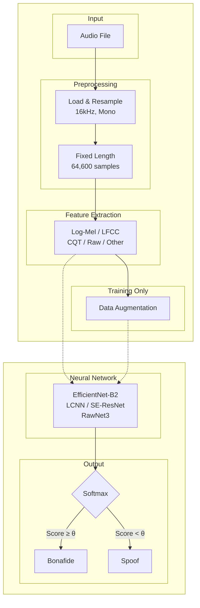

## System Overview



### Document Structure

| Section | Title                 | Description                                                                       |
| ------- | --------------------- | --------------------------------------------------------------------------------- |
| 1       | Data Preparation      | Dataset loading, audio standardization, fixed-length segmentation                 |
| 2       | Feature Extraction    | Log-Mel spectrogram, LFCC, CQT,Raw, Chroma, Spectral contrast, multi-modal fusion |
| 3       | Data Augmentation     | Noise, RIR, pitch shifting, SpecAugment                                           |
| 4       | Network Architectures | SimpleCNN, EfficientNet-B2, LCNN, RawNet3, SE-ResNet                              |
| 5       | Training              | Loss, optimizer, regularization, SWA, training loop                               |
| 6       | Inference             | Pipeline stages, batch processing                                                 |
| 7       | Evaluation Metrics    | EER, accuracy, ROC/AUC, Precision, Recall , F1-Score                                                            |
| 8       | Ensemble Strategy     | Multi-model fusion, soft voting                                                   |
| 9       | Optimization          | Mixed precision, TF32, memory layout                                              |
| 10      | Reproducibility       | Seed control, configuration management                                            |
| 11      | Explainability        | GradCAM visualization                                                             |
| 12      | Conclusion            | Summary and contributions                                                         |

---

## 1. Data Preparation and Preprocessing

### 1.1 Dataset Description

The system was developed and evaluated using the "Fake-or-Real" dataset, which consists of bonafide (genuine human) and spoofed (synthetically generated) audio recordings. The dataset is organized into training, validation, and testing partitions, with balanced representation of both classes to facilitate unbiased model learning.
The dataset aggregates data from the latest TTS solutions (such as Deep Voice 3 and Google Wavenet TTS) as well as a variety of real human speech, including the Arctic Dataset (http://festvox.org/cmu_arctic/), LJSpeech Dataset (https://keithito.com/LJ-Speech-Dataset/), VoxForge Dataset (http://www.voxforge.org).

The dataset is published in four versions: for-original, for-norm, for-2sec and for-rerec.

The first version, named for-original, contains the files as collected from the speech sources, without any modification (balanced version).

The second version, called for-norm, contains the same files, but balanced in terms of gender and class and normalized in terms of sample rate, volume and number of channels.

The third one, named for-2sec is based on the second one, but with the files truncated at 2 seconds.

The last version, named for-rerec, is a rerecorded version of the for-2second dataset, to simulate a scenario where an attacker sends an utterance through a voice channel (i.e. a phone call or a voice message).

In our system we have used for-2second version.
```
      Training samples: 13956 (Real: 6978, Fake: 6978)
      Validation samples: 2826 (Real: 1413, Fake: 1413)
      Testing samples: 1088 (Real: 544, Fake: 544)
```
### 1.2 Audio Loading and Standardization

All audio samples undergo standardized preprocessing to ensure consistency across the pipeline. Audio files are loaded using the `soundfile` library, which provides automatic format detection and efficient decoding for multiple audio formats including WAV, FLAC, and MP3.
The preprocessing pipeline consists of the following operations:
**Step 1: Format Conversion**
Audio files are loaded using the `soundfile` library, which automatically detects and decodes the audio format (e.g., FLAC, WAV) into a floating-point tensor representation.

**Step 2: Mono Conversion**
To ensure consistent input dimensions, multi-channel audio signals (e.g., stereo) are downmixed to mono by calculating the mean amplitude across all channels.

**Step 3: Resampling**
The system processes audio at a standard sampling rate of 16 kHz. Feature extraction parameters are tuned for this rate to adhere to the Nyquist-Shannon sampling theorem for speech signals up to 8 kHz.
 

### 1.3 Fixed-Length Segmentation

To facilitate batch processing and ensure consistent input dimensions for neural network training, all audio signals are processed to a fixed length of 64,600 samples, corresponding to approximately 4.04 seconds at 16 kHz sampling rate. This duration was empirically determined to capture sufficient contextual information for classification while maintaining computational efficiency.

For audio segments shorter than the target length ($L < 64600$), we employ a repetition-based padding technique.

For audio segments exceeding the target length ($L > 64600$), two strategies are employed.

1. **Training Phase:** Random cropping to introduce variability and prevent overfitting.
2. **Inference Phase:** Center cropping for deterministic evaluation.

### 1.4 Batch Processing Configuration

The DataLoader configuration was optimized for both training efficiency and reproducibility:

| Parameter            | Value        | Rationale                                              |
| -------------------- | ------------ | ------------------------------------------------------ |
| `batch_size`         | 32           | Balanced GPU memory utilization and gradient stability |
| `num_workers`        | 4            | Parallel data loading to prevent I/O bottlenecks       |
| `pin_memory`         | True         | Accelerated CPU-to-GPU transfers                       |
| `persistent_workers` | True         | Reduced worker initialization overhead                 |
| `prefetch_factor`    | 2            | Overlapped data loading with computation               |
| `drop_last`          | True (train) | Consistent batch sizes for BatchNorm stability         |

Worker initialization employs deterministic seeding to ensure reproducibility.

## 2. Feature Extraction

### 2.1 Overview of Acoustic Representations

The system supports multiple acoustic feature representations, each capturing different aspects of audio characteristics relevant to deepfake detection. The feature extraction strategy is configurable, enabling comparative analysis and multi-modal fusion.

| Feature Name        | Dimensionality | Primary Application               |
| ------------------- | -------------- | --------------------------------- |
| Raw Waveform        | $(N,)$         | End-to-end learning               |
| Log-Mel Spectrogram | $(128, T)$     | General-purpose CNN models        |
| LFCC                | $(13, T)$      | Anti-spoofing (linear frequency)  |
| MFCC                | $(13, T)$      | Traditional speech processing     |
| CQT                 | $(84, T)$      | Harmonic and tonal analysis       |
| Chroma              | $(12, T)$      | Pitch class and harmony analysis  |
| Spectral Contrast   | $(7, T)$       | Texture and timbre discrimination |

where $N$ denotes the number of samples (64,600) and $T$ represents the temporal dimension (varies by feature type).
 

### 2.2 Raw Waveform

**Dimensionality:** $(N,)$ where $N = 64,600$ samples

**Purpose:** End-to-end learning without manual feature engineering

**Characteristics:**
Raw waveform represents the audio signal in its most fundamental form—the time-domain amplitude variations. This representation preserves all information present in the original signal without any transformation or information loss.

**Advantages:**
- No information loss from transformation processes
- Enables the neural network to learn optimal representations directly from data
- Eliminates reliance on hand-crafted features that may miss subtle artifacts

**Challenges:**
- Requires deeper networks with more parameters to learn meaningful patterns
- Computationally intensive for processing long sequences
- May struggle with generalization without sufficient training data

**Use Cases:** Particularly effective with deep learning architectures like WaveNet, raw CNN models, or transformer-based systems that can automatically discover relevant acoustic patterns for deepfake detection.

---

### 2.3 Log-Mel Spectrogram

**Dimensionality:** $(128, T)$ - 128 Mel frequency bands across $T$ time frames

**Purpose:** General-purpose CNN models with perceptually-motivated frequency representation

### Mathematical Formulation

The extraction involves five sequential transformations:

**Step 1: Short-Time Fourier Transform (STFT)**

$$X(m, k) = \sum_{n=0}^{N-1} x(n + mH) w(n) e^{-j2\pi kn/N}$$

- $w(n)$: Hann window function
- $H$: Hop length (160 samples)
- $N$: FFT size (512)
- $m$: Time frame index
- $k$: Frequency bin index

**Step 2: Power Spectrum**

$$P(m, k) = |X(m, k)|^2$$

Converts complex STFT coefficients to power values, representing energy at each time-frequency point.

**Step 3: Mel Filterbank Application**

$$S_{\text{mel}}(m, b) = \sum_{k=0}^{N/2} P(m, k) \cdot H_b(k)$$

- $H_b(k)$: $b$-th triangular Mel filter
- $b = 1, \ldots, 128$: 128 Mel bands

**Step 4: Logarithmic Compression**

$$S_{\log}(m, b) = 10 \log_{10}(S_{\text{mel}}(m, b) + \epsilon)$$

- $\epsilon = 10^{-10}$: Prevents numerical instability for zero values
- Compresses dynamic range and approximates human loudness perception

**Step 5: Normalization (Mean-Variance Normalization)**

$$S_{\text{norm}}(m,b) = \frac{S_{\log}(m,b) - \mu_b}{\sigma_b}$$

- $\mu_b$: Mean of the $b$-th Mel band across all time frames
- $\sigma_b$: Standard deviation of the $b$-th Mel band

### Perceptual Motivation

The Mel scale approximates the non-linear frequency resolution of human hearing. It emphasizes perceptually relevant frequencies for speech (300-4000 Hz), making it particularly effective for tasks involving human auditory perception. The logarithmic compression further mimics the way humans perceive sound intensity.

**Advantages:**
- Biologically inspired representation aligned with human auditory perception
- Compact representation with good discriminative power
- Well-established in speech processing with extensive research support
- Effective for CNN-based architectures

**Detection Relevance:** Captures spectral characteristics and temporal evolution patterns that may differ between genuine and AI-generated speech, particularly in prosody and spectral envelope.

---

### 2.4 Linear Frequency Cepstral Coefficients (LFCC)

**Dimensionality:** $(13, T)$ - 13 cepstral coefficients across $T$ time frames

**Purpose:** Anti-spoofing detection with linear frequency emphasis

### Mathematical Formulation

**Step 1: Linear Filterbank Construction**

$$
H_b^{\text{lin}}(k) = \begin{cases}
\frac{f(k) - f_b^{\text{left}}}{f_b^{\text{center}} - f_b^{\text{left}}} & f_b^{\text{left}} \leq f(k) \leq f_b^{\text{center}} \\
\frac{f_b^{\text{right}} - f(k)}{f_b^{\text{right}} - f_b^{\text{center}}} & f_b^{\text{center}} \leq f(k) \leq f_b^{\text{right}} \\
0 & \text{otherwise}
\end{cases}
$$

Filter centers are linearly spaced: $f_b = b \cdot \frac{f_s/2}{B}$ for $b = 0, \ldots, B$ (20 filters)

**Step 2: Filterbank Application**

$$S_{\text{lin}}(m, b) = \sum_{k=0}^{N/2} P(m, k) \cdot H_b^{\text{lin}}(k)$$

**Step 3: Logarithmic Compression**

$$S_{\log}(m, b) = \log(S_{\text{lin}}(m, b) + \epsilon)$$

**Step 4: Discrete Cosine Transform (DCT)**

$$\text{LFCC}(m, c) = \sum_{b=0}^{B-1} S_{\log}(m, b) \cos\left(\frac{\pi c(b + 0.5)}{B}\right)$$

The first 13 coefficients ($c = 0, \ldots, 12$) are retained.

### Why Linear Frequency Scale?

Unlike the Mel scale's perceptual emphasis on lower frequencies, the linear frequency scale treats all frequencies equally. This characteristic makes LFCC particularly sensitive to high-frequency artifacts often present in synthetic speech, such as those introduced by vocoder processing, phase discontinuities, or bandwidth limitations in generative models.

**Advantages:**
- Superior sensitivity to high-frequency artifacts typical in synthetic speech
- Specifically designed for spoofing and anti-spoofing tasks
- Compact cepstral representation reduces dimensionality
- DCT decorrelates filterbank outputs, improving efficiency

**Detection Relevance:** AI-generated speech often exhibits subtle artifacts in high-frequency regions due to vocoder reconstruction, neural network processing artifacts, or training data limitations. LFCC's linear frequency resolution makes these anomalies more detectable.

---

### 2.5 Mel-Frequency Cepstral Coefficients (MFCC)

**Dimensionality:** $(13, T)$ - 13 cepstral coefficients across $T$ time frames

**Purpose:** Traditional speech processing and recognition

### Mathematical Formulation

MFCC extraction follows a similar pipeline to LFCC but uses Mel-scale filterbanks:

**Steps 1-3:** Same as Log-Mel Spectrogram (STFT → Power Spectrum → Mel Filterbank)

**Step 4: Logarithmic Compression**

$$S_{\log}(m, b) = \log(S_{\text{mel}}(m, b) + \epsilon)$$

**Step 5: Discrete Cosine Transform**

$$\text{MFCC}(m, c) = \sum_{b=0}^{B-1} S_{\log}(m, b) \cos\left(\frac{\pi c(b + 0.5)}{B}\right)$$

Typically, the first 13 coefficients are retained, sometimes augmented with delta (velocity) and delta-delta (acceleration) coefficients.

### Differences from LFCC

The key distinction is the use of Mel-scale filterbanks instead of linear-scale filterbanks. MFCCs emphasize lower frequencies where most speech information resides, while LFCCs maintain equal resolution across all frequencies.

**Advantages:**
- Highly compact representation capturing vocal tract characteristics
- Robust to variations in recording conditions
- Extensive history in speech recognition with well-understood properties
- DCT provides decorrelated, efficient features

**Detection Relevance:** MFCCs capture the spectral envelope and vocal tract resonances, which may exhibit unnatural patterns in AI-generated speech due to imperfect modeling of human speech production mechanisms.

---

### 2.6 Constant-Q Transform (CQT)

**Dimensionality:** $(84, T)$ - 84 logarithmically-spaced frequency bins across $T$ time frames

**Purpose:** Harmonic and tonal analysis with constant Q-factor

### Mathematical Foundation

CQT represents audio with logarithmically-spaced frequency bins, where each bin has a constant ratio of center frequency to bandwidth (Q-factor):

$$Q = \frac{f_k}{\Delta f_k} = \text{constant}$$

**Key Properties:**

- **Frequency Resolution:** Bins per octave (typically 12 or 24)
- **Time-Frequency Trade-off:** Higher frequency resolution at low frequencies, better temporal resolution at high frequencies
- **Musical Alignment:** Frequency bins align with musical notes (when bins per octave = 12)

### Computation

$$X_{\text{CQT}}(k, n) = \frac{1}{N_k} \sum_{n'=0}^{N_k-1} w_k(n') x(n + n') e^{-j2\pi Q n'/N_k}$$

where:
- $k$: Frequency bin index
- $N_k$: Window length for bin $k$ (varies with frequency)
- $w_k$: Window function for bin $k$

**Advantages:**
- Logarithmic frequency resolution matches musical scales and harmonic structures
- Superior representation of pitch and harmonic relationships
- Efficient for analyzing tonal content and pitch-related features
- Better frequency resolution at low frequencies where fundamental frequencies reside

**Detection Relevance:** AI-generated speech may exhibit unnatural harmonic structures, abnormal pitch contours, or artifacts in the harmonic series. CQT's logarithmic frequency spacing makes these harmonic anomalies more apparent, particularly in the fundamental frequency and its overtones.

---

### 2.7 Chroma Features

**Dimensionality:** $(12, T)$ - 12 pitch classes across $T$ time frames

**Purpose:** Pitch class and harmony analysis

### Concept

Chroma features represent the intensity of each of the 12 pitch classes (C, C#, D, D#, E, F, F#, G, G#, A, A#, B) in Western music theory, regardless of octave. This creates an octave-invariant representation that captures tonal and harmonic content.

### Computation

**From CQT or STFT:**

1. Map frequency bins to pitch classes (modulo 12 semitones)
2. Sum energy across all octaves for each pitch class
3. Normalize to create a 12-dimensional chroma vector per time frame

$$\text{Chroma}(p, m) = \sum_{k \in \text{octaves of } p} |X(m, k)|^2$$

where $p \in \{0, 1, \ldots, 11\}$ represents the 12 pitch classes.

**Advantages:**
- Octave-invariant representation focuses on harmonic content
- Compact 12-dimensional representation per frame
- Effective for capturing tonal and harmonic patterns
- Robust to timbre variations

**Detection Relevance:** Human speech exhibits characteristic pitch patterns and harmonic relationships based on vocal physiology. AI-generated speech may produce unnatural pitch class distributions, abnormal harmonic progressions, or inconsistent tonal characteristics, particularly in prosody-rich segments or emotional speech.

---

### 2.8 Spectral Contrast

**Dimensionality:** $(7, T)$ - 7 contrast values (6 sub-bands + 1 full-band) across $T$ time frames

**Purpose:** Texture and timbre discrimination

### Concept

Spectral contrast measures the difference between spectral peaks and valleys in different frequency sub-bands, providing information about the spectral envelope's shape and texture.

### Computation

**For each sub-band:**

1. Divide frequency spectrum into sub-bands (typically 6-7 octave-scale bands)
2. For each sub-band at each time frame:
   - Identify peak values (top α-percentile, e.g., 85th percentile)
   - Identify valley values (bottom α-percentile, e.g., 15th percentile)
   - Compute contrast: $\text{Contrast}_b(m) = \log(\text{Peak}_b(m)) - \log(\text{Valley}_b(m))$

**Mathematical Formulation:**

$$\text{SC}_b(m) = 10\log_{10}\left(\frac{\mu_{\text{peak},b}(m)}{\mu_{\text{valley},b}(m)}\right)$$

where:
- $\mu_{\text{peak},b}(m)$: Mean of peak magnitudes in sub-band $b$ at frame $m$
- $\mu_{\text{valley},b}(m)$: Mean of valley magnitudes in sub-band $b$

**Advantages:**
- Captures spectral envelope texture independent of overall energy
- Robust to variations in recording level
- Effective for distinguishing different timbres and textures
- Complements energy-based features

**Detection Relevance:** AI-generated speech may exhibit over-smoothed or unnaturally sharp spectral contrasts due to neural network regularization, training artifacts, or vocoder processing. The spectral texture of synthetic speech may lack the natural variability and micro-variations present in genuine human speech, particularly in transient regions like plosives and fricatives.

---

### 2.9 Multi-Modal Feature Fusion

### Intermediate Fusion Strategy

To leverage complementary information from multiple acoustic representations, the system employs an **intermediate fusion approach** that combines features at the feature level before classification.

### Fusion Architecture

**Stage 1: Independent Feature Extraction**

Each acoustic representation is computed separately, preserving unique spectro-temporal properties:
- Mel-spectrogram captures perceptual characteristics
- LFCC emphasizes high-frequency artifacts
- CQT reveals harmonic structures

**Stage 2: Temporal Alignment**

Features are synchronized along the time dimension to ensure consistent temporal correspondence across all modalities. This may involve:
- Resampling to common temporal resolution
- Padding or truncating to match sequence lengths
- Ensuring consistent hop lengths and window sizes

**Stage 3: Channel-wise Concatenation**

Aligned features are concatenated along the channel dimension:

$$\mathbf{F}_{\text{fused}} = [\mathbf{F}_{\text{mel}}, \mathbf{F}_{\text{lfcc}}, \mathbf{F}_{\text{cqt}}]$$

Creating a unified tensor with dimensions $[C_1 + C_2 + C_3, F, T]$ where:
- $C_i$: Number of channels for feature type $i$
- $F$: Frequency dimension
- $T$: Time dimension

### Advantages of Intermediate Fusion

**Complementary Information:** Different features capture different aspects of audio:
- Mel-spectrogram: Broad spectral patterns and perceptual features
- LFCC: High-frequency artifacts and anti-spoofing cues
- CQT: Harmonic structures and pitch-related information

**Cross-Modal Learning:** The CNN can learn complex inter-modal relationships and dependencies during training, discovering patterns that emerge only when features are jointly analyzed.

**Richer Representation Space:** The concatenated representation provides a more comprehensive input that combines perceptual, cepstral, and constant-Q domains, potentially capturing artifacts subtle or absent in individual feature spaces.
 
 

## 3. Data Augmentation

### 3.1 Motivation and Strategy

Data augmentation serves two critical purposes in audio deepfake detection: (1) preventing overfitting to training set characteristics, and (2) improving generalization across diverse acoustic environments and recording conditions. Our augmentation pipeline applies probabilistic transformations at the waveform level during training only, with an application probability of $p = 0.8$.

### 3.2 Composed Augmentation Strategy

The system employs a **composed augmentation** approach where 1-2 augmentations are randomly selected and applied sequentially to each audio sample. This creates diverse acoustic variations while avoiding excessive distortion.

### 3.3 Waveform-Level Augmentations

**3.3.1 Gaussian White Noise**

Introduces random perturbations with controlled Signal-to-Noise Ratio (SNR):

$$y(t) = x(t) + \sqrt{\frac{P_x}{10^{\text{SNR}/10}}} \cdot \mathcal{N}(0, 1)$$

where $P_x = \mathbb{E}[x^2(t)]$ is the signal power. SNR is randomly sampled from the range [10, 25] dB.

**3.3.2 Background Noise**

Adds synthetic white noise scaled by a noise factor:

$$y(t) = x(t) + \alpha \cdot \max|x(t)| \cdot \frac{n(t)}{\max|n(t)|}$$

where $\alpha \in [0.01, 0.05]$ controls the noise amplitude and $n(t)$ is Gaussian white noise.

**3.3.3 Reverberation**

Simulates room acoustics by adding a delayed echo:

$$y(t) = x(t) + \beta \cdot x(t - \tau)$$

where $\tau = 50\text{ms}$ (800 samples at 16 kHz) and $\beta \in [0.3, 0.8]$ controls the echo amplitude.

**3.3.4 Pitch Shifting**

Alters the fundamental frequency while preserving duration using librosa:

$$y = \text{PitchShift}(x, n_{\text{semitones}} \in [-4, +4])$$

**3.3.5 Time Stretching**

Modifies the temporal characteristics without affecting pitch:

$$y = \text{TimeStretch}(x, \text{rate} \in [0.85, 1.15])$$

**3.3.6 Gain Adjustment**

Random amplitude scaling in decibels:

$$y(t) = x(t) \cdot 10^{g/20}$$

where $g \in [-6, +6]$ dB.

**3.3.7 Low-Pass Filter**

Attenuates high-frequency components to simulate bandwidth-limited channels:

- 4th-order Butterworth filter
- Cutoff frequency: randomly selected from [2000, 6000] Hz

**3.3.8 High-Pass Filter**

Removes low-frequency components:

- 4th-order Butterworth filter
- Cutoff frequency: randomly selected from [50, 300] Hz

**3.3.9 Room Impulse Response (RIR) Simulation**

Synthesizes realistic room acoustics by convolving with a generated impulse response:

$$y(t) = x(t) * h(t)$$

where the impulse response is generated as:

$$h(t) = \delta(t) + \mathcal{N}(0, 1) \cdot e^{-3t/RT_{60}}$$

with reverberation time $RT_{60} \in [0.1, 0.5]$ seconds randomly sampled.

**3.3.10 MUSAN-Style Noise**

Simulates realistic environmental noise conditions with three noise types:

| Noise Type | Description                    | Frequency Range        | SNR Range |
| ---------- | ------------------------------ | ---------------------- | --------- |
| Babble     | Overlapping speech-like sounds | 300-3400 Hz (bandpass) | 10-20 dB  |
| Music      | Low-frequency emphasis         | 0-4000 Hz (lowpass)    | 5-15 dB   |
| Ambient    | Broadband noise                | Full spectrum          | 15-25 dB  |

The noise is scaled based on the target SNR:

$$y(t) = x(t) + \sqrt{\frac{P_x}{10^{\text{SNR}/10} \cdot P_n}} \cdot n(t)$$

### 3.4 Spectrogram-Level Augmentation (SpecAugment)

For spectrogram-based features (Mel, LFCC, MFCC, CQT), SpecAugment-style masking is applied:

**Frequency Masking:**

- Probability: 50%
- Mask width: up to 20 frequency bins
- Random contiguous frequency bands are set to the mean value

**Time Masking:**

- Probability: 50%
- Mask width: up to 50 time steps
- Random contiguous time segments are set to the mean value

$$\text{Spec}_{\text{masked}}[f_0:f_0+f, :] = \mu_{\text{spec}}$$
$$\text{Spec}_{\text{masked}}[:, t_0:t_0+t] = \mu_{\text{spec}}$$

where $f \in [1, \min(20, F/4)]$ and $t \in [1, \min(50, T/4)]$.

### 3.5 Augmentation Summary

| Augmentation     | Parameters        | Effect                    |
| ---------------- | ----------------- | ------------------------- |
| None             | -                 | No augmentation           |
| Gaussian Noise   | SNR: 10-25 dB     | Additive noise robustness |
| Background Noise | Factor: 0.01-0.05 | Environmental noise       |
| Reverberation    | Factor: 0.3-0.8   | Room acoustics            |
| Pitch Shift      | Semitones: ±4     | Speaker variability       |
| Time Stretch     | Rate: 0.85-1.15   | Tempo variation           |
| Gain             | dB: ±6            | Volume normalization      |
| Low-Pass Filter  | Cutoff: 2-6 kHz   | Channel simulation        |
| High-Pass Filter | Cutoff: 50-300 Hz | DC removal                |
| RIR Simulation   | RT60: 0.1-0.5s    | Room acoustics            |
| MUSAN-Style      | SNR: 5-25 dB      | Realistic noise           |
