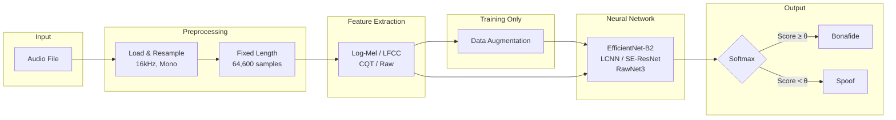

## System Overview

### Document Structure

| Section | Title                 | Description                                                       |
| ------- | --------------------- | ----------------------------------------------------------------- |
| 1       | Data Preparation      | Dataset loading, audio standardization, fixed-length segmentation |
| 2       | Feature Extraction    | Log-Mel spectrogram, LFCC, CQT,Raw, Chroma, Spectral contrast, multi-modal fusion                |
| 3       | Data Augmentation     | Noise, RIR, pitch shifting, SpecAugment                           |
| 4       | Network Architectures | SimpleCNN, EfficientNet-B2, LCNN, RawNet3, SE-ResNet              |
| 5       | Training              | Loss, optimizer, regularization, SWA, training loop               |
| 6       | Inference             | Pipeline stages, batch processing                                 |
| 7       | Evaluation Metrics    | EER, accuracy, ROC/AUC                              |
| 8       | Ensemble Strategy     | Multi-model fusion, soft voting                                   |
| 9       | Optimization          | Mixed precision, TF32, memory layout                              |
| 10      | Reproducibility       | Seed control, configuration management                            |
| 11      | Explainability        | GradCAM visualization                                             |
| 12      | Conclusion            | Summary and contributions                                         |

---

## 1. Data Preparation and Preprocessing

### 1.1 Dataset Description

The system was developed and evaluated using the "Fake-or-Real" dataset, which consists of bonafide (genuine human) and spoofed (synthetically generated) audio recordings. The dataset is organized into training, validation, and testing partitions, with balanced representation of both classes to facilitate unbiased model learning.

### 1.2 Audio Loading and Standardization

All audio samples undergo standardized preprocessing to ensure consistency across the pipeline. Audio files are loaded using the `soundfile` library, which provides automatic format detection and efficient decoding for multiple audio formats including WAV, FLAC, and MP3.
The preprocessing pipeline consists of the following operations:
**Step 1: Format Conversion**
**Step 2: Mono Conversion**
**Step 3: Resampling**
The sampling rate was selected based on the Nyquist-Shannon sampling theorem, which ensures adequate representation of speech frequencies (typically below 8 kHz) while maintaining computational tractability.

### 1.3 Fixed-Length Segmentation

To facilitate batch processing and ensure consistent input dimensions for neural network training, all audio signals are processed to a fixed length of 64,600 samples, corresponding to approximately 4.04 seconds at 16 kHz sampling rate. This duration was empirically determined to capture sufficient contextual information for classification while maintaining computational efficiency.

For audio segments shorter than the target length ($L < 64600$), we employ a repetition-based padding technique.

For audio segments exceeding the target length ($L > 64600$), two strategies are employed.

1. **Training Phase:** Random cropping to introduce variability and prevent overfitting.
2. **Inference Phase:** Center cropping for deterministic evaluation.

### 1.4 Batch Processing Configuration

The DataLoader configuration was optimized for both training efficiency and reproducibility:

| Parameter            | Value        | Rationale                                              |
| -------------------- | ------------ | ------------------------------------------------------ |
| `batch_size`         | 32           | Balanced GPU memory utilization and gradient stability |
| `num_workers`        | 4            | Parallel data loading to prevent I/O bottlenecks       |
| `pin_memory`         | True         | Accelerated CPU-to-GPU transfers                       |
| `persistent_workers` | True         | Reduced worker initialization overhead                 |
| `prefetch_factor`    | 2            | Overlapped data loading with computation               |
| `drop_last`          | True (train) | Consistent batch sizes for BatchNorm stability         |

Worker initialization employs deterministic seeding to ensure reproducibility.

## 2. Feature Extraction

### 2.1 Overview of Acoustic Representations

The system supports multiple acoustic feature representations, each capturing different aspects of audio characteristics relevant to deepfake detection. The feature extraction strategy is configurable, enabling comparative analysis and multi-modal fusion.

| Feature Name        | Dimensionality | Primary Application               |
| ------------------- | -------------- | --------------------------------- |
| Raw Waveform        | $(N,)$         | End-to-end learning               |
| Log-Mel Spectrogram | $(128, T)$     | General-purpose CNN models        |
| LFCC                | $(13, T)$      | Anti-spoofing (linear frequency)  |
| MFCC                | $(13, T)$      | Traditional speech processing     |
| CQT                 | $(84, T)$      | Harmonic and tonal analysis       |
| Chroma              | $(12, T)$      | Pitch class and harmony analysis  |
| Spectral Contrast   | $(7, T)$       | Texture and timbre discrimination |

where $N$ denotes the number of samples (64,600) and $T$ represents the temporal dimension (varies by feature type).

### 2.2 Log-Mel Spectrogram

The Log-Mel Spectrogram serves as the primary feature representation for CNN-based architectures. This transformation converts the time-domain signal into a time-frequency representation that approximates human auditory perception.

**Mathematical Formulation:**

The extraction process involves five sequential transformations:

**1. Short-Time Fourier Transform (STFT):**

$$X(m, k) = \sum_{n=0}^{N-1} x(n + mH) w(n) e^{-j2\pi kn/N}$$

where $w(n)$ is the Hann window, $H$ is the hop length (160 samples), and $N$ is the FFT size (512).

**2. Power Spectrum:**

$$P(m, k) = |X(m, k)|^2$$

**3. Mel Filterbank Application:**

$$S_{\text{mel}}(m, b) = \sum_{k=0}^{N/2} P(m, k) \cdot H_b(k)$$

where $H_b(k)$ represents the $b$-th triangular Mel filter ($b = 1, \ldots, 128$).

**4. Logarithmic Compression:**

$$S_{\log}(m, b) = 10 \log_{10}(S_{\text{mel}}(m, b) + \epsilon)$$

where $\epsilon = 10^{-10}$ prevents numerical instability.

**5. Normalization (Mean-Variance Normalization):**

After logarithmic compression, Mel spectrograms are typically normalized to have zero mean and unit variance:

$$S_norm(m,b) = (S_log(m,b) - μ_b) / σ_b$$

where:

- $μ_b$ is the mean of the b-th Mel band across all time frames
- $σ_b$ is the standard deviation of the b-th Mel band across all time frames

**Perceptual Motivation:** The Mel scale approximates the non-linear frequency resolution of human hearing, emphasizing perceptually relevant frequencies for speech (300-4000 Hz).

### 2.3 Linear Frequency Cepstral Coefficients

LFCC was specifically designed for spoofing detection tasks, as it employs a linear frequency scale rather than the perceptually-motivated Mel scale. This characteristic makes LFCC particularly sensitive to high-frequency artifacts often present in synthetic speech.

**Mathematical Formulation:**

**1. Linear Filterbank Construction:**

$$
H_b^{\text{lin}}(k) = \begin{cases}
\frac{f(k) - f_b^{\text{left}}}{f_b^{\text{center}} - f_b^{\text{left}}} & f_b^{\text{left}} \leq f(k) \leq f_b^{\text{center}} \\
\frac{f_b^{\text{right}} - f(k)}{f_b^{\text{right}} - f_b^{\text{center}}} & f_b^{\text{center}} \leq f(k) \leq f_b^{\text{right}} \\
0 & \text{otherwise}
\end{cases}
$$

where filter centers are linearly spaced: $f_b = b \cdot \frac{f_s/2}{B}$ for $b = 0, \ldots, B$ (20 filters).

**2. Filterbank Application:**

$$S_{\text{lin}}(m, b) = \sum_{k=0}^{N/2} P(m, k) \cdot H_b^{\text{lin}}(k)$$

**3. Logarithmic Compression:**

$$S_{\log}(m, b) = \log(S_{\text{lin}}(m, b) + \epsilon)$$

**4. Discrete Cosine Transform (DCT):**

$$\text{LFCC}(m, c) = \sum_{b=0}^{B-1} S_{\log}(m, b) \cos\left(\frac{\pi c(b + 0.5)}{B}\right)$$

The first 13 coefficients ($c = 0, \ldots, 12$) are retained, providing a compact representation.

### 2.5 Multi-Modal Feature Fusion

To leverage complementary information from multiple acoustic representations, the system employs an **intermediate fusion strategy**. This approach combines multiple feature types at the feature level before classification, enabling the model to learn complex inter-modal relationships and capture diverse acoustic characteristics of AI-generated speech.

**Intermediate Fusion Approach:**

Intermediate fusion operates by extracting multiple heterogeneous acoustic features independently and combining them before the classification stage. Unlike early fusion (raw signal concatenation) or late fusion (decision-level combination), intermediate fusion allows each feature extraction pipeline to preserve its specialized characteristics while enabling the network to learn joint representations across modalities.

The fusion process occurs in three stages:

1. **Independent Feature Extraction**: Each acoustic representation (Mel-spectrogram, LFCC, CQT) is computed separately, preserving their unique spectro-temporal properties

2. **Temporal Alignment**: Features are synchronized along the time dimension to ensure consistent temporal correspondence across all modalities

3. **Channel-wise Concatenation**: Aligned features are concatenated along the channel dimension, creating a unified multi-modal input tensor with dimensions [C₁+C₂+C₃, F, T], where C represents the number of channels for each feature type, F is the frequency dimension, and T is the time dimension

This intermediate fusion strategy enables the convolutional neural network to learn cross-modal patterns and dependencies during training, potentially capturing artifacts that may be subtle or absent in individual feature spaces but distinctive when features are jointly analyzed. The concatenated representation provides a richer input space that combines complementary information from perceptual (Mel-spectrogram), cepstral (LFCC), and constant-Q (CQT) domains.

## 3. Data Augmentation

### 3.1 Motivation and Strategy

Data augmentation serves two critical purposes in audio deepfake detection: (1) preventing overfitting to training set characteristics, and (2) improving generalization across diverse acoustic environments and recording conditions. Our augmentation pipeline applies probabilistic transformations at the waveform level during training only, with an application probability of $p = 0.8$.

### 3.2 Composed Augmentation Strategy

The system employs a **composed augmentation** approach where 1-2 augmentations are randomly selected and applied sequentially to each audio sample. This creates diverse acoustic variations while avoiding excessive distortion.

### 3.3 Waveform-Level Augmentations

**3.3.1 Gaussian White Noise**

Introduces random perturbations with controlled Signal-to-Noise Ratio (SNR):

$$y(t) = x(t) + \sqrt{\frac{P_x}{10^{\text{SNR}/10}}} \cdot \mathcal{N}(0, 1)$$

where $P_x = \mathbb{E}[x^2(t)]$ is the signal power. SNR is randomly sampled from the range [10, 25] dB.

**3.3.2 Background Noise**

Adds synthetic white noise scaled by a noise factor:

$$y(t) = x(t) + \alpha \cdot \max|x(t)| \cdot \frac{n(t)}{\max|n(t)|}$$

where $\alpha \in [0.01, 0.05]$ controls the noise amplitude and $n(t)$ is Gaussian white noise.

**3.3.3 Reverberation**

Simulates room acoustics by adding a delayed echo:

$$y(t) = x(t) + \beta \cdot x(t - \tau)$$

where $\tau = 50\text{ms}$ (800 samples at 16 kHz) and $\beta \in [0.3, 0.8]$ controls the echo amplitude.

**3.3.4 Pitch Shifting**

Alters the fundamental frequency while preserving duration using librosa:

$$y = \text{PitchShift}(x, n_{\text{semitones}} \in [-4, +4])$$

**3.3.5 Time Stretching**

Modifies the temporal characteristics without affecting pitch:

$$y = \text{TimeStretch}(x, \text{rate} \in [0.85, 1.15])$$

**3.3.6 Gain Adjustment**

Random amplitude scaling in decibels:

$$y(t) = x(t) \cdot 10^{g/20}$$

where $g \in [-6, +6]$ dB.

**3.3.7 Low-Pass Filter**

Attenuates high-frequency components to simulate bandwidth-limited channels:

- 4th-order Butterworth filter
- Cutoff frequency: randomly selected from [2000, 6000] Hz

**3.3.8 High-Pass Filter**

Removes low-frequency components:

- 4th-order Butterworth filter
- Cutoff frequency: randomly selected from [50, 300] Hz

**3.3.9 Room Impulse Response (RIR) Simulation**

Synthesizes realistic room acoustics by convolving with a generated impulse response:

$$y(t) = x(t) * h(t)$$

where the impulse response is generated as:

$$h(t) = \delta(t) + \mathcal{N}(0, 1) \cdot e^{-3t/RT_{60}}$$

with reverberation time $RT_{60} \in [0.1, 0.5]$ seconds randomly sampled.

**3.3.10 MUSAN-Style Noise**

Simulates realistic environmental noise conditions with three noise types:

| Noise Type | Description                    | Frequency Range        | SNR Range |
| ---------- | ------------------------------ | ---------------------- | --------- |
| Babble     | Overlapping speech-like sounds | 300-3400 Hz (bandpass) | 10-20 dB  |
| Music      | Low-frequency emphasis         | 0-4000 Hz (lowpass)    | 5-15 dB   |
| Ambient    | Broadband noise                | Full spectrum          | 15-25 dB  |

The noise is scaled based on the target SNR:

$$y(t) = x(t) + \sqrt{\frac{P_x}{10^{\text{SNR}/10} \cdot P_n}} \cdot n(t)$$

### 3.4 Spectrogram-Level Augmentation (SpecAugment)

For spectrogram-based features (Mel, LFCC, MFCC, CQT), SpecAugment-style masking is applied:

**Frequency Masking:**

- Probability: 50%
- Mask width: up to 20 frequency bins
- Random contiguous frequency bands are set to the mean value

**Time Masking:**

- Probability: 50%
- Mask width: up to 50 time steps
- Random contiguous time segments are set to the mean value

$$\text{Spec}_{\text{masked}}[f_0:f_0+f, :] = \mu_{\text{spec}}$$
$$\text{Spec}_{\text{masked}}[:, t_0:t_0+t] = \mu_{\text{spec}}$$

where $f \in [1, \min(20, F/4)]$ and $t \in [1, \min(50, T/4)]$.

### 3.5 Augmentation Summary

| Augmentation     | Parameters        | Effect                    |
| ---------------- | ----------------- | ------------------------- |
| None             | -                 | No augmentation           |
| Gaussian Noise   | SNR: 10-25 dB     | Additive noise robustness |
| Background Noise | Factor: 0.01-0.05 | Environmental noise       |
| Reverberation    | Factor: 0.3-0.8   | Room acoustics            |
| Pitch Shift      | Semitones: ±4     | Speaker variability       |
| Time Stretch     | Rate: 0.85-1.15   | Tempo variation           |
| Gain             | dB: ±6            | Volume normalization      |
| Low-Pass Filter  | Cutoff: 2-6 kHz   | Channel simulation        |
| High-Pass Filter | Cutoff: 50-300 Hz | DC removal                |
| RIR Simulation   | RT60: 0.1-0.5s    | Room acoustics            |
| MUSAN-Style      | SNR: 5-25 dB      | Realistic noise           |
