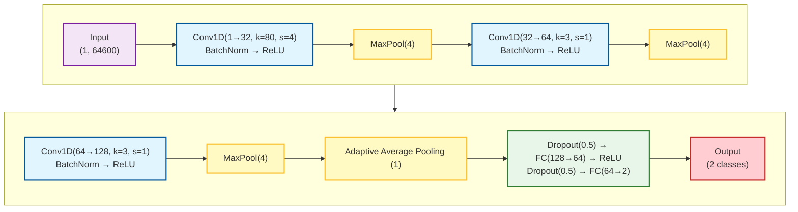
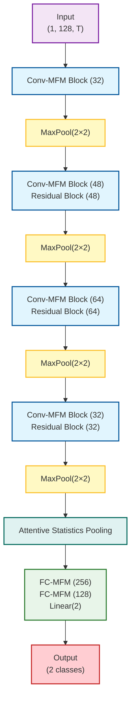
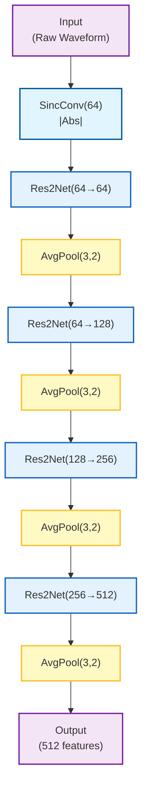

## 4. Network Architectures

### 4.1 Overview

We employed a diverse set of deep neural network architectures, each offering distinct advantages for audio deepfake detection. The architectures range from lightweight models optimized for real-time inference to deep networks with high representational capacity.

**Feature Compatibility:**

| Model                     | Mel-Spectrogram | LFCC | CQT | Raw Waveform |
| ------------------------- | :-------------: | :--: | :-: | :----------: |
| EfficientNet-B2           |        ✓        |  ✓   |  ✓  |      ✗       |
| EfficientNet-B2 Attention |        ✓        |  ✓   |  ✓  |      ✗       |
| LCNN                      |        ✓        |  ✓   |  ✓  |      ✗       |
| LCNN Large                |        ✓        |  ✓   |  ✓  |      ✗       |
| SE-ResNet                 |        ✓        |  ✓   |  ✓  |      ✗       |
| RawNet3                   |        ✗        |  ✗   |  ✗  |      ✓       |
| SimpleCNN                 |        ✗        |  ✗   |  ✗  |      ✓       |

Models trained with spectrogram-based features (Mel-Spectrogram, LFCC, CQT) benefit from the complementary information provided by each representation, enabling robust detection across diverse spoofing attack types.

### 4.2 SimpleCNN

**Architecture Description:**

SimpleCNN is a lightweight 1D convolutional neural network designed for processing raw audio waveforms. It serves as a baseline model with minimal computational overhead, suitable for rapid prototyping and real-time inference on resource-constrained devices.

**Key Specifications:**

- **Input:** Raw Waveform $(B, 64600)$
- **Parameters:** ~0.3M
- **Output Embedding:** 128-dimensional feature vector

**Network Structure:**



**Design Rationale:**

- The initial large kernel (80 samples) captures low-level acoustic patterns at approximately 5ms temporal resolution at 16 kHz
- Progressive channel expansion (32 → 64 → 128) increases representational capacity
- Aggressive pooling reduces computational complexity while maintaining discriminative features
- High dropout rate (0.5) prevents overfitting given the model's limited capacity

### 4.3 EfficientNet-B2

**Architecture Description:**

EfficientNet-B2 is a compound-scaled convolutional neural network originally developed for image classification. We adapted it for audio forensics by modifying the input layer to accept single-channel spectrograms and replacing the classification head.

**Key Specifications:**

- **Input:** Log-Mel Spectrogram / LFCC / CQT $(B, 1, F, T)$

- **Backbone:** EfficientNet-B2 (depth=1.1, width=1.1, resolution scaling)

- **Parameters:** ~9.2M

- **Output Embedding:** 1408-dimensional feature vector

**Architectural Modifications:**

1. **Input Layer Adaptation:** The first convolutional layer was modified from Conv2d(3, 32) to Conv2d(1, 32) to accommodate single-channel input. Pre-trained weights from ImageNet were averaged across RGB channels:

$$W_{\text{new}}(1, :, :, :) = \frac{1}{3}\sum_{c=1}^{3} W_{\text{pretrained}}(c, :, :, :)$$

2. **Custom Classification Head:**


The progressive dimensionality reduction with interleaved regularization prevents overfitting while maintaining discriminative capacity.

**Transfer Learning Strategy:** Pre-training on ImageNet provides robust low-level feature extractors (edges, textures) that generalize well to spectro-temporal patterns in audio.

### 4.4 EfficientNet-B2 with Attention

**Architecture Description:**

An enhanced variant of EfficientNet-B2 that incorporates attention-based pooling for improved temporal modeling. This architecture is particularly effective when input spectrograms have variable lengths or require fine-grained temporal attention.

**Key Specifications:**

- **Input:** Log-Mel Spectrogram / LFCC / CQT $(B, 1, F, T)$
- **Backbone:** EfficientNet-B2 features (without global pooling)
- **Parameters:** ~9.5M
- **Output Embedding:** 2816-dimensional feature vector (mean + std concatenation)

**Attention Pooling Mechanism:**

Instead of global average pooling, this variant uses learnable attention weights over spatial dimensions:

1. **Attention Weight Computation:**
   $$\alpha_{h,w} = \frac{\exp(g(\mathbf{F}_{:,h,w}))}{\sum_{h',w'} \exp(g(\mathbf{F}_{:,h',w'}))}$$

where $g(\cdot)$ is a bottleneck attention network: Conv2d(1408 → 128) → ReLU → Conv2d(128 → 1).

2. **Attentive Statistics Pooling:**
   $$\mu_c = \sum_{h,w} \alpha_{h,w} \mathbf{F}_{c,h,w}$$
   $$\sigma_c = \sqrt{\sum_{h,w} \alpha_{h,w} \mathbf{F}_{c,h,w}^2 - \mu_c^2}$$
   $$\mathbf{v} = [\mu; \sigma]$$

The concatenation of attention-weighted mean and standard deviation provides a richer representation that captures both central tendency and variability of feature activations.

**Custom Classification Head:**

```mermaid
flowchart LR
    %% Fully Connected Network Architecture
    classDef input fill:#f3e5f5,stroke:#7b1fa2,stroke-width:2px
    classDef fc fill:#e1f5fe,stroke:#01579b,stroke-width:2px
    classDef dropout fill:#fff9c4,stroke:#fbc02d,stroke-width:2px
    classDef output fill:#ffcdd2,stroke:#c62828,stroke-width:2px

    Input["Input<br/>(2816)"]:::input

    Drop1["Dropout(0.3)"]:::dropout
    FC1["Linear(512)<br/>BatchNorm → ReLU"]:::fc

    Drop2["Dropout(0.3)"]:::dropout
    FC2["Linear(256)<br/>BatchNorm → ReLU"]:::fc

    Drop3["Dropout(0.3)"]:::dropout
    FC3["Linear(2)"]:::output

    Input --> Drop1 --> FC1 --> Drop2 --> FC2 --> Drop3 --> FC3
```



### 4.5 Light CNN (LCNN)

**Architecture Description:**

LCNN employs Max-Feature-Map (MFM) activation functions instead of traditional ReLU. MFM acts as a learnable feature selection mechanism, particularly effective for spoofing detection where discriminative artifact selection is crucial.

**Key Specifications:**

- **Input:** Log-Mel Spectrogram / LFCC / CQT $(B, 1, 128, T)$
- **Backbone:** 4-stage LCNN with MFM activations
- **Parameters:** ~0.8M
- **Output Embedding:** 128-dimensional feature vector

**MFM Activation:**

Given input $\mathbf{x} \in \mathbb{R}^{2C \times H \times W}$, MFM partitions channels and applies element-wise maximum:

$$\text{MFM}(\mathbf{x})_{c,h,w} = \max(\mathbf{x}_{c,h,w}, \mathbf{x}_{c+C,h,w})$$

This reduces the channel dimension by half while preserving the most salient features.

**Network Structure:**



**Attentive Statistics Pooling:**

Temporal aggregation is performed via attention-weighted statistics:

$$\alpha_t = \frac{\exp(w^T \phi(h_t))}{\sum_{t'} \exp(w^T \phi(h_{t'}))}$$

$$\mu = \sum_t \alpha_t h_t, \quad \sigma = \sqrt{\sum_t \alpha_t h_t^2 - \mu^2}$$

$$\mathbf{v} = [\mu; \sigma]$$

where $\phi$ is a learned transformation and $[\cdot; \cdot]$ denotes concatenation.

**LCNN Backbone Architecture:**

The backbone consists of four stages with progressively learned feature representations:

| Stage | Channels | Operations                                   |
| ----- | -------- | -------------------------------------------- |
| 0     | 32       | Conv-MFM(5×5) → MaxPool(2×2)                 |
| 1     | 48       | Conv-MFM(3×3) → ResBlock-MFM → MaxPool(2×2)  |
| 2     | 64       | Conv-MFM(3×3) → ResBlock-MFM → MaxPool(2×2)  |
| 3     | 32       | Conv-MFM(3×3) → ResBlock-MFM → Conv-MFM(1×1) |

**Embedding Projection:**

```
AttentiveStatPool (64) → Linear(128) → MFM1D → BatchNorm(64)
→ Dropout(0.3) → Linear(256) → BatchNorm → ReLU
→ Dropout(0.3) → Linear(2)
```

### 4.6 LCNN Large

**Architecture Description:**

LCNN Large is a scaled-up variant of the standard LCNN, designed to capture more complex acoustic patterns through increased model capacity. It features wider convolutional layers and a deeper classification head, making it suitable for larger-scale datasets where the standard model might underfit.

**Key Specifications:**

- **Input:** Log-Mel Spectrogram / LFCC / CQT $(B, 1, 128, T)$
- **Backbone:** 4-stage LCNN with doubled channel width
- **Parameters:** ~3.2M
- **Output Embedding:** 256-dimensional feature vector

**Architectural Enhancements:**

1.  **Increased Width:**
    The channel dimensions in the backbone are doubled compared to the standard model:
    `[32, 48, 64, 32]` $\rightarrow$ `[64, 96, 128, 64]`

2.  **Expanded Attention Bottleneck:**
    The attention mechanism uses a larger bottleneck size (128 vs 64) to capture more fine-grained temporal statistics.

3.  **Deeper Classification Head:**
    An additional fully connected layer is introduced to process the higher-dimensional embeddings:

```
AttentiveStatPool (128) → Linear(256) → MFM1D → BatchNorm(128)
→ Dropout(0.4) → Linear(512) → BatchNorm → ReLU
→ Dropout(0.4) → Linear(256) → BatchNorm → ReLU
→ Dropout(0.4) → Linear(2)
```

4.  **Stronger Regularization:**
    Dropout rate is increased to $p=0.4$ to prevent overfitting given the increased parameter count.

### 4.7 RawNet3

**Architecture Description:**

RawNet3 processes raw waveforms directly, eliminating handcrafted feature extraction. This end-to-end approach allows the network to learn optimal representations for the task.

**Key Specifications:**

- **Input:** Raw Waveform $(B, 64600)$
- **Backbone:** Sinc convolution + Res2Net blocks
- **Parameters:** ~2.5M
- **Output Embedding:** 512-dimensional feature vector

**Key Components:**

1. **Sinc Convolution Layer:** Parameterized band-pass filters learn frequency band selection:

$$h[n] = 2f_c \text{sinc}(2\pi f_c n) \cdot w[n]$$

where $f_c$ is the learnable cutoff frequency and $w[n]$ is a Hamming window. The layer uses 64 filters with kernel size 251, initialized with Mel-scale frequency spacing.

2. **Res2Net Blocks:** Multi-scale feature extraction with hierarchical residual-like connections:
   - Split input channels into $s=4$ groups
   - Apply 3×1 convolutions with inter-group fusion
   - Concatenate outputs for multi-scale representation

3. **Encoder Structure:**



4. **Attention Pooling:** Temporal attention followed by fully connected projection:
   $$\alpha_t = \text{softmax}(\tanh(W_1 h_t) \cdot W_2)$$
   $$\mathbf{e} = \sum_t \alpha_t h_t$$

**Classifier Head:**

```
Embedding (512) → Linear(256) → ReLU → Dropout(0.3) → Linear(2)
```

### 4.8 SE-ResNet

**Architecture Description:**

Squeeze-and-Excitation ResNet incorporates channel-wise attention mechanisms into the residual learning framework.

**Key Specifications:**

- **Input:** Log-Mel Spectrogram / LFCC / CQT $(B, 1, 128, T)$
- **Backbone:** ResNet-34 style with SE blocks
- **Parameters:** ~11.2M
- **Output Embedding:** 1024-dimensional feature vector (mean + std)

**SE Block:**

$$\tilde{\mathbf{F}}_c = \mathbf{F}_c \cdot \sigma(W_2 \delta(W_1 \mathbf{z}))$$

where $\mathbf{z} = \frac{1}{HW}\sum_{h,w} \mathbf{F}_{c,h,w}$ is global average pooling, $\delta$ is ReLU, $\sigma$ is sigmoid, and $W_1, W_2$ are learned projections with reduction ratio $r=16$.

**Network Structure:**

| Stage   | Layers                               | Channels | Stride |
| ------- | ------------------------------------ | -------- | ------ |
| Stem    | Conv(7×7) → BN → ReLU → MaxPool(3×3) | 64       | 2      |
| Layer 1 | 3 × BasicBlockSE                     | 64       | 1      |
| Layer 2 | 4 × BasicBlockSE                     | 128      | 2      |
| Layer 3 | 6 × BasicBlockSE                     | 256      | 2      |
| Layer 4 | 3 × BasicBlockSE                     | 512      | 2      |

**BasicBlockSE Structure:**

```
x → Conv(3×3) → BN → ReLU → Conv(3×3) → BN → SE → (+x) → ReLU
```

**Attentive Statistics Pooling:**

After the backbone, the frequency axis is collapsed via mean pooling, and attentive statistics pooling is applied over the temporal axis:

$$\mathbf{v} = [\mu_{\text{att}}; \sigma_{\text{att}}] \in \mathbb{R}^{1024}$$

**Classifier Head:**

```
Embedding (1024) → Linear(512) → BatchNorm → ReLU → Dropout(0.3)
→ Linear(256) → BatchNorm → ReLU → Dropout(0.3) → Linear(2)
```

### 4.9 Model Comparison Summary

| Model                     | Input Type  | Parameters | Embedding Dim | Key Advantage                     |
| ------------------------- | ----------- | ---------- | ------------- | --------------------------------- |
| SimpleCNN                 | Raw         | ~0.3M      | 128           | Lightweight, fast inference       |
| EfficientNet-B2           | Spectrogram | ~9.2M      | 1408          | Transfer learning from ImageNet   |
| EfficientNet-B2 Attention | Spectrogram | ~9.5M      | 2816          | Attention-based temporal modeling |
| LCNN                      | Spectrogram | ~0.8M      | 128           | MFM feature selection             |
| LCNN Large                | Spectrogram | ~3.2M      | 256           | High capacity, deep classifier    |
| RawNet3                   | Raw         | ~2.5M      | 512           | End-to-end learnable filters      |
| SE-ResNet                 | Spectrogram | ~11.2M     | 1024          | Channel attention + deep residual |

## 5. Experimental Setup

### 5.1 Loss Function

A weighted Cross-Entropy loss addresses class imbalance:

$$\mathcal{L} = -\frac{1}{N}\sum_{i=1}^{N} w_{y_i} \log p_{y_i}(\mathbf{x}_i)$$

where $w_0 = 0.1$ (spoof) and $w_1 = 0.9$ (bonafide), emphasizing correct classification of genuine audio.

### 5.2 Optimization

**Adam Optimizer:** Adaptive moment estimation with parameters:

- Learning rate: $\eta = 10^{-4}$

- $\beta_1 = 0.9$, $\beta_2 = 0.999$

- Weight decay: $\lambda = 10^{-4}$

**Learning Rate Scheduling:**

Cosine annealing without warm restarts:

$$\eta_t = \eta_{\min} + \frac{1}{2}(\eta_{\max} - \eta_{\min})\left(1 + \cos\left(\frac{t}{T}\pi\right)\right)$$

where $t$ is the current step, $T$ is the total training steps, $\eta_{\max} = 10^{-4}$, and $\eta_{\min} = 10^{-6}$.

### 5.3 Regularization

1. **Dropout:** Applied with $p = 0.3$ in fully connected layers

2. **Batch Normalization:** After each convolutional layer

3. **Gradient Clipping:** Maximum gradient norm of 1.0

4. **Early Stopping:** Based on validation EER with patience of 5 epochs
