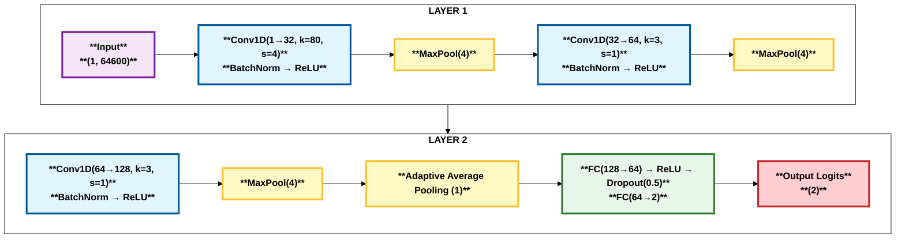

## 4. Network Architectures

### 4.1 Overview

We employed a diverse set of deep neural network architectures, each offering distinct advantages for audio deepfake detection. The architectures range from lightweight models optimized for real-time inference to deep networks with high representational capacity.

**Feature Compatibility:**

| Model                     | Mel-Spectrogram | LFCC | CQT | Raw Waveform |
| ------------------------- | :-------------: | :--: | :-: | :----------: |
| EfficientNet-B2           |        ✓        |  ✓   |  ✓  |      ✗       |
| EfficientNet-B2 Attention |        ✓        |  ✓   |  ✓  |      ✗       |
| LCNN                      |        ✓        |  ✓   |  ✓  |      ✗       |
| LCNN Large                |        ✓        |  ✓   |  ✓  |      ✗       |
| SE-ResNet                 |        ✓        |  ✓   |  ✓  |      ✗       |
| RawNet3                   |        ✗        |  ✗   |  ✗  |      ✓       |
| SimpleCNN                 |        ✗        |  ✗   |  ✗  |      ✓       |

**Note:** Models trained with spectrogram-based features (Mel-Spectrogram, LFCC, CQT) benefit from the complementary information provided by each representation, enabling robust detection across diverse spoofing attack types. Raw waveform models (RawNet3, SimpleCNN) learn representations directly from time-domain signals, avoiding handcrafted feature engineering.

### 4.2 SimpleCNN

**Architecture Description:**

SimpleCNN is a lightweight 1D convolutional neural network designed for processing raw audio waveforms. It serves as a baseline model with minimal computational overhead, suitable for rapid prototyping and real-time inference on resource-constrained devices.

**Key Specifications:**

- **Input:** Raw Waveform $(B, 64600)$
- **Parameters:** ~0.3M
- **Feature Embedding:** 128-dimensional vector before classification
- **Output:** 2-class logits (bonafide vs. spoof)

**Network Structure:**



**Design Rationale:**

- The initial large kernel (80 samples) captures low-level acoustic patterns at approximately 5ms temporal resolution at 16 kHz
- Progressive channel expansion (32 → 64 → 128) increases representational capacity
- Aggressive pooling reduces computational complexity while maintaining discriminative features
- Adaptive average pooling produces a fixed-size 128-D feature representation regardless of input length
- High dropout rate (0.5) prevents overfitting given the model's limited capacity

**Feature Extraction Pipeline:**

```
Raw Waveform (64600)
→ Conv-Pool-Conv-Pool-Conv-Pool (128 channels)
→ Adaptive Pool (128-D embedding)
→ FC layers → 2-class output
```

### 4.3 EfficientNet-B2

**Architecture Description:**

EfficientNet-B2 is a compound-scaled convolutional neural network originally developed for image classification. We adapted it for audio forensics by modifying the input layer to accept single-channel spectrograms and replacing the classification head.

**Key Specifications:**

- **Input:** Log-Mel Spectrogram / LFCC / CQT $(B, 1, F, T)$
- **Backbone:** EfficientNet-B2 (depth=1.1, width=1.1, resolution scaling)
- **Parameters:** ~9.2M
- **Feature Embedding:** 1408-dimensional vector from backbone
- **Output:** 2-class logits (bonafide vs. spoof)

**Architectural Modifications:**

1. **Input Layer Adaptation:** The first convolutional layer was modified from Conv2d(3, 32) to Conv2d(1, 32) to accommodate single-channel input. Pre-trained weights from ImageNet were averaged across RGB channels:

$$W_{\text{new}}(1, :, :, :) = \frac{1}{3}\sum_{c=1}^{3} W_{\text{pretrained}}(c, :, :, :)$$

2. **Custom Classification Head:**

```mermaid
flowchart LR
    %% Fully Connected Network Architecture
    classDef input fill:#f3e5f5,stroke:#7b1fa2,stroke-width:2px
    classDef fc fill:#e1f5fe,stroke:#01579b,stroke-width:2px
    classDef dropout fill:#fff9c4,stroke:#fbc02d,stroke-width:2px
    classDef output fill:#ffcdd2,stroke:#c62828,stroke-width:2px

    Input["Backbone Features<br/>(1408)"]:::input

    Drop1["Dropout(0.3)"]:::dropout
    FC1["Linear(512)<br/>BatchNorm → ReLU"]:::fc

    Drop2["Dropout(0.3)"]:::dropout
    FC2["Linear(256)<br/>BatchNorm → ReLU"]:::fc

    Drop3["Dropout(0.3)"]:::dropout
    FC3["Linear(2)"]:::output

    Input --> Drop1 --> FC1 --> Drop2 --> FC2 --> Drop3 --> FC3
```



The progressive dimensionality reduction (1408 → 512 → 256 → 2) with interleaved regularization prevents overfitting while maintaining discriminative capacity.

**Transfer Learning Strategy:** Pre-training on ImageNet provides robust low-level feature extractors (edges, textures) that generalize well to spectro-temporal patterns in audio spectrograms.

### 4.4 EfficientNet-B2 with Attention

**Architecture Description:**

An enhanced variant of EfficientNet-B2 that incorporates attention-based pooling for improved temporal modeling. This architecture is particularly effective when input spectrograms have variable lengths or require fine-grained temporal attention.

**Key Specifications:**

- **Input:** Log-Mel Spectrogram / LFCC / CQT $(B, 1, F, T)$
- **Backbone:** EfficientNet-B2 features (without global pooling)
- **Parameters:** ~9.5M
- **Feature Embedding:** 2816-dimensional vector (1408-D mean + 1408-D std concatenation)
- **Output:** 2-class logits (bonafide vs. spoof)

**Attention Pooling Mechanism:**

Instead of global average pooling, this variant uses learnable attention weights over spatial dimensions:

1. **Attention Weight Computation:**
   $$\alpha_{h,w} = \frac{\exp(g(\mathbf{F}_{:,h,w}))}{\sum_{h',w'} \exp(g(\mathbf{F}_{:,h',w'}))}$$

   where $g(\cdot)$ is a bottleneck attention network: Conv2d(1408 → 128) → ReLU → Conv2d(128 → 1).

2. **Attentive Statistics Pooling:**
   $$\mu_c = \sum_{h,w} \alpha_{h,w} \mathbf{F}_{c,h,w}$$

   $$\sigma_c = \sqrt{\sum_{h,w} \alpha_{h,w} (\mathbf{F}_{c,h,w} - \mu_c)^2 + \epsilon}$$

   $$\mathbf{v} = [\mu; \sigma]$$

   where $\epsilon = 10^{-8}$ ensures numerical stability. The concatenation of attention-weighted mean and standard deviation provides a richer representation that captures both central tendency and variability of feature activations.

**Custom Classification Head:**

```
Backbone + Attention Pooling (2816)
→ Dropout(0.3) → Linear(512) → BatchNorm → ReLU
→ Dropout(0.3) → Linear(256) → BatchNorm → ReLU
→ Dropout(0.3) → Linear(2)
```

### 4.5 Light CNN (LCNN)

**Architecture Description:**

LCNN employs Max-Feature-Map (MFM) activation functions instead of traditional ReLU. MFM acts as a learnable feature selection mechanism, particularly effective for spoofing detection where discriminative artifact selection is crucial.

**Key Specifications:**

- **Input:** Log-Mel Spectrogram / LFCC / CQT $(B, 1, 128, T)$
- **Backbone:** 4-stage LCNN with MFM activations
- **Parameters:** ~0.8M
- **Feature Embedding:** 64-dimensional vector after MFM projection
- **Output:** 2-class logits (bonafide vs. spoof)

**MFM Activation:**

Given input $\mathbf{x} \in \mathbb{R}^{2C \times H \times W}$, MFM partitions channels and applies element-wise maximum:

$$\text{MFM}(\mathbf{x})_{c,h,w} = \max(\mathbf{x}_{c,h,w}, \mathbf{x}_{c+C,h,w})$$

This reduces the channel dimension by half while preserving the most salient features. For example, MFM applied to a 128-D vector produces a 64-D output.

**Network Structure:**

```
Input (1, 128, T)
→ Conv-MFM Block (32) → MaxPool(2×2)
→ Conv-MFM Block (48) → Residual Block (48) → MaxPool(2×2)
→ Conv-MFM Block (64) → Residual Block (64) → MaxPool(2×2)
→ Conv-MFM Block (32) → Residual Block (32) → MaxPool(2×2)
→ Attentive Statistics Pooling (produces 64-D mean + 64-D std = 128-D)
→ Linear(128) → MFM1D → BatchNorm(64)    [64-D embedding]
→ Dropout(0.3) → Linear(256) → BatchNorm → ReLU
→ Dropout(0.3) → Linear(2)
```

**Attentive Statistics Pooling:**

Temporal aggregation is performed via attention-weighted statistics, where $\phi(\cdot)$ is a learned transformation (typically a single linear layer):

$$\alpha_t = \frac{\exp(w^T \phi(h_t))}{\sum_{t'} \exp(w^T \phi(h_{t'}))}$$

$$\mu = \sum_t \alpha_t h_t, \quad \sigma = \sqrt{\sum_t \alpha_t (h_t - \mu)^2 + \epsilon}$$

$$\mathbf{v} = [\mu; \sigma]$$

where $[\cdot; \cdot]$ denotes concatenation and $\epsilon = 10^{-8}$ ensures numerical stability.

**LCNN Backbone Architecture:**

The backbone consists of four stages with progressively learned feature representations:

| Stage | Channels | Operations                                   |
| ----- | -------- | -------------------------------------------- |
| 0     | 32       | Conv-MFM(5×5) → MaxPool(2×2)                 |
| 1     | 48       | Conv-MFM(3×3) → ResBlock-MFM → MaxPool(2×2)  |
| 2     | 64       | Conv-MFM(3×3) → ResBlock-MFM → MaxPool(2×2)  |
| 3     | 32       | Conv-MFM(3×3) → ResBlock-MFM → Conv-MFM(1×1) |

**Embedding Projection:**

```
AttentiveStatPool output (128-D: 64-D mean + 64-D std)
→ Linear(128) → MFM1D (reduces to 64-D) → BatchNorm(64)  [Final 64-D embedding]
→ Classification head: Dropout(0.3) → Linear(256) → BatchNorm → ReLU
→ Dropout(0.3) → Linear(2)
```

### 4.6 LCNN Large

**Architecture Description:**

LCNN Large is a scaled-up variant of the standard LCNN, designed to capture more complex acoustic patterns through increased model capacity. It features wider convolutional layers and a deeper classification head, making it suitable for larger-scale datasets where the standard model might underfit.

**Key Specifications:**

- **Input:** Log-Mel Spectrogram / LFCC / CQT $(B, 1, 128, T)$
- **Backbone:** 4-stage LCNN with doubled channel width
- **Parameters:** ~3.2M
- **Feature Embedding:** 128-dimensional vector after MFM projection
- **Output:** 2-class logits (bonafide vs. spoof)

**Architectural Enhancements:**

1. **Increased Width:**
   The channel dimensions in the backbone are doubled compared to the standard model:
   `[32, 48, 64, 32]` $\rightarrow$ `[64, 96, 128, 64]`

2. **Expanded Attention Bottleneck:**
   The attention mechanism uses a larger bottleneck size (128 vs 64) to capture more fine-grained temporal statistics, producing 256-D concatenated statistics (128-D mean + 128-D std).

3. **Deeper Classification Head:**
   An additional fully connected layer is introduced to process the higher-dimensional embeddings:

```
AttentiveStatPool output (256-D: 128-D mean + 128-D std)
→ Linear(256) → MFM1D (reduces to 128-D) → BatchNorm(128)  [Final 128-D embedding]
→ Classification head: Dropout(0.4) → Linear(512) → BatchNorm → ReLU
→ Dropout(0.4) → Linear(256) → BatchNorm → ReLU
→ Dropout(0.4) → Linear(2)
```

4. **Stronger Regularization:**
   Dropout rate is increased to $p=0.4$ to prevent overfitting given the increased parameter count.

### 4.7 RawNet3

**Architecture Description:**

RawNet3 processes raw waveforms directly, eliminating handcrafted feature extraction. This end-to-end approach allows the network to learn optimal representations for the task.

**Key Specifications:**

- **Input:** Raw Waveform $(B, 64600)$
- **Backbone:** Sinc convolution + Res2Net blocks
- **Parameters:** ~2.5M
- **Feature Embedding:** 512-dimensional vector before classification
- **Output:** 2-class logits (bonafide vs. spoof)

**Key Components:**

1. **Sinc Convolution Layer:**

   Parameterized band-pass filters learn frequency band selection. Each filter is defined as:

   $$h[n] = 2f_c \text{sinc}(2\pi f_c n) \cdot w[n]$$

   where $f_c$ is the learnable cutoff frequency and $w[n]$ is a Hamming window. The layer uses 64 filters with kernel size 251, initialized with Mel-scale frequency spacing.

2. **Res2Net Blocks:**

   Multi-scale feature extraction with hierarchical residual-like connections. Each Res2Net block operates as follows:
   - Split input channels into $s=4$ groups: $\mathbf{X} = [\mathbf{X}_1, \mathbf{X}_2, \mathbf{X}_3, \mathbf{X}_4]$
   - Apply hierarchical transformations:
     - $\mathbf{Y}_1 = \text{Conv}_{3×1}(\mathbf{X}_1)$
     - $\mathbf{Y}_i = \text{Conv}_{3×1}(\mathbf{X}_i + \mathbf{Y}_{i-1})$ for $i \in \{2,3,4\}$
   - Concatenate outputs: $\mathbf{Y} = [\mathbf{Y}_1, \mathbf{Y}_2, \mathbf{Y}_3, \mathbf{Y}_4]$

   This creates multi-scale receptive fields and improves feature reuse.

3. **Encoder Structure:**

```
Raw Waveform (B, 64600)
→ SincConv(64 filters, k=251) → BatchNorm → ReLU → MaxPool
→ Res2Net Block (64→64) → BatchNorm → ReLU → MaxPool
→ Res2Net Block (64→128) → BatchNorm → ReLU → MaxPool
→ Res2Net Block (128→256) → BatchNorm → ReLU → MaxPool
→ Res2Net Block (256→512) → BatchNorm → ReLU → MaxPool
→ Temporal Attention Pooling
→ 512-D Feature Embedding
```

4. **Attention Pooling:**

   Temporal attention aggregates variable-length sequences into fixed-size embeddings:

   $$\alpha_t = \text{softmax}(\tanh(W_1 h_t) \cdot W_2)$$

   $$\mathbf{e} = \sum_t \alpha_t h_t$$

   where $h_t \in \mathbb{R}^{512}$ is the feature at time $t$, and $\mathbf{e} \in \mathbb{R}^{512}$ is the final embedding.

**Classifier Head:**

```
Feature Embedding (512)
→ Linear(256) → ReLU → Dropout(0.3)
→ Linear(2)
```

### 4.8 SE-ResNet

**Architecture Description:**

Squeeze-and-Excitation ResNet incorporates channel-wise attention mechanisms into the residual learning framework, enabling the network to recalibrate channel-wise feature responses dynamically.

**Key Specifications:**

- **Input:** Log-Mel Spectrogram / LFCC / CQT $(B, 1, 128, T)$
- **Backbone:** ResNet-34 style with SE blocks
- **Parameters:** ~11.2M
- **Feature Embedding:** 1024-dimensional vector (512-D mean + 512-D std concatenation)
- **Output:** 2-class logits (bonafide vs. spoof)

**SE Block:**

The Squeeze-and-Excitation mechanism recalibrates channel responses:

$$\mathbf{z}_c = \frac{1}{HW}\sum_{h,w} \mathbf{F}_{c,h,w} \quad \text{(Global Average Pooling)}$$

$$\mathbf{s} = \sigma(W_2 \delta(W_1 \mathbf{z})) \quad \text{(Excitation: FC → ReLU → FC → Sigmoid)}$$

$$\tilde{\mathbf{F}}_c = \mathbf{F}_c \cdot \mathbf{s}_c \quad \text{(Channel-wise scaling)}$$

where $\delta$ is ReLU, $\sigma$ is sigmoid, and $W_1, W_2$ are learned projections with reduction ratio $r=16$.

**Network Structure:**

| Stage   | Layers                               | Channels | Stride |
| ------- | ------------------------------------ | -------- | ------ |
| Stem    | Conv(7×7) → BN → ReLU → MaxPool(3×3) | 64       | 2      |
| Layer 1 | 3 × BasicBlockSE                     | 64       | 1      |
| Layer 2 | 4 × BasicBlockSE                     | 128      | 2      |
| Layer 3 | 6 × BasicBlockSE                     | 256      | 2      |
| Layer 4 | 3 × BasicBlockSE                     | 512      | 2      |

**BasicBlockSE Structure:**

```
Input x
→ Conv(3×3) → BatchNorm → ReLU
→ Conv(3×3) → BatchNorm
→ SE Block (Squeeze-and-Excitation)
→ Add residual: output = SE(conv(x)) + x
→ ReLU
```

**Attentive Statistics Pooling:**

After the backbone produces features of shape $(B, 512, F', T')$, the frequency axis is collapsed via mean pooling to obtain $(B, 512, T')$. Attentive statistics pooling is then applied over the temporal axis:

$$\alpha_t = \frac{\exp(w^T \tanh(V h_t))}{\sum_{t'} \exp(w^T \tanh(V h_{t'}))}$$

$$\mu = \sum_t \alpha_t h_t, \quad \sigma = \sqrt{\sum_t \alpha_t (h_t - \mu)^2 + \epsilon}$$

$$\mathbf{v} = [\mu; \sigma] \in \mathbb{R}^{1024}$$

where $h_t \in \mathbb{R}^{512}$, producing a 1024-D embedding (512-D mean + 512-D std).

**Classifier Head:**

```
Feature Embedding (1024)
→ Linear(512) → BatchNorm → ReLU → Dropout(0.3)
→ Linear(256) → BatchNorm → ReLU → Dropout(0.3)
→ Linear(2)
```

### 4.9 Model Comparison Summary

| Model                     | Input Type  | Parameters | Embedding Dim | Key Advantage                     |
| ------------------------- | ----------- | ---------- | ------------- | --------------------------------- |
| SimpleCNN                 | Raw         | ~0.3M      | 128           | Lightweight, fast inference       |
| EfficientNet-B2           | Spectrogram | ~9.2M      | 1408          | Transfer learning from ImageNet   |
| EfficientNet-B2 Attention | Spectrogram | ~9.5M      | 2816          | Attention-based temporal modeling |
| LCNN                      | Spectrogram | ~0.8M      | 64            | MFM feature selection             |
| LCNN Large                | Spectrogram | ~3.2M      | 128           | High capacity, deep classifier    |
| RawNet3                   | Raw         | ~2.5M      | 512           | End-to-end learnable filters      |
| SE-ResNet                 | Spectrogram | ~11.2M     | 1024          | Channel attention + deep residual |

**Note:** Embedding dimensions represent the feature vector size before the final classification layer.

## 5. Experimental Setup

### 5.1 Loss Function

We employ a weighted Cross-Entropy loss to address class imbalance in the dataset:

$$\mathcal{L} = -\frac{1}{N}\sum_{i=1}^{N} w_{y_i} \log p_{y_i}(\mathbf{x}_i)$$

where:

- $N$ is the batch size
- $y_i \in \{0, 1\}$ is the true label (0=spoof, 1=bonafide)
- $p_{y_i}(\mathbf{x}_i)$ is the predicted probability for the true class
- $w_0 = 0.1$ (weight for spoof class)
- $w_1 = 0.9$ (weight for bonafide class)

**Rationale:** These weights assume that bonafide samples are the minority class in the training set. The higher weight on bonafide ($w_1 = 0.9$) penalizes misclassification of genuine audio more heavily, which is critical for maintaining low false rejection rates in practical deployments. If your dataset has a different class distribution (e.g., spoofs are rare), you should reverse these weights to $w_0 = 0.9, w_1 = 0.1$.

### 5.2 Optimization

**Adam Optimizer:** We use adaptive moment estimation with the following hyperparameters:

- Learning rate: $\eta = 10^{-4}$
- Momentum coefficients: $\beta_1 = 0.9$, $\beta_2 = 0.999$
- Weight decay (L2 regularization): $\lambda = 10^{-4}$
- $\epsilon = 10^{-8}$ (for numerical stability)

**Learning Rate Scheduling:**

Cosine annealing without warm restarts gradually reduces the learning rate:

$$\eta_t = \eta_{\min} + \frac{1}{2}(\eta_{\max} - \eta_{\min})\left(1 + \cos\left(\frac{t}{T}\pi\right)\right)$$

where:

- $t$ is the current training step
- $T$ is the total number of training steps
- $\eta_{\max} = 10^{-4}$ (initial learning rate)
- $\eta_{\min} = 10^{-6}$ (minimum learning rate)

This schedule encourages better convergence to local minima by allowing the optimizer to explore the loss landscape early in training (high LR) and settle into sharp minima later (low LR).

### 5.3 Regularization

We apply multiple regularization techniques to prevent overfitting:

1. **Dropout:** Applied with probability $p = 0.3$ in fully connected layers (increased to $p = 0.4$ for LCNN Large and $p = 0.5$ for SimpleCNN)

2. **Batch Normalization:** Applied after each convolutional layer to stabilize training and reduce internal covariate shift

3. **Gradient Clipping:** Maximum gradient norm of 1.0 to prevent exploding gradients

4. **Early Stopping:** Training halts if validation Equal Error Rate (EER) does not improve for 5 consecutive epochs

5. **Weight Decay:** L2 penalty of $\lambda = 10^{-4}$ applied to all learnable parameters

### 5.4 Training Protocol

- **Batch Size:** 32 samples per GPU
- **Epochs:** Maximum 100 epochs (typically converges within 30-50 epochs with early stopping)
- **Validation Frequency:** Every epoch
- **Hardware:** Training conducted on NVIDIA GPUs (V100 or A100)
- **Mixed Precision:** FP16 training with dynamic loss scaling for computational efficiency
- **Data Augmentation:** Applied during training (details in data preprocessing section)

### 5.5 Evaluation Metrics

- **Equal Error Rate (EER):** Primary metric, computed where FAR = FRR
- **t-DCF (tandem Detection Cost Function):** ASVspoof 2019 challenge metric
- **Accuracy:** Overall classification accuracy on balanced test sets
- **AUC (Area Under ROC Curve):** Aggregate measure of classification performance
