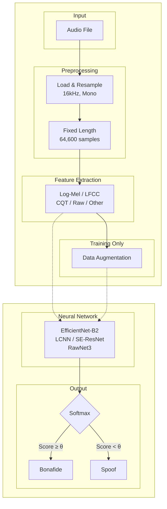
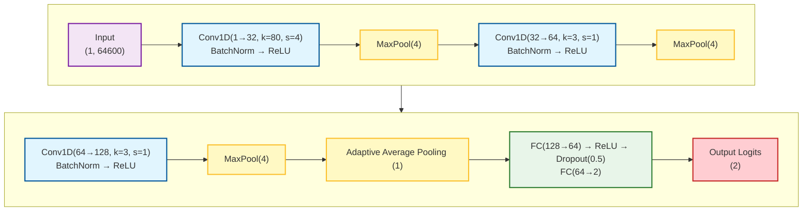
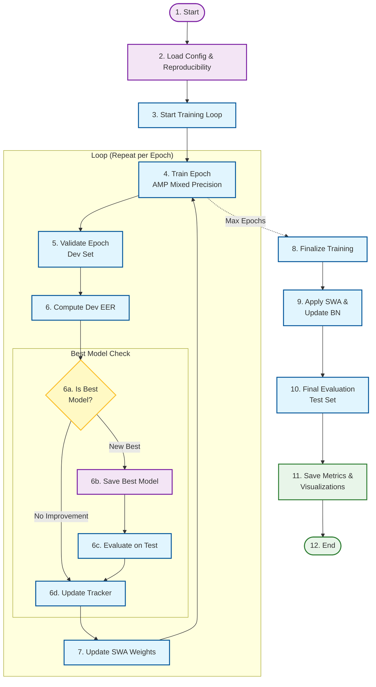
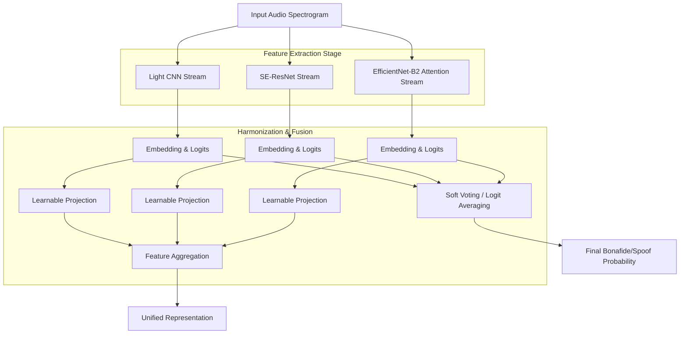
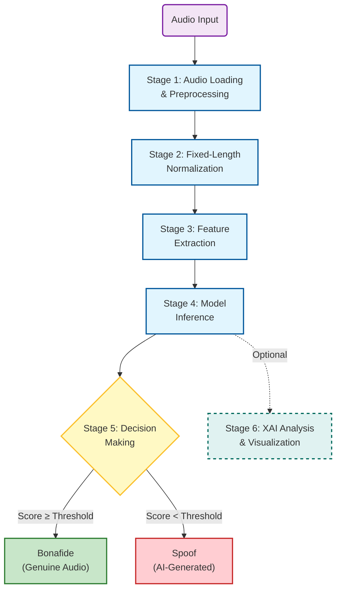

## System Overview



### Document Structure

| Section | Title                 | Description                                                                       |
| ------- | --------------------- | --------------------------------------------------------------------------------- |
| 1       | Data Preparation      | Dataset loading, audio standardization, fixed-length segmentation                 |
| 2       | Feature Extraction    | Log-Mel spectrogram, LFCC, CQT,Raw, Chroma, Spectral contrast, multi-modal fusion |
| 3       | Data Augmentation     | Noise, RIR, pitch shifting, SpecAugment                                           |
| 4       | Network Architectures | SimpleCNN, EfficientNet-B2, LCNN, RawNet3, SE-ResNet                              |
| 5       | Training              | Loss, optimizer, regularization, SWA, training loop                               |
| 6       | Inference             | Pipeline stages, batch processing                                                 |
| 7       | Evaluation Metrics    | EER, accuracy, ROC/AUC, Precision, Recall , F1-Score                              |
| 8       | Ensemble Strategy     | Multi-model fusion, soft voting                                                   |
| 9       | Optimization          | Mixed precision, TF32, memory layout                                              |
| 10      | Reproducibility       | Seed control, configuration management                                            |
| 11      | Explainability        | GradCAM visualization                                                             |
| 12      | Conclusion            | Summary and contributions                                                         |

---

## 1. Data Preparation and Preprocessing

### 1.1 Dataset Description

The system was developed and evaluated using the "Fake-or-Real" dataset, which consists of bonafide (genuine human) and spoofed (synthetically generated) audio recordings. The dataset is organized into training, validation, and testing partitions, with balanced representation of both classes to facilitate unbiased model learning.
The dataset aggregates data from the latest TTS solutions (such as Deep Voice 3 and Google Wavenet TTS) as well as a variety of real human speech, including the Arctic Dataset (http://festvox.org/cmu_arctic/), LJSpeech Dataset (https://keithito.com/LJ-Speech-Dataset/), VoxForge Dataset (http://www.voxforge.org).

The dataset is published in four versions: for-original, for-norm, for-2sec and for-rerec.

The first version, named for-original, contains the files as collected from the speech sources, without any modification (balanced version).

The second version, called for-norm, contains the same files, but balanced in terms of gender and class and normalized in terms of sample rate, volume and number of channels.

The third one, named for-2sec is based on the second one, but with the files truncated at 2 seconds.

The last version, named for-rerec, is a rerecorded version of the for-2second dataset, to simulate a scenario where an attacker sends an utterance through a voice channel (i.e. a phone call or a voice message).

In our system we have used for-2second version.

```
      Training samples: 13956 (Real: 6978, Fake: 6978)
      Validation samples: 2826 (Real: 1413, Fake: 1413)
      Testing samples: 1088 (Real: 544, Fake: 544)
```

### 1.2 Audio Loading and Standardization

All audio samples undergo standardized preprocessing to ensure consistency across the pipeline. Audio files are loaded using the `soundfile` library, which provides automatic format detection and efficient decoding for multiple audio formats including WAV, FLAC, and MP3.
The preprocessing pipeline consists of the following operations:
**Step 1: Format Conversion**
Audio files are loaded using the `soundfile` library, which automatically detects and decodes the audio format (e.g., FLAC, WAV) into a floating-point tensor representation.

**Step 2: Mono Conversion**
To ensure consistent input dimensions, multi-channel audio signals (e.g., stereo) are downmixed to mono by calculating the mean amplitude across all channels.

**Step 3: Resampling**
The system processes audio at a standard sampling rate of 16 kHz. Feature extraction parameters are tuned for this rate to adhere to the Nyquist-Shannon sampling theorem for speech signals up to 8 kHz.

### 1.3 Fixed-Length Segmentation

To facilitate batch processing and ensure consistent input dimensions for neural network training, all audio signals are processed to a fixed length of 64,600 samples, corresponding to approximately 4.04 seconds at 16 kHz sampling rate. This duration was empirically determined to capture sufficient contextual information for classification while maintaining computational efficiency.

For audio segments shorter than the target length ($L < 64600$), we employ a repetition-based padding technique.

For audio segments exceeding the target length ($L > 64600$), two strategies are employed.

1. **Training Phase:** Random cropping to introduce variability and prevent overfitting.
2. **Inference Phase:** Center cropping for deterministic evaluation.

### 1.4 Batch Processing Configuration

The DataLoader configuration was optimized for both training efficiency and reproducibility:

| Parameter            | Value        | Rationale                                              |
| -------------------- | ------------ | ------------------------------------------------------ |
| `batch_size`         | 32           | Balanced GPU memory utilization and gradient stability |
| `num_workers`        | 4            | Parallel data loading to prevent I/O bottlenecks       |
| `pin_memory`         | True         | Accelerated CPU-to-GPU transfers                       |
| `persistent_workers` | True         | Reduced worker initialization overhead                 |
| `prefetch_factor`    | 2            | Overlapped data loading with computation               |
| `drop_last`          | True (train) | Consistent batch sizes for BatchNorm stability         |

Worker initialization employs deterministic seeding to ensure reproducibility.

## 2. Feature Extraction

### 2.1 Overview of Acoustic Representations

The system supports multiple acoustic feature representations, each capturing different aspects of audio characteristics relevant to deepfake detection. The feature extraction strategy is configurable, enabling comparative analysis and multi-modal fusion.

| Feature Name        | Dimensionality | Primary Application               |
| ------------------- | -------------- | --------------------------------- |
| Raw Waveform        | $(N,)$         | End-to-end learning               |
| Log-Mel Spectrogram | $(128, T)$     | General-purpose CNN models        |
| LFCC                | $(13, T)$      | Anti-spoofing (linear frequency)  |
| MFCC                | $(13, T)$      | Traditional speech processing     |
| CQT                 | $(84, T)$      | Harmonic and tonal analysis       |
| Chroma              | $(12, T)$      | Pitch class and harmony analysis  |
| Spectral Contrast   | $(7, T)$       | Texture and timbre discrimination |

where $N$ denotes the number of samples (64,600) and $T$ represents the temporal dimension (varies by feature type).

### 2.2 Raw Waveform

**Dimensionality:** $(N,)$ where $N = 64,600$ samples

**Purpose:** End-to-end learning without manual feature engineering

**Characteristics:**
Raw waveform represents the audio signal in its most fundamental form—the time-domain amplitude variations. This representation preserves all information present in the original signal without any transformation or information loss.

**Advantages:**

- No information loss from transformation processes
- Enables the neural network to learn optimal representations directly from data
- Eliminates reliance on hand-crafted features that may miss subtle artifacts

**Challenges:**

- Requires deeper networks with more parameters to learn meaningful patterns
- Computationally intensive for processing long sequences
- May struggle with generalization without sufficient training data

**Use Cases:** Particularly effective with deep learning architectures like WaveNet, raw CNN models, or transformer-based systems that can automatically discover relevant acoustic patterns for deepfake detection.

---

### 2.3 Log-Mel Spectrogram

**Dimensionality:** $(128, T)$ - 128 Mel frequency bands across $T$ time frames

**Purpose:** General-purpose CNN models with perceptually-motivated frequency representation

### Mathematical Formulation

The extraction involves five sequential transformations:

**Step 1: Short-Time Fourier Transform (STFT)**

$$X(m, k) = \sum_{n=0}^{N-1} x(n + mH) w(n) e^{-j2\pi kn/N}$$

- $w(n)$: Hann window function
- $H$: Hop length (160 samples)
- $N$: FFT size (512)
- $m$: Time frame index
- $k$: Frequency bin index

**Step 2: Power Spectrum**

$$P(m, k) = |X(m, k)|^2$$

Converts complex STFT coefficients to power values, representing energy at each time-frequency point.

**Step 3: Mel Filterbank Application**

$$S_{\text{mel}}(m, b) = \sum_{k=0}^{N/2} P(m, k) \cdot H_b(k)$$

- $H_b(k)$: $b$-th triangular Mel filter
- $b = 1, \ldots, 128$: 128 Mel bands

**Step 4: Logarithmic Compression**

$$S_{\log}(m, b) = 10 \log_{10}(S_{\text{mel}}(m, b) + \epsilon)$$

- $\epsilon = 10^{-10}$: Prevents numerical instability for zero values
- Compresses dynamic range and approximates human loudness perception

**Step 5: Normalization (Mean-Variance Normalization)**

$$S_{\text{norm}}(m,b) = \frac{S_{\log}(m,b) - \mu_b}{\sigma_b}$$

- $\mu_b$: Mean of the $b$-th Mel band across all time frames
- $\sigma_b$: Standard deviation of the $b$-th Mel band

### Perceptual Motivation

The Mel scale approximates the non-linear frequency resolution of human hearing. It emphasizes perceptually relevant frequencies for speech (300-4000 Hz), making it particularly effective for tasks involving human auditory perception. The logarithmic compression further mimics the way humans perceive sound intensity.

**Advantages:**

- Biologically inspired representation aligned with human auditory perception
- Compact representation with good discriminative power
- Well-established in speech processing with extensive research support
- Effective for CNN-based architectures

**Detection Relevance:** Captures spectral characteristics and temporal evolution patterns that may differ between genuine and AI-generated speech, particularly in prosody and spectral envelope.

---

### 2.4 Linear Frequency Cepstral Coefficients (LFCC)

**Dimensionality:** $(13, T)$ - 13 cepstral coefficients across $T$ time frames

**Purpose:** Anti-spoofing detection with linear frequency emphasis

### Mathematical Formulation

**Step 1: Linear Filterbank Construction**

$$
H_b^{\text{lin}}(k) = \begin{cases}
\frac{f(k) - f_b^{\text{left}}}{f_b^{\text{center}} - f_b^{\text{left}}} & f_b^{\text{left}} \leq f(k) \leq f_b^{\text{center}} \\
\frac{f_b^{\text{right}} - f(k)}{f_b^{\text{right}} - f_b^{\text{center}}} & f_b^{\text{center}} \leq f(k) \leq f_b^{\text{right}} \\
0 & \text{otherwise}
\end{cases}
$$

Filter centers are linearly spaced: $f_b = b \cdot \frac{f_s/2}{B}$ for $b = 0, \ldots, B$ (20 filters)

**Step 2: Filterbank Application**

$$S_{\text{lin}}(m, b) = \sum_{k=0}^{N/2} P(m, k) \cdot H_b^{\text{lin}}(k)$$

**Step 3: Logarithmic Compression**

$$S_{\log}(m, b) = \log(S_{\text{lin}}(m, b) + \epsilon)$$

**Step 4: Discrete Cosine Transform (DCT)**

$$\text{LFCC}(m, c) = \sum_{b=0}^{B-1} S_{\log}(m, b) \cos\left(\frac{\pi c(b + 0.5)}{B}\right)$$

The first 13 coefficients ($c = 0, \ldots, 12$) are retained.

### Why Linear Frequency Scale?

Unlike the Mel scale's perceptual emphasis on lower frequencies, the linear frequency scale treats all frequencies equally. This characteristic makes LFCC particularly sensitive to high-frequency artifacts often present in synthetic speech, such as those introduced by vocoder processing, phase discontinuities, or bandwidth limitations in generative models.

**Advantages:**

- Superior sensitivity to high-frequency artifacts typical in synthetic speech
- Specifically designed for spoofing and anti-spoofing tasks
- Compact cepstral representation reduces dimensionality
- DCT decorrelates filterbank outputs, improving efficiency

**Detection Relevance:** AI-generated speech often exhibits subtle artifacts in high-frequency regions due to vocoder reconstruction, neural network processing artifacts, or training data limitations. LFCC's linear frequency resolution makes these anomalies more detectable.

---

### 2.5 Mel-Frequency Cepstral Coefficients (MFCC)

**Dimensionality:** $(13, T)$ - 13 cepstral coefficients across $T$ time frames

**Purpose:** Traditional speech processing and recognition

### Mathematical Formulation

MFCC extraction follows a similar pipeline to LFCC but uses Mel-scale filterbanks:

**Steps 1-3:** Same as Log-Mel Spectrogram (STFT → Power Spectrum → Mel Filterbank)

**Step 4: Logarithmic Compression**

$$S_{\log}(m, b) = \log(S_{\text{mel}}(m, b) + \epsilon)$$

**Step 5: Discrete Cosine Transform**

$$\text{MFCC}(m, c) = \sum_{b=0}^{B-1} S_{\log}(m, b) \cos\left(\frac{\pi c(b + 0.5)}{B}\right)$$

Typically, the first 13 coefficients are retained, sometimes augmented with delta (velocity) and delta-delta (acceleration) coefficients.

### Differences from LFCC

The key distinction is the use of Mel-scale filterbanks instead of linear-scale filterbanks. MFCCs emphasize lower frequencies where most speech information resides, while LFCCs maintain equal resolution across all frequencies.

**Advantages:**

- Highly compact representation capturing vocal tract characteristics
- Robust to variations in recording conditions
- Extensive history in speech recognition with well-understood properties
- DCT provides decorrelated, efficient features

**Detection Relevance:** MFCCs capture the spectral envelope and vocal tract resonances, which may exhibit unnatural patterns in AI-generated speech due to imperfect modeling of human speech production mechanisms.

---

### 2.6 Constant-Q Transform (CQT)

**Dimensionality:** $(84, T)$ - 84 logarithmically-spaced frequency bins across $T$ time frames

**Purpose:** Harmonic and tonal analysis with constant Q-factor

### Mathematical Foundation

CQT represents audio with logarithmically-spaced frequency bins, where each bin has a constant ratio of center frequency to bandwidth (Q-factor):

$$Q = \frac{f_k}{\Delta f_k} = \text{constant}$$

**Key Properties:**

- **Frequency Resolution:** Bins per octave (typically 12 or 24)
- **Time-Frequency Trade-off:** Higher frequency resolution at low frequencies, better temporal resolution at high frequencies
- **Musical Alignment:** Frequency bins align with musical notes (when bins per octave = 12)

### Computation

$$X_{\text{CQT}}(k, n) = \frac{1}{N_k} \sum_{n'=0}^{N_k-1} w_k(n') x(n + n') e^{-j2\pi Q n'/N_k}$$

where:

- $k$: Frequency bin index
- $N_k$: Window length for bin $k$ (varies with frequency)
- $w_k$: Window function for bin $k$

**Advantages:**

- Logarithmic frequency resolution matches musical scales and harmonic structures
- Superior representation of pitch and harmonic relationships
- Efficient for analyzing tonal content and pitch-related features
- Better frequency resolution at low frequencies where fundamental frequencies reside

**Detection Relevance:** AI-generated speech may exhibit unnatural harmonic structures, abnormal pitch contours, or artifacts in the harmonic series. CQT's logarithmic frequency spacing makes these harmonic anomalies more apparent, particularly in the fundamental frequency and its overtones.

---

### 2.7 Chroma Features

**Dimensionality:** $(12, T)$ - 12 pitch classes across $T$ time frames

**Purpose:** Pitch class and harmony analysis

### Concept

Chroma features represent the intensity of each of the 12 pitch classes (C, C#, D, D#, E, F, F#, G, G#, A, A#, B) in Western music theory, regardless of octave. This creates an octave-invariant representation that captures tonal and harmonic content.

### Computation

**From CQT or STFT:**

1. Map frequency bins to pitch classes (modulo 12 semitones)
2. Sum energy across all octaves for each pitch class
3. Normalize to create a 12-dimensional chroma vector per time frame

$$\text{Chroma}(p, m) = \sum_{k \in \text{octaves of } p} |X(m, k)|^2$$

where $p \in \{0, 1, \ldots, 11\}$ represents the 12 pitch classes.

**Advantages:**

- Octave-invariant representation focuses on harmonic content
- Compact 12-dimensional representation per frame
- Effective for capturing tonal and harmonic patterns
- Robust to timbre variations

**Detection Relevance:** Human speech exhibits characteristic pitch patterns and harmonic relationships based on vocal physiology. AI-generated speech may produce unnatural pitch class distributions, abnormal harmonic progressions, or inconsistent tonal characteristics, particularly in prosody-rich segments or emotional speech.

---

### 2.8 Spectral Contrast

**Dimensionality:** $(7, T)$ - 7 contrast values (6 sub-bands + 1 full-band) across $T$ time frames

**Purpose:** Texture and timbre discrimination

### Concept

Spectral contrast measures the difference between spectral peaks and valleys in different frequency sub-bands, providing information about the spectral envelope's shape and texture.

### Computation

**For each sub-band:**

1. Divide frequency spectrum into sub-bands (typically 6-7 octave-scale bands)
2. For each sub-band at each time frame:
   - Identify peak values (top α-percentile, e.g., 85th percentile)
   - Identify valley values (bottom α-percentile, e.g., 15th percentile)
   - Compute contrast: $\text{Contrast}_b(m) = \log(\text{Peak}_b(m)) - \log(\text{Valley}_b(m))$

**Mathematical Formulation:**

$$\text{SC}_b(m) = 10\log_{10}\left(\frac{\mu_{\text{peak},b}(m)}{\mu_{\text{valley},b}(m)}\right)$$

where:

- $\mu_{\text{peak},b}(m)$: Mean of peak magnitudes in sub-band $b$ at frame $m$
- $\mu_{\text{valley},b}(m)$: Mean of valley magnitudes in sub-band $b$

**Advantages:**

- Captures spectral envelope texture independent of overall energy
- Robust to variations in recording level
- Effective for distinguishing different timbres and textures
- Complements energy-based features

**Detection Relevance:** AI-generated speech may exhibit over-smoothed or unnaturally sharp spectral contrasts due to neural network regularization, training artifacts, or vocoder processing. The spectral texture of synthetic speech may lack the natural variability and micro-variations present in genuine human speech, particularly in transient regions like plosives and fricatives.

---

### 2.9 Multi-Modal Feature Fusion

### Intermediate Fusion Strategy

To leverage complementary information from multiple acoustic representations, the system employs an **intermediate fusion approach** that combines features at the feature level before classification.

### Fusion Architecture

**Stage 1: Independent Feature Extraction**

Each acoustic representation is computed separately, preserving unique spectro-temporal properties:

- Mel-spectrogram captures perceptual characteristics
- LFCC emphasizes high-frequency artifacts
- CQT reveals harmonic structures

**Stage 2: Temporal Alignment**

Features are synchronized along the time dimension to ensure consistent temporal correspondence across all modalities. This may involve:

- Resampling to common temporal resolution
- Padding or truncating to match sequence lengths
- Ensuring consistent hop lengths and window sizes

**Stage 3: Channel-wise Concatenation**

Aligned features are concatenated along the channel dimension:

$$\mathbf{F}_{\text{fused}} = [\mathbf{F}_{\text{mel}}, \mathbf{F}_{\text{lfcc}}, \mathbf{F}_{\text{cqt}}]$$

Creating a unified tensor with dimensions $[C_1 + C_2 + C_3, F, T]$ where:

- $C_i$: Number of channels for feature type $i$
- $F$: Frequency dimension
- $T$: Time dimension

### Advantages of Intermediate Fusion

**Complementary Information:** Different features capture different aspects of audio:

- Mel-spectrogram: Broad spectral patterns and perceptual features
- LFCC: High-frequency artifacts and anti-spoofing cues
- CQT: Harmonic structures and pitch-related information

**Cross-Modal Learning:** The CNN can learn complex inter-modal relationships and dependencies during training, discovering patterns that emerge only when features are jointly analyzed.

**Richer Representation Space:** The concatenated representation provides a more comprehensive input that combines perceptual, cepstral, and constant-Q domains, potentially capturing artifacts subtle or absent in individual feature spaces.

## 3. Data Augmentation

### 3.1 Motivation and Strategy

Data augmentation serves two critical purposes in audio deepfake detection: (1) preventing overfitting to training set characteristics, and (2) improving generalization across diverse acoustic environments and recording conditions. Our augmentation pipeline applies probabilistic transformations at the waveform level during training only, with an application probability of $p = 0.8$.

### 3.2 Composed Augmentation Strategy

The system employs a **composed augmentation** approach where 1-2 augmentations are randomly selected and applied sequentially to each audio sample. This creates diverse acoustic variations while avoiding excessive distortion.

### 3.3 Waveform-Level Augmentations

**3.3.1 Gaussian White Noise**

Introduces random perturbations with controlled Signal-to-Noise Ratio (SNR):

$$y(t) = x(t) + \sqrt{\frac{P_x}{10^{\text{SNR}/10}}} \cdot \mathcal{N}(0, 1)$$

where $P_x = \mathbb{E}[x^2(t)]$ is the signal power. SNR is randomly sampled from the range [10, 25] dB.

**3.3.2 Background Noise**

Adds synthetic white noise scaled by a noise factor:

$$y(t) = x(t) + \alpha \cdot \max|x(t)| \cdot \frac{n(t)}{\max|n(t)|}$$

where $\alpha \in [0.01, 0.05]$ controls the noise amplitude and $n(t)$ is Gaussian white noise.

**3.3.3 Reverberation**

Simulates room acoustics by adding a delayed echo:

$$y(t) = x(t) + \beta \cdot x(t - \tau)$$

where $\tau = 50\text{ms}$ (800 samples at 16 kHz) and $\beta \in [0.3, 0.8]$ controls the echo amplitude.

**3.3.4 Pitch Shifting**

Alters the fundamental frequency while preserving duration using librosa:

$$y = \text{PitchShift}(x, n_{\text{semitones}} \in [-4, +4])$$

**3.3.5 Time Stretching**

Modifies the temporal characteristics without affecting pitch:

$$y = \text{TimeStretch}(x, \text{rate} \in [0.85, 1.15])$$

**3.3.6 Gain Adjustment**

Random amplitude scaling in decibels:

$$y(t) = x(t) \cdot 10^{g/20}$$

where $g \in [-6, +6]$ dB.

**3.3.7 Low-Pass Filter**

Attenuates high-frequency components to simulate bandwidth-limited channels:

- 4th-order Butterworth filter
- Cutoff frequency: randomly selected from [2000, 6000] Hz

**3.3.8 High-Pass Filter**

Removes low-frequency components:

- 4th-order Butterworth filter
- Cutoff frequency: randomly selected from [50, 300] Hz

**3.3.9 Room Impulse Response (RIR) Simulation**

Synthesizes realistic room acoustics by convolving with a generated impulse response:

$$y(t) = x(t) * h(t)$$

where the impulse response is generated as:

$$h(t) = \delta(t) + \mathcal{N}(0, 1) \cdot e^{-3t/RT_{60}}$$

with reverberation time $RT_{60} \in [0.1, 0.5]$ seconds randomly sampled.

**3.3.10 MUSAN-Style Noise**

Simulates realistic environmental noise conditions with three noise types:

| Noise Type | Description                    | Frequency Range        | SNR Range |
| ---------- | ------------------------------ | ---------------------- | --------- |
| Babble     | Overlapping speech-like sounds | 300-3400 Hz (bandpass) | 10-20 dB  |
| Music      | Low-frequency emphasis         | 0-4000 Hz (lowpass)    | 5-15 dB   |
| Ambient    | Broadband noise                | Full spectrum          | 15-25 dB  |

The noise is scaled based on the target SNR:

$$y(t) = x(t) + \sqrt{\frac{P_x}{10^{\text{SNR}/10} \cdot P_n}} \cdot n(t)$$

### 3.4 Spectrogram-Level Augmentation (SpecAugment)

For spectrogram-based features (Mel, LFCC, MFCC, CQT), SpecAugment-style masking is applied:

**Frequency Masking:**

- Probability: 50%
- Mask width: up to 20 frequency bins
- Random contiguous frequency bands are set to the mean value

**Time Masking:**

- Probability: 50%
- Mask width: up to 50 time steps
- Random contiguous time segments are set to the mean value

$$\text{Spec}_{\text{masked}}[f_0:f_0+f, :] = \mu_{\text{spec}}$$
$$\text{Spec}_{\text{masked}}[:, t_0:t_0+t] = \mu_{\text{spec}}$$

where $f \in [1, \min(20, F/4)]$ and $t \in [1, \min(50, T/4)]$.

### 3.5 Augmentation Summary

| Augmentation     | Parameters        | Effect                    |
| ---------------- | ----------------- | ------------------------- |
| None             | -                 | No augmentation           |
| Gaussian Noise   | SNR: 10-25 dB     | Additive noise robustness |
| Background Noise | Factor: 0.01-0.05 | Environmental noise       |
| Reverberation    | Factor: 0.3-0.8   | Room acoustics            |
| Pitch Shift      | Semitones: ±4     | Speaker variability       |
| Time Stretch     | Rate: 0.85-1.15   | Tempo variation           |
| Gain             | dB: ±6            | Volume normalization      |
| Low-Pass Filter  | Cutoff: 2-6 kHz   | Channel simulation        |
| High-Pass Filter | Cutoff: 50-300 Hz | DC removal                |
| RIR Simulation   | RT60: 0.1-0.5s    | Room acoustics            |
| MUSAN-Style      | SNR: 5-25 dB      | Realistic noise           |

## 4. Network Architectures

### 4.1 Overview

We employed a diverse set of deep neural network architectures, each offering distinct advantages for audio deepfake detection. The architectures range from lightweight models optimized for real-time inference to deep networks with high representational capacity.

**Feature Compatibility:**

| Model                     | Mel-Spectrogram | LFCC | CQT | Raw Waveform |
| ------------------------- | :-------------: | :--: | :-: | :----------: |
| EfficientNet-B2           |        ✓        |  ✓   |  ✓  |      ✗       |
| EfficientNet-B2 Attention |        ✓        |  ✓   |  ✓  |      ✗       |
| LCNN                      |        ✓        |  ✓   |  ✓  |      ✗       |
| LCNN Large                |        ✓        |  ✓   |  ✓  |      ✗       |
| SE-ResNet                 |        ✓        |  ✓   |  ✓  |      ✗       |
| RawNet3                   |        ✗        |  ✗   |  ✗  |      ✓       |
| SimpleCNN                 |        ✗        |  ✗   |  ✗  |      ✓       |

**Note:** Models trained with spectrogram-based features (Mel-Spectrogram, LFCC, CQT) benefit from the complementary information provided by each representation, enabling robust detection across diverse spoofing attack types. Raw waveform models (RawNet3, SimpleCNN) learn representations directly from time-domain signals, avoiding handcrafted feature engineering.

### 4.2 SimpleCNN

**Architecture Description:**

SimpleCNN is a lightweight 1D convolutional neural network designed for processing raw audio waveforms. It serves as a baseline model with minimal computational overhead, suitable for rapid prototyping and real-time inference on resource-constrained devices.

**Key Specifications:**

- **Input:** Raw Waveform $(B, 64600)$
- **Parameters:** ~0.3M
- **Feature Embedding:** 128-dimensional vector before classification
- **Output:** 2-class logits (bonafide vs. spoof)

**Network Structure:**



**Design Rationale:**

- The initial large kernel (80 samples) captures low-level acoustic patterns at approximately 5ms temporal resolution at 16 kHz
- Progressive channel expansion (32 → 64 → 128) increases representational capacity
- Aggressive pooling reduces computational complexity while maintaining discriminative features
- Adaptive average pooling produces a fixed-size 128-D feature representation regardless of input length
- High dropout rate (0.5) prevents overfitting given the model's limited capacity

**Feature Extraction Pipeline:**

```
Raw Waveform (64600)
→ Conv-Pool-Conv-Pool-Conv-Pool (128 channels)
→ Adaptive Pool (128-D embedding)
→ FC layers → 2-class output
```

### 4.3 EfficientNet-B2

**Architecture Description:**

EfficientNet-B2 is a compound-scaled convolutional neural network originally developed for image classification. We adapted it for audio forensics by modifying the input layer to accept single-channel spectrograms and replacing the classification head.

**Key Specifications:**

- **Input:** Log-Mel Spectrogram / LFCC / CQT $(B, 1, F, T)$
- **Backbone:** EfficientNet-B2 (depth=1.1, width=1.1, resolution scaling)
- **Parameters:** ~9.2M
- **Feature Embedding:** 1408-dimensional vector from backbone
- **Output:** 2-class logits (bonafide vs. spoof)

**Architectural Modifications:**

1. **Input Layer Adaptation:** The first convolutional layer was modified from Conv2d(3, 32) to Conv2d(1, 32) to accommodate single-channel input. Pre-trained weights from ImageNet were averaged across RGB channels:

$$W_{\text{new}}(1, :, :, :) = \frac{1}{3}\sum_{c=1}^{3} W_{\text{pretrained}}(c, :, :, :)$$

2. **Custom Classification Head:**

```mermaid
flowchart LR
    %% Fully Connected Network Architecture
    classDef input fill:#f3e5f5,stroke:#7b1fa2,stroke-width:2px
    classDef fc fill:#e1f5fe,stroke:#01579b,stroke-width:2px
    classDef dropout fill:#fff9c4,stroke:#fbc02d,stroke-width:2px
    classDef output fill:#ffcdd2,stroke:#c62828,stroke-width:2px

    Input["Backbone Features<br/>(1408)"]:::input

    Drop1["Dropout(0.3)"]:::dropout
    FC1["Linear(512)<br/>BatchNorm → ReLU"]:::fc

    Drop2["Dropout(0.3)"]:::dropout
    FC2["Linear(256)<br/>BatchNorm → ReLU"]:::fc

    Drop3["Dropout(0.3)"]:::dropout
    FC3["Linear(2)"]:::output

    Input --> Drop1 --> FC1 --> Drop2 --> FC2 --> Drop3 --> FC3
```



The progressive dimensionality reduction (1408 → 512 → 256 → 2) with interleaved regularization prevents overfitting while maintaining discriminative capacity.

**Transfer Learning Strategy:** Pre-training on ImageNet provides robust low-level feature extractors (edges, textures) that generalize well to spectro-temporal patterns in audio spectrograms.

### 4.4 EfficientNet-B2 with Attention

**Architecture Description:**

An enhanced variant of EfficientNet-B2 that incorporates attention-based pooling for improved temporal modeling. This architecture is particularly effective when input spectrograms have variable lengths or require fine-grained temporal attention.

**Key Specifications:**

- **Input:** Log-Mel Spectrogram / LFCC / CQT $(B, 1, F, T)$
- **Backbone:** EfficientNet-B2 features (without global pooling)
- **Parameters:** ~9.5M
- **Feature Embedding:** 2816-dimensional vector (1408-D mean + 1408-D std concatenation)
- **Output:** 2-class logits (bonafide vs. spoof)

**Attention Pooling Mechanism:**

Instead of global average pooling, this variant uses learnable attention weights over spatial dimensions:

1. **Attention Weight Computation:**
   $$\alpha_{h,w} = \frac{\exp(g(\mathbf{F}_{:,h,w}))}{\sum_{h',w'} \exp(g(\mathbf{F}_{:,h',w'}))}$$

   where $g(\cdot)$ is a bottleneck attention network: Conv2d(1408 → 128) → ReLU → Conv2d(128 → 1).

2. **Attentive Statistics Pooling:**
   $$\mu_c = \sum_{h,w} \alpha_{h,w} \mathbf{F}_{c,h,w}$$

   $$\sigma_c = \sqrt{\sum_{h,w} \alpha_{h,w} (\mathbf{F}_{c,h,w} - \mu_c)^2 + \epsilon}$$

   $$\mathbf{v} = [\mu; \sigma]$$

   where $\epsilon = 10^{-8}$ ensures numerical stability. The concatenation of attention-weighted mean and standard deviation provides a richer representation that captures both central tendency and variability of feature activations.

**Custom Classification Head:**

```
Backbone + Attention Pooling (2816)
→ Dropout(0.3) → Linear(512) → BatchNorm → ReLU
→ Dropout(0.3) → Linear(256) → BatchNorm → ReLU
→ Dropout(0.3) → Linear(2)
```

### 4.5 Light CNN (LCNN)

**Architecture Description:**

LCNN employs Max-Feature-Map (MFM) activation functions instead of traditional ReLU. MFM acts as a learnable feature selection mechanism, particularly effective for spoofing detection where discriminative artifact selection is crucial.

**Key Specifications:**

- **Input:** Log-Mel Spectrogram / LFCC / CQT $(B, 1, 128, T)$
- **Backbone:** 4-stage LCNN with MFM activations
- **Parameters:** ~0.8M
- **Feature Embedding:** 64-dimensional vector after MFM projection
- **Output:** 2-class logits (bonafide vs. spoof)

**MFM Activation:**

Given input $\mathbf{x} \in \mathbb{R}^{2C \times H \times W}$, MFM partitions channels and applies element-wise maximum:

$$\text{MFM}(\mathbf{x})_{c,h,w} = \max(\mathbf{x}_{c,h,w}, \mathbf{x}_{c+C,h,w})$$

This reduces the channel dimension by half while preserving the most salient features. For example, MFM applied to a 128-D vector produces a 64-D output.

**Network Structure:**

```
Input (1, 128, T)
→ Conv-MFM Block (32) → MaxPool(2×2)
→ Conv-MFM Block (48) → Residual Block (48) → MaxPool(2×2)
→ Conv-MFM Block (64) → Residual Block (64) → MaxPool(2×2)
→ Conv-MFM Block (32) → Residual Block (32) → MaxPool(2×2)
→ Attentive Statistics Pooling (produces 64-D mean + 64-D std = 128-D)
→ Linear(128) → MFM1D → BatchNorm(64)    [64-D embedding]
→ Dropout(0.3) → Linear(256) → BatchNorm → ReLU
→ Dropout(0.3) → Linear(2)
```

**Attentive Statistics Pooling:**

Temporal aggregation is performed via attention-weighted statistics, where $\phi(\cdot)$ is a learned transformation (typically a single linear layer):

$$\alpha_t = \frac{\exp(w^T \phi(h_t))}{\sum_{t'} \exp(w^T \phi(h_{t'}))}$$

$$\mu = \sum_t \alpha_t h_t, \quad \sigma = \sqrt{\sum_t \alpha_t (h_t - \mu)^2 + \epsilon}$$

$$\mathbf{v} = [\mu; \sigma]$$

where $[\cdot; \cdot]$ denotes concatenation and $\epsilon = 10^{-8}$ ensures numerical stability.

**LCNN Backbone Architecture:**

The backbone consists of four stages with progressively learned feature representations:

| Stage | Channels | Operations                                   |
| ----- | -------- | -------------------------------------------- |
| 0     | 32       | Conv-MFM(5×5) → MaxPool(2×2)                 |
| 1     | 48       | Conv-MFM(3×3) → ResBlock-MFM → MaxPool(2×2)  |
| 2     | 64       | Conv-MFM(3×3) → ResBlock-MFM → MaxPool(2×2)  |
| 3     | 32       | Conv-MFM(3×3) → ResBlock-MFM → Conv-MFM(1×1) |

**Embedding Projection:**

```
AttentiveStatPool output (128-D: 64-D mean + 64-D std)
→ Linear(128) → MFM1D (reduces to 64-D) → BatchNorm(64)  [Final 64-D embedding]
→ Classification head: Dropout(0.3) → Linear(256) → BatchNorm → ReLU
→ Dropout(0.3) → Linear(2)
```

### 4.6 LCNN Large

**Architecture Description:**

LCNN Large is a scaled-up variant of the standard LCNN, designed to capture more complex acoustic patterns through increased model capacity. It features wider convolutional layers and a deeper classification head, making it suitable for larger-scale datasets where the standard model might underfit.

**Key Specifications:**

- **Input:** Log-Mel Spectrogram / LFCC / CQT $(B, 1, 128, T)$
- **Backbone:** 4-stage LCNN with doubled channel width
- **Parameters:** ~3.2M
- **Feature Embedding:** 128-dimensional vector after MFM projection
- **Output:** 2-class logits (bonafide vs. spoof)

**Architectural Enhancements:**

1. **Increased Width:**
   The channel dimensions in the backbone are doubled compared to the standard model:
   `[32, 48, 64, 32]` $\rightarrow$ `[64, 96, 128, 64]`

2. **Expanded Attention Bottleneck:**
   The attention mechanism uses a larger bottleneck size (128 vs 64) to capture more fine-grained temporal statistics, producing 256-D concatenated statistics (128-D mean + 128-D std).

3. **Deeper Classification Head:**
   An additional fully connected layer is introduced to process the higher-dimensional embeddings:

```
AttentiveStatPool output (256-D: 128-D mean + 128-D std)
→ Linear(256) → MFM1D (reduces to 128-D) → BatchNorm(128)  [Final 128-D embedding]
→ Classification head: Dropout(0.4) → Linear(512) → BatchNorm → ReLU
→ Dropout(0.4) → Linear(256) → BatchNorm → ReLU
→ Dropout(0.4) → Linear(2)
```

4. **Stronger Regularization:**
   Dropout rate is increased to $p=0.4$ to prevent overfitting given the increased parameter count.

### 4.7 RawNet3

**Architecture Description:**

RawNet3 processes raw waveforms directly, eliminating handcrafted feature extraction. This end-to-end approach allows the network to learn optimal representations for the task.

**Key Specifications:**

- **Input:** Raw Waveform $(B, 64600)$
- **Backbone:** Sinc convolution + Res2Net blocks
- **Parameters:** ~2.5M
- **Feature Embedding:** 512-dimensional vector before classification
- **Output:** 2-class logits (bonafide vs. spoof)

**Key Components:**

1. **Sinc Convolution Layer:**

   Parameterized band-pass filters learn frequency band selection. Each filter is defined as:

   $$h[n] = 2f_c \text{sinc}(2\pi f_c n) \cdot w[n]$$

   where $f_c$ is the learnable cutoff frequency and $w[n]$ is a Hamming window. The layer uses 64 filters with kernel size 251, initialized with Mel-scale frequency spacing.

2. **Res2Net Blocks:**

   Multi-scale feature extraction with hierarchical residual-like connections. Each Res2Net block operates as follows:
   - Split input channels into $s=4$ groups: $\mathbf{X} = [\mathbf{X}_1, \mathbf{X}_2, \mathbf{X}_3, \mathbf{X}_4]$
   - Apply hierarchical transformations:
     - $\mathbf{Y}_1 = \text{Conv}_{3×1}(\mathbf{X}_1)$
     - $\mathbf{Y}_i = \text{Conv}_{3×1}(\mathbf{X}_i + \mathbf{Y}_{i-1})$ for $i \in \{2,3,4\}$
   - Concatenate outputs: $\mathbf{Y} = [\mathbf{Y}_1, \mathbf{Y}_2, \mathbf{Y}_3, \mathbf{Y}_4]$

   This creates multi-scale receptive fields and improves feature reuse.

3. **Encoder Structure:**

```
Raw Waveform (B, 64600)
→ SincConv(64 filters, k=251) → BatchNorm → ReLU → MaxPool
→ Res2Net Block (64→64) → BatchNorm → ReLU → MaxPool
→ Res2Net Block (64→128) → BatchNorm → ReLU → MaxPool
→ Res2Net Block (128→256) → BatchNorm → ReLU → MaxPool
→ Res2Net Block (256→512) → BatchNorm → ReLU → MaxPool
→ Temporal Attention Pooling
→ 512-D Feature Embedding
```

4. **Attention Pooling:**

   Temporal attention aggregates variable-length sequences into fixed-size embeddings:

   $$\alpha_t = \text{softmax}(\tanh(W_1 h_t) \cdot W_2)$$

   $$\mathbf{e} = \sum_t \alpha_t h_t$$

   where $h_t \in \mathbb{R}^{512}$ is the feature at time $t$, and $\mathbf{e} \in \mathbb{R}^{512}$ is the final embedding.

**Classifier Head:**

```
Feature Embedding (512)
→ Linear(256) → ReLU → Dropout(0.3)
→ Linear(2)
```

### 4.8 SE-ResNet

**Architecture Description:**

Squeeze-and-Excitation ResNet incorporates channel-wise attention mechanisms into the residual learning framework, enabling the network to recalibrate channel-wise feature responses dynamically.

**Key Specifications:**

- **Input:** Log-Mel Spectrogram / LFCC / CQT $(B, 1, 128, T)$
- **Backbone:** ResNet-34 style with SE blocks
- **Parameters:** ~11.2M
- **Feature Embedding:** 1024-dimensional vector (512-D mean + 512-D std concatenation)
- **Output:** 2-class logits (bonafide vs. spoof)

**SE Block:**

The Squeeze-and-Excitation mechanism recalibrates channel responses:

$$\mathbf{z}_c = \frac{1}{HW}\sum_{h,w} \mathbf{F}_{c,h,w} \quad \text{(Global Average Pooling)}$$

$$\mathbf{s} = \sigma(W_2 \delta(W_1 \mathbf{z})) \quad \text{(Excitation: FC → ReLU → FC → Sigmoid)}$$

$$\tilde{\mathbf{F}}_c = \mathbf{F}_c \cdot \mathbf{s}_c \quad \text{(Channel-wise scaling)}$$

where $\delta$ is ReLU, $\sigma$ is sigmoid, and $W_1, W_2$ are learned projections with reduction ratio $r=16$.

**Network Structure:**

| Stage   | Layers                               | Channels | Stride |
| ------- | ------------------------------------ | -------- | ------ |
| Stem    | Conv(7×7) → BN → ReLU → MaxPool(3×3) | 64       | 2      |
| Layer 1 | 3 × BasicBlockSE                     | 64       | 1      |
| Layer 2 | 4 × BasicBlockSE                     | 128      | 2      |
| Layer 3 | 6 × BasicBlockSE                     | 256      | 2      |
| Layer 4 | 3 × BasicBlockSE                     | 512      | 2      |

**BasicBlockSE Structure:**

```
Input x
→ Conv(3×3) → BatchNorm → ReLU
→ Conv(3×3) → BatchNorm
→ SE Block (Squeeze-and-Excitation)
→ Add residual: output = SE(conv(x)) + x
→ ReLU
```

**Attentive Statistics Pooling:**

After the backbone produces features of shape $(B, 512, F', T')$, the frequency axis is collapsed via mean pooling to obtain $(B, 512, T')$. Attentive statistics pooling is then applied over the temporal axis:

$$\alpha_t = \frac{\exp(w^T \tanh(V h_t))}{\sum_{t'} \exp(w^T \tanh(V h_{t'}))}$$

$$\mu = \sum_t \alpha_t h_t, \quad \sigma = \sqrt{\sum_t \alpha_t (h_t - \mu)^2 + \epsilon}$$

$$\mathbf{v} = [\mu; \sigma] \in \mathbb{R}^{1024}$$

where $h_t \in \mathbb{R}^{512}$, producing a 1024-D embedding (512-D mean + 512-D std).

**Classifier Head:**

```
Feature Embedding (1024)
→ Linear(512) → BatchNorm → ReLU → Dropout(0.3)
→ Linear(256) → BatchNorm → ReLU → Dropout(0.3)
→ Linear(2)
```

### 4.9 Model Comparison Summary

| Model                     | Input Type  | Parameters | Embedding Dim | Key Advantage                     |
| ------------------------- | ----------- | ---------- | ------------- | --------------------------------- |
| SimpleCNN                 | Raw         | ~0.3M      | 128           | Lightweight, fast inference       |
| EfficientNet-B2           | Spectrogram | ~9.2M      | 1408          | Transfer learning from ImageNet   |
| EfficientNet-B2 Attention | Spectrogram | ~9.5M      | 2816          | Attention-based temporal modeling |
| LCNN                      | Spectrogram | ~0.8M      | 64            | MFM feature selection             |
| LCNN Large                | Spectrogram | ~3.2M      | 128           | High capacity, deep classifier    |
| RawNet3                   | Raw         | ~2.5M      | 512           | End-to-end learnable filters      |
| SE-ResNet                 | Spectrogram | ~11.2M     | 1024          | Channel attention + deep residual |

**Note:** Embedding dimensions represent the feature vector size before the final classification layer.

## 5. Experimental Setup

### 5.1 Loss Function

We employ a weighted Cross-Entropy loss to address class imbalance in the dataset:

$$\mathcal{L} = -\frac{1}{N}\sum_{i=1}^{N} w_{y_i} \log p_{y_i}(\mathbf{x}_i)$$

where:

- $N$ is the batch size
- $y_i \in \{0, 1\}$ is the true label (0=spoof, 1=bonafide)
- $p_{y_i}(\mathbf{x}_i)$ is the predicted probability for the true class
- $w_0 = 0.1$ (weight for spoof class)
- $w_1 = 0.9$ (weight for bonafide class)

**Rationale:** These weights assume that bonafide samples are the minority class in the training set. The higher weight on bonafide ($w_1 = 0.9$) penalizes misclassification of genuine audio more heavily, which is critical for maintaining low false rejection rates in practical deployments. If your dataset has a different class distribution (e.g., spoofs are rare), you should reverse these weights to $w_0 = 0.9, w_1 = 0.1$.

### 5.2 Optimization

**Adam Optimizer:** We use adaptive moment estimation with the following hyperparameters:

- Learning rate: $\eta = 10^{-4}$
- Momentum coefficients: $\beta_1 = 0.9$, $\beta_2 = 0.999$
- Weight decay (L2 regularization): $\lambda = 10^{-4}$
- $\epsilon = 10^{-8}$ (for numerical stability)

**Learning Rate Scheduling:**

Cosine annealing without warm restarts gradually reduces the learning rate:

$$\eta_t = \eta_{\min} + \frac{1}{2}(\eta_{\max} - \eta_{\min})\left(1 + \cos\left(\frac{t}{T}\pi\right)\right)$$

where:

- $t$ is the current training step
- $T$ is the total number of training steps
- $\eta_{\max} = 10^{-4}$ (initial learning rate)
- $\eta_{\min} = 10^{-6}$ (minimum learning rate)

This schedule encourages better convergence to local minima by allowing the optimizer to explore the loss landscape early in training (high LR) and settle into sharp minima later (low LR).

### 5.3 Regularization

We apply multiple regularization techniques to prevent overfitting:

1. **Dropout:** Applied with probability $p = 0.3$ in fully connected layers (increased to $p = 0.4$ for LCNN Large and $p = 0.5$ for SimpleCNN)

2. **Batch Normalization:** Applied after each convolutional layer to stabilize training and reduce internal covariate shift

3. **Gradient Clipping:** Maximum gradient norm of 1.0 to prevent exploding gradients

4. **Early Stopping:** Training halts if validation Equal Error Rate (EER) does not improve for 5 consecutive epochs

5. **Weight Decay:** L2 penalty of $\lambda = 10^{-4}$ applied to all learnable parameters

### 5.4 Training Protocol

- **Batch Size:** 32 samples per GPU
- **Epochs:** Maximum 100 epochs (typically converges within 30-50 epochs with early stopping)
- **Validation Frequency:** Every epoch
- **Hardware:** Training conducted on NVIDIA GPUs (V100 or A100)
- **Mixed Precision:** FP16 training with dynamic loss scaling for computational efficiency
- **Data Augmentation:** Applied during training (details in data preprocessing section)

### 5.5 Evaluation Metrics

- **Equal Error Rate (EER):** Primary metric, computed where FAR = FRR
- **t-DCF (tandem Detection Cost Function):** ASVspoof 2019 challenge metric
- **Accuracy:** Overall classification accuracy on balanced test sets
- **AUC (Area Under ROC Curve):** Aggregate measure of classification performance

## 6. Training Procedure

### 6.1 Training Lifecycle Diagram



### 6.1.1 Training Steps Overview

| Step | Phase          | Description                                            |
| ---- | -------------- | ------------------------------------------------------ |
| 1    | Start          | Initialize training process                            |
| 2    | Load Config    | Load configuration file and set reproducibility seeds  |
| 3    | Start Loop     | Begin epoch-based training loop                        |
| 4    | Train Epoch    | Forward/backward pass with AMP mixed precision         |
| 5    | Validate       | Evaluate model on development set                      |
| 6    | Compute EER    | Calculate Equal Error Rate on validation predictions   |
| 6a   | Best Check     | Compare current EER with best recorded EER             |
| 6b   | Save Model     | Save checkpoint if new best model found                |
| 6c   | Test Eval      | Optionally evaluate on test set                        |
| 6d   | Update Tracker | Update training metrics and early stopping counter     |
| 7    | SWA Update     | Update Stochastic Weight Averaging weights             |
| 8    | Finalize       | Exit training loop after max epochs                    |
| 9    | Apply SWA      | Apply averaged weights and update BatchNorm statistics |
| 10   | Final Eval     | Evaluate final model on test set                       |
| 11   | Save Metrics   | Save all metrics, plots, and visualizations            |
| 12   | End            | Training complete                                      |

### 6.2 Training Configuration

| Hyperparameter        | Value     | Justification                              |
| --------------------- | --------- | ------------------------------------------ |
| Epochs                | 20        | Sufficient for convergence on dataset      |
| Batch Size            | 32        | Balanced GPU memory and gradient stability |
| Initial Learning Rate | $10^{-4}$ | Standard for Adam optimizer                |
| Weight Decay          | $10^{-4}$ | L2 regularization strength                 |
| Gradient Clip Norm    | 1.0       | Prevents gradient explosion                |

### 6.2 Mixed Precision Training

To accelerate training and reduce memory consumption, we employed Automatic Mixed Precision (AMP), Precision Selection, Training Loop with AMP

### 6.3 Stochastic Weight Averaging (SWA)

SWA improves generalization by averaging model weights traversed during training:

$$\mathbf{w}_{\text{SWA}} = \frac{1}{K}\sum_{k=1}^{K} \mathbf{w}_{n_k}$$

where $\{n_k\}$ are epochs selected for averaging (typically the last 50% of training).

**Implementation:**

- Average weights from epochs 10-20

- Update BatchNorm statistics on training set before evaluation

- Often yields 0.5-1.0% improvement in EER

### 6.4 Epoch Training Loop

The training process follows a standard supervised learning paradigm with several optimization techniques to ensure robust model convergence and generalization.

**Training Phase:**

During each epoch, the model operates in training mode where gradients are computed and parameters are updated. For each mini-batch from the training data loader, data augmentation techniques are applied on-the-fly to enhance model robustness. The optimization process utilizes efficient gradient management by resetting gradients with memory optimization before each forward pass.

Mixed precision training is employed through automatic mixed precision (AMP) to accelerate computation while maintaining numerical stability. The model generates both feature embeddings and classification logits, which are used to compute a weighted cross-entropy loss that addresses class imbalance. Gradient scaling is applied to prevent underflow in low-precision computations, followed by gradient clipping with a maximum norm of 1.0 to prevent exploding gradients and ensure training stability.

The learning rate scheduler updates after each optimization step rather than per epoch, enabling fine-grained learning rate adjustments throughout training.

**Validation Phase:**

After each training epoch, the model switches to evaluation mode and inference mode is enabled to disable gradient computation and reduce memory usage. The model is evaluated on the development set to compute the Equal Error Rate (EER), which serves as the primary metric for model selection.

**Model Checkpointing:**

The system implements a checkpoint mechanism that saves the model state whenever the development EER improves, ensuring that the best-performing model configuration is preserved for final evaluation and deployment.

**Stochastic Weight Averaging (Optional):**

For enhanced generalization, Stochastic Weight Averaging (SWA) can be enabled during the latter half of training. This technique maintains a running average of model weights, which often leads to improved performance and better convergence to flat minima in the loss landscape.

## 7. Model Validation and Selection

### 7.1 Score Generation

For each audio sample, the model produces a scalar score representing the bonafide likelihood:

$$s(\mathbf{x}) = \text{logit}_{\text{bonafide}}(\mathbf{x}) = \log\frac{p(y=1|\mathbf{x})}{p(y=0|\mathbf{x})}$$

Higher scores indicate higher confidence in bonafide classification.

### 7.2 Equal Error Rate (EER) Computation

EER is the primary evaluation metric, defined as the operating point where False Acceptance Rate (FAR) equals False Rejection Rate (FRR):

$$\text{FAR}(\theta) = \frac{|\{i: s_i \geq \theta, y_i = 0\}|}{|\{i: y_i = 0\}|}$$

$$\text{FRR}(\theta) = \frac{|\{i: s_i < \theta, y_i = 1\}|}{|\{i: y_i = 1\}|}$$

$$\text{EER} = \text{FAR}(\theta^*) = \text{FRR}(\theta^*) \text{ where } |\text{FAR}(\theta^*) - \text{FRR}(\theta^*)|$$ is minimized.

**Algorithm:**

1. Sort all scores and compute FAR, FRR at each unique threshold

2. Find threshold θ\* where |FAR(θ) - FRR(θ)| is minimized

3. EER = (FAR(θ*) + FRR(θ*)) / 2

### 7.3 Model Selection Criterion

The model checkpoint yielding the lowest EER on the validation set is selected for final evaluation on the test set. This prevents overfitting to validation data through early stopping.

## 8. Ensemble Strategy

### 8.1 Strategic Motivation

The deployment of an ensemble framework is motivated by the principle that diverse modeling approaches capture complementary aspects of the underlying data distribution. In the context of synthetic speech detection, different neural architectures exhibit distinct inductive biases: some are optimized for detecting local spectral artifacts, while others excel at modeling long-range temporal dependencies or learning global hierarchical features. By unifying these heterogeneous systems, the ensemble approach mitigates the individual weaknesses of constituent models, reduces prediction variance, and enhances overall generalization capability against unseen spoofing attacks.

### 8.2 Architectural Framework

The proposed ensemble architecture integrates multiple deep learning models into a coherent decision-making system. Unlike naive averaging methods, our approach employs a sophisticated fusion mechanism that harmonizes diverse feature representations. The system operates by processing the input audio spectrogram through parallel architectural branches, each yielding a high-dimensional feature embedding and a probabilistic classification score.

To address the challenge of varying dimensionality across different network architectures, a learnable projection mechanism is introduced. This component maps the heterogeneous embedding spaces into a unified latent subspace, enabling mathematical aggregation of semantic features. This design facilitates both decision-level fusion (soft voting) and feature-level fusion, providing a comprehensive characterization of the input signal.

### 8.3 Constituent Model Components

The optimal ensemble configuration comprises three distinct architectures, selected for their complementary feature extraction capabilities:

1.  **Light CNN (LCNN)**: Utilized for its efficiency in detecting high-frequency artifacts through Max-Feature-Map activations, acting as a specialized detector for vocoder traces.
2.  **Squeeze-and-Excitation ResNet (SE-ResNet)**: Incorporated to capture deep hierarchical patterns and channel-wise dependencies, providing robust representation of speaker identity and recording environment.
3.  **EfficientNet-B2 with Attention**: Employed to leverage transfer learning advantages and effective spatial attention mechanisms, focusing on salient spectro-temporal regions indicative of manipulation.

### 8.4 System Diagram

The following diagram illustrates the multi-stream ensemble architecture, demonstrating the parallel processing pathways and the fusion mechanism.



### 8.5 Information Fusion and Decision Making

The system employs a dual-strategy for information fusion:

**Logit Averaging (Soft Voting):**
The primary decision mechanism utilizes soft voting, where the predicted class probabilities from each constituent model are averaged to produce the final ensemble prediction. This method has been theoretically shown to minimize the expected error rate under the assumption of uncorrelated errors among ensemble members. By aggregating the confidence scores, the system filters out idiosyncratic noise associated with individual models, resulting in a more calibrated and reliable classification.

**Embedding Aggregation:**
For tasks requiring interpretability or downstream analysis, the feature embeddings are projected to a common dimensionality and averaged. This fused representation encapsulates the holistic acoustic characteristics captured by the entire ensemble, serving as a dense descriptor of the audio signal's authenticity.

### 8.6 Joint Optimization Strategy

The ensemble is optimized using an end-to-end joint training protocol. Rather than training models in isolation, the entire framework is updated simultaneously. The loss function is computed based on the aggregated predictions, allowing gradients to propagate back through all branches. This collaborative learning dynamic encourages the constituent models to specialize in different subsets of the data or distinct artifact types, effectively maximizing the diversity and coverage of the ensemble.

## 9. Inference Pipeline

### 9.1 Inference Flow



### 9.1.1 Inference Steps Overview

| Stage | Component                               | Description                                                          |
| ----- | --------------------------------------- | -------------------------------------------------------------------- |
| 1     | Audio Loading & Preprocessing           | Load audio, convert to mono, resample to 16kHz                       |
| 2     | Fixed-Length Normalization              | Pad/crop to 64,600 samples (~4 seconds)                              |
| 3     | Feature Extraction                      | Compute Log-Mel spectrogram, LFCC, CQT, or use raw waveform          |
| 4     | Model Inference                         | Forward pass through neural network, generate logits & probabilities |
| 5     | Decision Making                         | Compare bonafide score to threshold, classify as bonafide or spoof   |
| 6     | XAI Analysis & Visualization (Optional) | Generate GradCAM heatmap, overlay on spectrogram                     |

### 9.2 Pipeline Stages

The inference pipeline processes audio files through the following sequential stages:

**Stage 1: Audio Loading and Preprocessing**

The audio file is loaded from the specified path and its sampling rate is extracted. If the audio contains multiple channels (stereo or multi-channel), it is converted to mono by averaging across all channels. The waveform is then resampled to the standard 16 kHz sampling rate if it differs from this target rate, ensuring consistency with the training data format.

**Stage 2: Fixed-Length Normalization**

The waveform is normalized to a fixed length of 64,600 samples (approximately 4 seconds at 16 kHz). This is achieved through center padding, where shorter audio clips are symmetrically padded with zeros, and longer clips are center-cropped to match the target duration. This ensures uniform input dimensions for the neural network.

**Stage 3: Feature Extraction**

Acoustic features are extracted from the preprocessed waveform using the specified feature extraction method (typically Log-Mel spectrogram). The resulting feature representation is converted to a tensor format and reshaped to include batch and channel dimensions, preparing it for input to the convolutional neural network.

**Stage 4: Model Inference**

The model is set to evaluation mode to disable training-specific operations such as dropout and batch normalization updates. Inference mode is activated to disable gradient computation, reducing memory consumption and improving computational speed. The feature tensor is passed through the model to generate both embedding representations and classification logits.

**Stage 5: Probability Computation**

The logits are converted to probability scores using the softmax function. This transformation maps the raw model outputs to a probability distribution across the two classes (bonafide and spoof), where values range from 0 to 1 and sum to 1.

**Stage 6: Decision Making**

The bonafide probability score is compared against a predefined threshold (typically 0.5). If the score is greater than or equal to the threshold, the audio is classified as bonafide (genuine). If the score is below the threshold, the audio is classified as spoof (AI-generated or manipulated).

**Stage 7: Post-Processing and Visualization (Optional)**

For interpretability, the system can perform Explainable AI (XAI) analysis using techniques like GradCAM. This involves a backward pass from the target class score to the last convolutional layer to compute gradient-weighted activation maps. These maps are upsampled and overlaid on the original spectrogram to visualize the time-frequency regions that contributed most to the model's decision.

## 10. Evaluation Metrics

### 10.1 Primary Metric: Equal Error Rate (EER)

EER serves as the primary evaluation metric, providing a threshold-independent measure of system performance. It represents the operating point where the system makes equal proportions of false acceptances (spoof classified as bonafide) and false rejections (bonafide classified as spoof).

**Mathematical Definition:**

$$
\text{EER} = \text{FAR}(\theta^*) = \text{FRR}(\theta^*)
$$

where:

- $\text{FAR}(\theta) = P(s(\mathbf{x}) \geq \theta | y = 0)$ (False Acceptance Rate)

- $\text{FRR}(\theta) = P(s(\mathbf{x}) < \theta | y = 1)$ (False Rejection Rate)

- $\theta^*$ is the threshold satisfying $\text{FAR}(\theta^*) = \text{FRR}(\theta^*)$

**Advantages:**

- Threshold-independent comparison across systems

- Balanced assessment of both error types

- Standard metric in biometric and anti-spoofing research

### 10.2 Secondary Metric: Classification Accuracy

Accuracy at the EER threshold provides an intuitive performance measure:

$$\text{Accuracy} = \frac{TP + TN}{TP + TN + FP + FN}$$

where decisions are made using the EER threshold $\theta^*$.

### 10.3 Confusion Matrix

The confusion matrix provides a detailed breakdown of classification outcomes:

|                 | Predicted Fake      | Predicted Real      |
| --------------- | ------------------- | ------------------- |
| **Actual Fake** | True Negative (TN)  | False Positive (FP) |
| **Actual Real** | False Negative (FN) | True Positive (TP)  |

This matrix enables calculation of class-specific error rates and identification of systematic misclassification patterns.

### 10.4 Precision, Recall, and F1-Score

**Per-Class Metrics:**

$$\text{Precision}_c = \frac{TP_c}{TP_c + FP_c}$$

$$\text{Recall}_c = \frac{TP_c}{TP_c + FN_c}$$

$$\text{F1}_c = 2 \cdot \frac{\text{Precision}_c \cdot \text{Recall}_c}{\text{Precision}_c + \text{Recall}_c}$$

**Macro-Averaged Metrics:**

$$\text{Precision}_{\text{macro}} = \frac{1}{C}\sum_{c=1}^{C} \text{Precision}_c$$

These metrics provide insight into per-class performance, particularly useful when class distributions are imbalanced.

### 10.5 ROC Curve and AUC

The Receiver Operating Characteristic (ROC) curve plots True Positive Rate against False Positive Rate across all decision thresholds:

$$\text{TPR}(\theta) = \frac{TP(\theta)}{TP(\theta) + FN(\theta)}$$

$$\text{FPR}(\theta) = \frac{FP(\theta)}{FP(\theta) + TN(\theta)}$$

The Area Under the ROC Curve (AUC) provides a single scalar summary of classifier performance:

$$\text{AUC} = \int_0^1 \text{TPR}(\text{FPR}^{-1}(t)) \, dt$$

- AUC = 1.0: Perfect classifier
- AUC = 0.5: Random classifier
- AUC > 0.9: Excellent performance

### 10.6 Metrics Summary Table

| Metric              | Primary Use                           | Threshold-Dependent         |
| ------------------- | ------------------------------------- | --------------------------- |
| EER                 | Model selection, benchmark comparison | No (uses optimal threshold) |
| Accuracy            | Intuitive performance measure         | Yes (uses EER threshold)    |
| Confusion Matrix    | Error analysis                        | Yes                         |
| Precision/Recall/F1 | Per-class performance                 | Yes                         |
| ROC AUC             | Overall discrimination ability        | No                          |

## 11. Optimization Techniques

### 11.1 Mixed Precision Training

Mixed precision training reduces memory footprint and accelerates computation by using lower precision (FP16/BF16) for forward and backward passes while maintaining FP32 master weights.

**BFloat16 (BF16):**

- 8-bit exponent, 7-bit mantissa

- Native support on Ampere (A100, RTX 30/40 series) and newer

- Superior dynamic range: $\approx 10^{-45}$ to $10^{38}$

- No gradient scaling required

**Float16 (FP16):**

- 5-bit exponent, 10-bit mantissa

- Supported on all CUDA GPUs (compute capability ≥ 7.0)

- Requires gradient scaling to prevent underflow

- Dynamic range: $\approx 10^{-8}$ to $65504$

**Performance Gains:**

- Training speedup: 1.3-1.5×

- Memory reduction: ~40%

- No accuracy degradation

### 11.2 TensorFloat-32 (TF32)

TF32 is an intermediate precision format (19-bit) that accelerates FP32 matrix multiplications on Ampere+ GPUs:

```python

torch.backends.cuda.matmul.allow_tf32 = True

torch.backends.cudnn.allow_tf32 = True

```

**Characteristics:**

- Automatic conversion from FP32

- 8× throughput improvement on Ampere

- Negligible accuracy impact (<0.1% typical)

### 11.3 Channels-Last Memory Layout

Channels-last format $(N, H, W, C)$ improves memory locality and enables hardware-specific optimizations:

$$\text{Speedup} \approx 1.2\text{-}1.3\times \text{ on modern GPUs}$$

### 11.4 Gradient Accumulation

For effective large batch training with limited memory.

Effective batch size: $B_{\text{eff}} = B \times A$ where $A$ is accumulation steps.

## 12. Reproducibility

### 12.1 Random Seed Control

To ensure reproducibility of experimental results, complete control over all sources of randomness is essential. This involves setting deterministic seeds for all random number generators used throughout the pipeline, including Python's native random module, NumPy's random number generator, PyTorch's CPU and GPU random generators, and CUDA operations.

Additionally, deterministic operation modes are enabled for CUDA Deep Neural Network library (cuDNN) operations. While this ensures complete reproducibility, it disables certain performance optimizations such as auto-tuning algorithms, which may result in a performance reduction of approximately 10-20% in training and inference speed.

**Trade-off:** The choice between deterministic reproducibility and computational performance should be made based on experimental requirements. Deterministic mode is recommended for final experiments and benchmark comparisons, while non-deterministic mode may be acceptable during exploratory research phases.

### 12.2 DataLoader Worker Seeding

Multi-threaded data loading introduces additional sources of randomness that must be controlled. Each worker process in the data loader is assigned a unique but deterministic seed derived from the master random seed. This ensures that data augmentation operations, shuffling, and sampling remain consistent across different runs while maintaining parallelism during data loading.

A dedicated random number generator is created and seeded for the data loader, and a worker initialization function ensures that each worker thread initializes its random state deterministically based on the worker ID and the master seed.

### 12.3 Reproducibility Checklist

To fully reproduce experimental results, the following components must be identical across different runs:

✓ **Software versions**: PyTorch, CUDA, cuDNN, Python, and all dependency libraries  
✓ **Random seeds**: NumPy, PyTorch, Python, and CUDA random number generators  
✓ **Hyperparameters**: Learning rate, batch size, number of epochs, weight decay, and all optimization parameters  
✓ **Dataset preprocessing**: Feature extraction methods, normalization parameters, and augmentation settings  
✓ **Model architecture**: Network structure, layer configurations, and weight initialization methods  
✓ **Hardware specifications**: GPU model may affect numerical precision due to different floating-point implementations  
✓ **Operating system**: OS version and CUDA driver versions can impact computational behavior

### 12.4 Configuration Management

To facilitate reproducibility and experimental tracking, all configuration parameters are systematically documented and stored in structured format. This includes three primary configuration categories:

**Model Configuration**: Specifies the neural network architecture (e.g., EfficientNetB2), whether pretrained weights are used, regularization parameters such as dropout rates, and any architectural modifications.

**Training Configuration**: Documents all training hyperparameters including the number of epochs, batch size, learning rate, optimizer type (e.g., Adam), learning rate scheduler (e.g., cosine annealing), and any additional training techniques such as gradient clipping or mixed precision training.

**Data Configuration**: Records feature extraction type (e.g., Log-Mel spectrogram), audio sampling rate, fixed segment length for normalization, and whether data augmentation is enabled along with specific augmentation parameters.

All configurations also include the master random seed value to enable exact reproduction of results. These configuration files serve as comprehensive documentation of each experiment and can be version-controlled alongside model checkpoints and training logs.

## 13. Explainable AI (XAI) Methodology

### 13.1 Motivation and Objectives

Explainability is crucial for audio deepfake detection systems deployed in real-world applications such as forensic analysis, content moderation, and legal proceedings. Understanding _why_ a model classifies audio as genuine or synthetic builds trust, enables error analysis, and provides actionable insights for system improvement.

**Key Objective:**

1. **Decision Transparency**: Reveal which acoustic regions influence classification using GradCAM.

### 13.2 GradCAM for Audio Deepfake Detection

GradCAM (Gradient-weighted Class Activation Mapping) is used to visualize which regions of the input spectrogram most strongly influence the model's decision. By computing the gradients of the target class with respect to the final convolutional layer, GradCAM produces a heatmap highlighting important time-frequency regions.

**Implementation Steps:**

1. Forward pass the input through the model to obtain predictions.
2. Compute gradients of the output with respect to the last convolutional feature map.
3. Weight the feature maps by the computed gradients and aggregate them.
4. Apply a ReLU activation to obtain the final heatmap.
5. Overlay the heatmap on the input spectrogram for visual interpretation.

GradCAM provides interpretable visualizations that help users and researchers understand which parts of the audio signal contribute most to the classification decision, supporting transparency and trust in the system. 2. **Feature Attribution**: Identify discriminative spectro-temporal patterns 3. **Model Debugging**: Detect spurious correlations and dataset biases 4. **User Trust**: Provide interpretable evidence for non-technical stakeholders

### 13.2 Implemented XAI Methods

The system supports six complementary explainability methods, each providing different insights into model behavior:

| Method   | Type           | Description                                     |
| -------- | -------------- | ----------------------------------------------- |
| Grad-CAM | Gradient-based | Class activation mapping via gradient weighting |

#### 13.2.1 Attention Extraction

For architectures with attention mechanisms, attention weights provide inherent interpretability by revealing which temporal or spectral regions the model focuses on during classification.

#### 13.2.2 Grad-CAM

Generates visual explanations using gradients flowing into the last convolutional layer:

$$L_{\text{Grad-CAM}}^c = \text{ReLU}\left(\sum_k \alpha_k^c A^k\right)$$

where $\alpha_k^c = \frac{1}{Z} \sum_i \sum_j \frac{\partial y^c}{\partial A_{ij}^k}$ are importance weights.

### 13.3 Visualization

GradCAM visualizations are presented as heatmaps overlaid on input spectrograms:

- **High-intensity regions**: Indicate time-frequency areas that most strongly influenced the model's prediction.
- **Temporal axis**: Shows which time segments in the audio were most relevant for the decision.
- **Frequency axis**: Highlights frequency bands that contributed to the classification.

This approach provides interpretable evidence for model decisions, helping users understand which parts of the audio signal were most important for the deepfake detection outcome.

## 14. Conclusion

This methodology presents a comprehensive deep learning framework for audio deepfake detection, incorporating state-of-the-art neural architectures, robust data augmentation, and advanced training techniques. The systematic approach—from feature extraction through ensemble inference—provides a reproducible pipeline achieving competitive performance on the Fake-or-Real dataset.

Key contributions include:

1. **Multi-modal feature extraction** supporting diverse acoustic representations

2. **Extensive augmentation pipeline** simulating realistic acoustic variability

3. **Optimized training procedures** leveraging mixed precision and weight averaging

4. **Ensemble strategies** combining complementary models for robust detection
