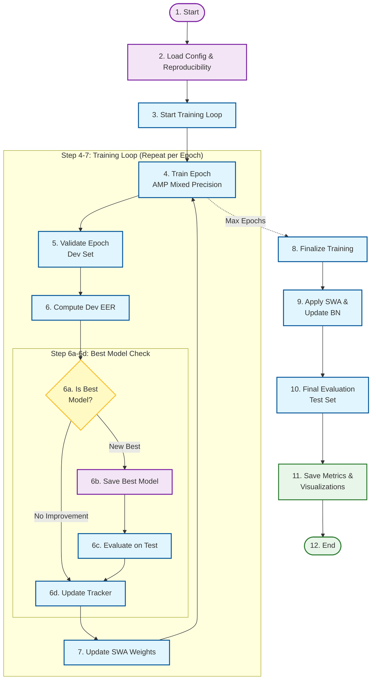
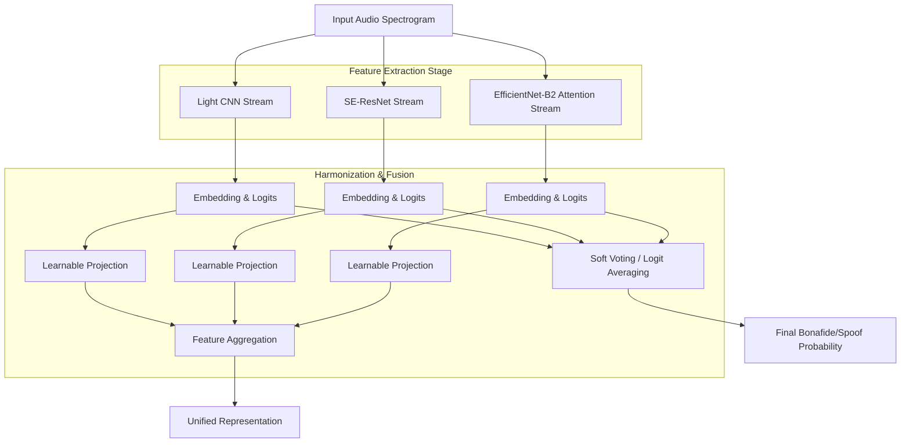

## 6. Training Procedure

### 6.1 Training Lifecycle Diagram

### 6.1.1 Training Steps Overview

| Step | Phase          | Description                                            |
| ---- | -------------- | ------------------------------------------------------ |
| 1    | Start          | Initialize training process                            |
| 2    | Load Config    | Load configuration file and set reproducibility seeds  |
| 3    | Start Loop     | Begin epoch-based training loop                        |
| 4    | Train Epoch    | Forward/backward pass with AMP mixed precision         |
| 5    | Validate       | Evaluate model on development set                      |
| 6    | Compute EER    | Calculate Equal Error Rate on validation predictions   |
| 6a   | Best Check     | Compare current EER with best recorded EER             |
| 6b   | Save Model     | Save checkpoint if new best model found                |
| 6c   | Test Eval      | Optionally evaluate on test set                        |
| 6d   | Update Tracker | Update training metrics and early stopping counter     |
| 7    | SWA Update     | Update Stochastic Weight Averaging weights             |
| 8    | Finalize       | Exit training loop after max epochs                    |
| 9    | Apply SWA      | Apply averaged weights and update BatchNorm statistics |
| 10   | Final Eval     | Evaluate final model on test set                       |
| 11   | Save Metrics   | Save all metrics, plots, and visualizations            |
| 12   | End            | Training complete                                      |

### 6.2 Training Configuration

| Hyperparameter        | Value     | Justification                              |
| --------------------- | --------- | ------------------------------------------ |
| Epochs                | 20        | Sufficient for convergence on dataset      |
| Batch Size            | 32        | Balanced GPU memory and gradient stability |
| Initial Learning Rate | $10^{-4}$ | Standard for Adam optimizer                |
| Weight Decay          | $10^{-4}$ | L2 regularization strength                 |
| Gradient Clip Norm    | 1.0       | Prevents gradient explosion                |

### 6.2 Mixed Precision Training

To accelerate training and reduce memory consumption, we employed Automatic Mixed Precision (AMP), Precision Selection, Training Loop with AMP

### 6.3 Stochastic Weight Averaging (SWA)

SWA improves generalization by averaging model weights traversed during training:

$$\mathbf{w}_{\text{SWA}} = \frac{1}{K}\sum_{k=1}^{K} \mathbf{w}_{n_k}$$

where $\{n_k\}$ are epochs selected for averaging (typically the last 50% of training).

**Implementation:**

- Average weights from epochs 10-20

- Update BatchNorm statistics on training set before evaluation

- Often yields 0.5-1.0% improvement in EER

### 6.4 Epoch Training Loop

The training process follows a standard supervised learning paradigm with several optimization techniques to ensure robust model convergence and generalization.

**Training Phase:**

During each epoch, the model operates in training mode where gradients are computed and parameters are updated. For each mini-batch from the training data loader, data augmentation techniques are applied on-the-fly to enhance model robustness. The optimization process utilizes efficient gradient management by resetting gradients with memory optimization before each forward pass.

Mixed precision training is employed through automatic mixed precision (AMP) to accelerate computation while maintaining numerical stability. The model generates both feature embeddings and classification logits, which are used to compute a weighted cross-entropy loss that addresses class imbalance. Gradient scaling is applied to prevent underflow in low-precision computations, followed by gradient clipping with a maximum norm of 1.0 to prevent exploding gradients and ensure training stability.

The learning rate scheduler updates after each optimization step rather than per epoch, enabling fine-grained learning rate adjustments throughout training.

**Validation Phase:**

After each training epoch, the model switches to evaluation mode and inference mode is enabled to disable gradient computation and reduce memory usage. The model is evaluated on the development set to compute the Equal Error Rate (EER), which serves as the primary metric for model selection.

**Model Checkpointing:**

The system implements a checkpoint mechanism that saves the model state whenever the development EER improves, ensuring that the best-performing model configuration is preserved for final evaluation and deployment.

**Stochastic Weight Averaging (Optional):**

For enhanced generalization, Stochastic Weight Averaging (SWA) can be enabled during the latter half of training. This technique maintains a running average of model weights, which often leads to improved performance and better convergence to flat minima in the loss landscape.

## 7. Model Validation and Selection

### 7.1 Score Generation

For each audio sample, the model produces a scalar score representing the bonafide likelihood:

$$s(\mathbf{x}) = \text{logit}_{\text{bonafide}}(\mathbf{x}) = \log\frac{p(y=1|\mathbf{x})}{p(y=0|\mathbf{x})}$$

Higher scores indicate higher confidence in bonafide classification.

### 7.2 Equal Error Rate (EER) Computation

EER is the primary evaluation metric, defined as the operating point where False Acceptance Rate (FAR) equals False Rejection Rate (FRR):

$$\text{FAR}(\theta) = \frac{|\{i: s_i \geq \theta, y_i = 0\}|}{|\{i: y_i = 0\}|}$$

$$\text{FRR}(\theta) = \frac{|\{i: s_i < \theta, y_i = 1\}|}{|\{i: y_i = 1\}|}$$

$$\text{EER} = \text{FAR}(\theta^*) = \text{FRR}(\theta^*) \text{ where } |\text{FAR}(\theta^*) - \text{FRR}(\theta^*)|$$ is minimized.

**Algorithm:**

1. Sort all scores and compute FAR, FRR at each unique threshold

2. Find threshold θ\* where |FAR(θ) - FRR(θ)| is minimized

3. EER = (FAR(θ*) + FRR(θ*)) / 2

### 7.3 Model Selection Criterion

The model checkpoint yielding the lowest EER on the validation set is selected for final evaluation on the test set. This prevents overfitting to validation data through early stopping.

## 8. Ensemble Strategy

### 8.1 Strategic Motivation

The deployment of an ensemble framework is motivated by the principle that diverse modeling approaches capture complementary aspects of the underlying data distribution. In the context of synthetic speech detection, different neural architectures exhibit distinct inductive biases: some are optimized for detecting local spectral artifacts, while others excel at modeling long-range temporal dependencies or learning global hierarchical features. By unifying these heterogeneous systems, the ensemble approach mitigates the individual weaknesses of constituent models, reduces prediction variance, and enhances overall generalization capability against unseen spoofing attacks.

### 8.2 Architectural Framework

The proposed ensemble architecture integrates multiple deep learning models into a coherent decision-making system. Unlike naive averaging methods, our approach employs a sophisticated fusion mechanism that harmonizes diverse feature representations. The system operates by processing the input audio spectrogram through parallel architectural branches, each yielding a high-dimensional feature embedding and a probabilistic classification score.

To address the challenge of varying dimensionality across different network architectures, a learnable projection mechanism is introduced. This component maps the heterogeneous embedding spaces into a unified latent subspace, enabling mathematical aggregation of semantic features. This design facilitates both decision-level fusion (soft voting) and feature-level fusion, providing a comprehensive characterization of the input signal.

### 8.3 Constituent Model Components

The optimal ensemble configuration comprises three distinct architectures, selected for their complementary feature extraction capabilities:

1.  **Light CNN (LCNN)**: Utilized for its efficiency in detecting high-frequency artifacts through Max-Feature-Map activations, acting as a specialized detector for vocoder traces.
2.  **Squeeze-and-Excitation ResNet (SE-ResNet)**: Incorporated to capture deep hierarchical patterns and channel-wise dependencies, providing robust representation of speaker identity and recording environment.
3.  **EfficientNet-B2 with Attention**: Employed to leverage transfer learning advantages and effective spatial attention mechanisms, focusing on salient spectro-temporal regions indicative of manipulation.

### 8.4 System Diagram

The following diagram illustrates the multi-stream ensemble architecture, demonstrating the parallel processing pathways and the fusion mechanism.

### 8.5 Information Fusion and Decision Making

The system employs a dual-strategy for information fusion:

**Logit Averaging (Soft Voting):**
The primary decision mechanism utilizes soft voting, where the predicted class probabilities from each constituent model are averaged to produce the final ensemble prediction. This method has been theoretically shown to minimize the expected error rate under the assumption of uncorrelated errors among ensemble members. By aggregating the confidence scores, the system filters out idiosyncratic noise associated with individual models, resulting in a more calibrated and reliable classification.

**Embedding Aggregation:**
For tasks requiring interpretability or downstream analysis, the feature embeddings are projected to a common dimensionality and averaged. This fused representation encapsulates the holistic acoustic characteristics captured by the entire ensemble, serving as a dense descriptor of the audio signal's authenticity.

### 8.6 Joint Optimization Strategy

The ensemble is optimized using an end-to-end joint training protocol. Rather than training models in isolation, the entire framework is updated simultaneously. The loss function is computed based on the aggregated predictions, allowing gradients to propagate back through all branches. This collaborative learning dynamic encourages the constituent models to specialize in different subsets of the data or distinct artifact types, effectively maximizing the diversity and coverage of the ensemble.
