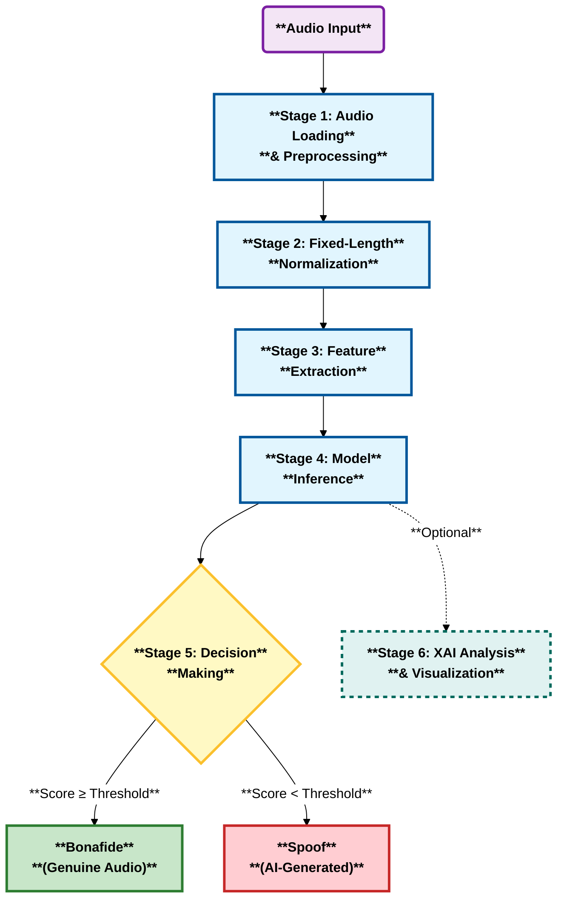

## 9. Inference Pipeline

### 9.1 Inference Flow



### 9.1.1 Inference Steps Overview

| Stage | Component                               | Description                                                          |
| ----- | --------------------------------------- | -------------------------------------------------------------------- |
| 1     | Audio Loading & Preprocessing           | Load audio, convert to mono, resample to 16kHz                       |
| 2     | Fixed-Length Normalization              | Pad/crop to 64,600 samples (~4 seconds)                              |
| 3     | Feature Extraction                      | Compute Log-Mel spectrogram, LFCC, CQT, or use raw waveform          |
| 4     | Model Inference                         | Forward pass through neural network, generate logits & probabilities |
| 5     | Decision Making                         | Compare bonafide score to threshold, classify as bonafide or spoof   |
| 6     | XAI Analysis & Visualization (Optional) | Generate GradCAM heatmap, overlay on spectrogram                     |

### 9.2 Pipeline Stages

The inference pipeline processes audio files through the following sequential stages:

**Stage 1: Audio Loading and Preprocessing**

The audio file is loaded from the specified path and its sampling rate is extracted. If the audio contains multiple channels (stereo or multi-channel), it is converted to mono by averaging across all channels. The waveform is then resampled to the standard 16 kHz sampling rate if it differs from this target rate, ensuring consistency with the training data format.

**Stage 2: Fixed-Length Normalization**

The waveform is normalized to a fixed length of 64,600 samples (approximately 4 seconds at 16 kHz). This is achieved through center padding, where shorter audio clips are symmetrically padded with zeros, and longer clips are center-cropped to match the target duration. This ensures uniform input dimensions for the neural network.

**Stage 3: Feature Extraction**

Acoustic features are extracted from the preprocessed waveform using the specified feature extraction method (typically Log-Mel spectrogram). The resulting feature representation is converted to a tensor format and reshaped to include batch and channel dimensions, preparing it for input to the convolutional neural network.

**Stage 4: Model Inference**

The model is set to evaluation mode to disable training-specific operations such as dropout and batch normalization updates. Inference mode is activated to disable gradient computation, reducing memory consumption and improving computational speed. The feature tensor is passed through the model to generate both embedding representations and classification logits.

**Stage 5: Probability Computation**

The logits are converted to probability scores using the softmax function. This transformation maps the raw model outputs to a probability distribution across the two classes (bonafide and spoof), where values range from 0 to 1 and sum to 1.

**Stage 6: Decision Making**

The bonafide probability score is compared against a predefined threshold (typically 0.5). If the score is greater than or equal to the threshold, the audio is classified as bonafide (genuine). If the score is below the threshold, the audio is classified as spoof (AI-generated or manipulated).

**Stage 7: Post-Processing and Visualization (Optional)**

For interpretability, the system can perform Explainable AI (XAI) analysis using techniques like GradCAM. This involves a backward pass from the target class score to the last convolutional layer to compute gradient-weighted activation maps. These maps are upsampled and overlaid on the original spectrogram to visualize the time-frequency regions that contributed most to the model's decision.

## 10. Evaluation Metrics

### 10.1 Primary Metric: Equal Error Rate (EER)

EER serves as the primary evaluation metric, providing a threshold-independent measure of system performance. It represents the operating point where the system makes equal proportions of false acceptances (spoof classified as bonafide) and false rejections (bonafide classified as spoof).

**Mathematical Definition:**

$$
\text{EER} = \text{FAR}(\theta^*) = \text{FRR}(\theta^*)
$$

where:

- $\text{FAR}(\theta) = P(s(\mathbf{x}) \geq \theta | y = 0)$ (False Acceptance Rate)

- $\text{FRR}(\theta) = P(s(\mathbf{x}) < \theta | y = 1)$ (False Rejection Rate)

- $\theta^*$ is the threshold satisfying $\text{FAR}(\theta^*) = \text{FRR}(\theta^*)$

**Advantages:**

- Threshold-independent comparison across systems

- Balanced assessment of both error types

- Standard metric in biometric and anti-spoofing research

### 10.2 Secondary Metric: Classification Accuracy

Accuracy at the EER threshold provides an intuitive performance measure:

$$\text{Accuracy} = \frac{TP + TN}{TP + TN + FP + FN}$$

where decisions are made using the EER threshold $\theta^*$.

### 10.3 Confusion Matrix

The confusion matrix provides a detailed breakdown of classification outcomes:

|                 | Predicted Fake      | Predicted Real      |
| --------------- | ------------------- | ------------------- |
| **Actual Fake** | True Negative (TN)  | False Positive (FP) |
| **Actual Real** | False Negative (FN) | True Positive (TP)  |

This matrix enables calculation of class-specific error rates and identification of systematic misclassification patterns.

### 10.4 Precision, Recall, and F1-Score

**Per-Class Metrics:**

$$\text{Precision}_c = \frac{TP_c}{TP_c + FP_c}$$

$$\text{Recall}_c = \frac{TP_c}{TP_c + FN_c}$$

$$\text{F1}_c = 2 \cdot \frac{\text{Precision}_c \cdot \text{Recall}_c}{\text{Precision}_c + \text{Recall}_c}$$

**Macro-Averaged Metrics:**

$$\text{Precision}_{\text{macro}} = \frac{1}{C}\sum_{c=1}^{C} \text{Precision}_c$$

These metrics provide insight into per-class performance, particularly useful when class distributions are imbalanced.

### 10.5 ROC Curve and AUC

The Receiver Operating Characteristic (ROC) curve plots True Positive Rate against False Positive Rate across all decision thresholds:

$$\text{TPR}(\theta) = \frac{TP(\theta)}{TP(\theta) + FN(\theta)}$$

$$\text{FPR}(\theta) = \frac{FP(\theta)}{FP(\theta) + TN(\theta)}$$

The Area Under the ROC Curve (AUC) provides a single scalar summary of classifier performance:

$$\text{AUC} = \int_0^1 \text{TPR}(\text{FPR}^{-1}(t)) \, dt$$

- AUC = 1.0: Perfect classifier
- AUC = 0.5: Random classifier
- AUC > 0.9: Excellent performance

### 10.6 Metrics Summary Table

| Metric              | Primary Use                           | Threshold-Dependent         |
| ------------------- | ------------------------------------- | --------------------------- |
| EER                 | Model selection, benchmark comparison | No (uses optimal threshold) |
| Accuracy            | Intuitive performance measure         | Yes (uses EER threshold)    |
| Confusion Matrix    | Error analysis                        | Yes                         |
| Precision/Recall/F1 | Per-class performance                 | Yes                         |
| ROC AUC             | Overall discrimination ability        | No                          |

## 11. Optimization Techniques

### 11.1 Mixed Precision Training

Mixed precision training reduces memory footprint and accelerates computation by using lower precision (FP16/BF16) for forward and backward passes while maintaining FP32 master weights.

**BFloat16 (BF16):**

- 8-bit exponent, 7-bit mantissa

- Native support on Ampere (A100, RTX 30/40 series) and newer

- Superior dynamic range: $\approx 10^{-45}$ to $10^{38}$

- No gradient scaling required

**Float16 (FP16):**

- 5-bit exponent, 10-bit mantissa

- Supported on all CUDA GPUs (compute capability ≥ 7.0)

- Requires gradient scaling to prevent underflow

- Dynamic range: $\approx 10^{-8}$ to $65504$

**Performance Gains:**

- Training speedup: 1.3-1.5×

- Memory reduction: ~40%

- No accuracy degradation

### 11.2 TensorFloat-32 (TF32)

TF32 is an intermediate precision format (19-bit) that accelerates FP32 matrix multiplications on Ampere+ GPUs:

```python

torch.backends.cuda.matmul.allow_tf32 = True

torch.backends.cudnn.allow_tf32 = True

```

**Characteristics:**

- Automatic conversion from FP32

- 8× throughput improvement on Ampere

- Negligible accuracy impact (<0.1% typical)

### 11.3 Channels-Last Memory Layout

Channels-last format $(N, H, W, C)$ improves memory locality and enables hardware-specific optimizations:

$$\text{Speedup} \approx 1.2\text{-}1.3\times \text{ on modern GPUs}$$

### 11.4 Gradient Accumulation

For effective large batch training with limited memory.

Effective batch size: $B_{\text{eff}} = B \times A$ where $A$ is accumulation steps.

## 12. Reproducibility

### 12.1 Random Seed Control

To ensure reproducibility of experimental results, complete control over all sources of randomness is essential. This involves setting deterministic seeds for all random number generators used throughout the pipeline, including Python's native random module, NumPy's random number generator, PyTorch's CPU and GPU random generators, and CUDA operations.

Additionally, deterministic operation modes are enabled for CUDA Deep Neural Network library (cuDNN) operations. While this ensures complete reproducibility, it disables certain performance optimizations such as auto-tuning algorithms, which may result in a performance reduction of approximately 10-20% in training and inference speed.

**Trade-off:** The choice between deterministic reproducibility and computational performance should be made based on experimental requirements. Deterministic mode is recommended for final experiments and benchmark comparisons, while non-deterministic mode may be acceptable during exploratory research phases.

### 12.2 DataLoader Worker Seeding

Multi-threaded data loading introduces additional sources of randomness that must be controlled. Each worker process in the data loader is assigned a unique but deterministic seed derived from the master random seed. This ensures that data augmentation operations, shuffling, and sampling remain consistent across different runs while maintaining parallelism during data loading.

A dedicated random number generator is created and seeded for the data loader, and a worker initialization function ensures that each worker thread initializes its random state deterministically based on the worker ID and the master seed.

### 12.3 Reproducibility Checklist

To fully reproduce experimental results, the following components must be identical across different runs:

✓ **Software versions**: PyTorch, CUDA, cuDNN, Python, and all dependency libraries  
✓ **Random seeds**: NumPy, PyTorch, Python, and CUDA random number generators  
✓ **Hyperparameters**: Learning rate, batch size, number of epochs, weight decay, and all optimization parameters  
✓ **Dataset preprocessing**: Feature extraction methods, normalization parameters, and augmentation settings  
✓ **Model architecture**: Network structure, layer configurations, and weight initialization methods  
✓ **Hardware specifications**: GPU model may affect numerical precision due to different floating-point implementations  
✓ **Operating system**: OS version and CUDA driver versions can impact computational behavior

### 12.4 Configuration Management

To facilitate reproducibility and experimental tracking, all configuration parameters are systematically documented and stored in structured format. This includes three primary configuration categories:

**Model Configuration**: Specifies the neural network architecture (e.g., EfficientNetB2), whether pretrained weights are used, regularization parameters such as dropout rates, and any architectural modifications.

**Training Configuration**: Documents all training hyperparameters including the number of epochs, batch size, learning rate, optimizer type (e.g., Adam), learning rate scheduler (e.g., cosine annealing), and any additional training techniques such as gradient clipping or mixed precision training.

**Data Configuration**: Records feature extraction type (e.g., Log-Mel spectrogram), audio sampling rate, fixed segment length for normalization, and whether data augmentation is enabled along with specific augmentation parameters.

All configurations also include the master random seed value to enable exact reproduction of results. These configuration files serve as comprehensive documentation of each experiment and can be version-controlled alongside model checkpoints and training logs.

## 13. Explainable AI (XAI) Methodology

### 13.1 Motivation and Objectives

Explainability is crucial for audio deepfake detection systems deployed in real-world applications such as forensic analysis, content moderation, and legal proceedings. Understanding _why_ a model classifies audio as genuine or synthetic builds trust, enables error analysis, and provides actionable insights for system improvement.

**Key Objectives:**

1. **Spatial Attribution**: Reveal which acoustic regions influence classification using Grad-CAM.
2. **Concept-Level Understanding**: Identify which semantic audio concepts drive predictions using TCAV.
3. **Model Comparison**: Analyze why certain architectures outperform others through explainability insights.
4. **User Trust**: Provide interpretable evidence for non-technical stakeholders.

### 13.2 GradCAM for Audio Deepfake Detection

GradCAM (Gradient-weighted Class Activation Mapping) is used to visualize which regions of the input spectrogram most strongly influence the model's decision. By computing the gradients of the target class with respect to the final convolutional layer, GradCAM produces a heatmap highlighting important time-frequency regions.

**Implementation Steps:**

1. Forward pass the input through the model to obtain predictions.
2. Compute gradients of the output with respect to the last convolutional feature map.
3. Weight the feature maps by the computed gradients and aggregate them.
4. Apply a ReLU activation to obtain the final heatmap.
5. Overlay the heatmap on the input spectrogram for visual interpretation.

GradCAM provides interpretable visualizations that help users and researchers understand which parts of the audio signal contribute most to the classification decision, supporting transparency and trust in the system.

### 13.2 Implemented XAI Methods

The system implements complementary explainability methods, each providing different insights into model behavior:

| Method   | Type           | Description                                     |
| -------- | -------------- | ----------------------------------------------- |
| Grad-CAM | Gradient-based | Class activation mapping via gradient weighting |
| TCAV     | Concept-based  | Testing with Concept Activation Vectors         |

#### 13.2.1 Attention Extraction

For architectures with attention mechanisms, attention weights provide inherent interpretability by revealing which temporal or spectral regions the model focuses on during classification.

#### 13.2.2 Grad-CAM

Generates visual explanations using gradients flowing into the last convolutional layer:

$$L_{\text{Grad-CAM}}^c = \text{ReLU}\left(\sum_k \alpha_k^c A^k\right)$$

where $\alpha_k^c = \frac{1}{Z} \sum_i \sum_j \frac{\partial y^c}{\partial A_{ij}^k}$ are importance weights.

#### 13.2.3 TCAV (Testing with Concept Activation Vectors)

TCAV provides concept-level explanations by measuring how much a high-level concept influences model predictions. Unlike gradient-based methods that highlight input regions, TCAV reveals _which semantic concepts_ drive classification decisions.

**Concept Definitions for Audio Deepfake Detection:**

| Concept | Description |
|---------|-------------|
| High Freq Artifacts | Synthesis artifacts common in fake audio (>4kHz) |
| Low Freq Energy | Fundamental frequency patterns (~100-300 Hz) |
| Temporal Discontinuity | Glitches or unnatural transitions |
| Noise Floor | Background noise characteristics |
| Harmonic Structure | Natural voice harmonic patterns |
| Spectral Flatness | Tonal vs. noise-like characteristics |

**Mathematical Formulation:**

Given a concept $C$, TCAV trains a linear classifier (CAV) to separate concept examples from random examples in the model's activation space:

$$v_C = \arg\min_v \sum_{x \in P \cup N} \mathcal{L}(v \cdot f_l(x), y_x)$$

where $f_l(x)$ is the activation at layer $l$, $P$ is the set of concept examples, and $N$ is the set of random examples.

The TCAV score measures directional sensitivity of class $c$ predictions to concept $C$:

$$\text{TCAV}_{C,c} = \frac{|\{x \in X_c : S_{C,c}(x) > 0\}|}{|X_c|}$$

where $S_{C,c}(x) = \nabla h_{l,c}(f_l(x)) \cdot v_C$ is the directional derivative.

**Implementation Steps:**

1. **Concept Dataset Creation**: Generate synthetic audio examples representing each concept (e.g., audio with high-frequency artifacts, audio with specific noise floor characteristics).
2. **CAV Training**: Train binary linear classifiers to distinguish concept examples from random examples in the model's intermediate layer activations.
3. **CAV Accuracy Validation**: Verify that the learned CAVs accurately capture the intended concepts (target: >90% accuracy).
4. **Sensitivity Computation**: Calculate directional derivatives of class predictions with respect to each CAV.
5. **TCAV Score Aggregation**: Compute the fraction of inputs for which moving toward a concept increases class probability.

**Interpretation Guidelines:**

- **High TCAV Score (>0.1)**: The concept strongly influences predictions for that class.
- **CAV Accuracy (100%)**: The concept is well-separated in activation space, indicating reliable measurements.
- **Differential Concept Usage**: Effective models use different concepts for detecting FAKE vs. REAL audio.

### 13.3 Visualization

**Grad-CAM Visualizations:**

GradCAM visualizations are presented as heatmaps overlaid on input spectrograms:

- **High-intensity regions**: Indicate time-frequency areas that most strongly influenced the model's prediction.
- **Temporal axis**: Shows which time segments in the audio were most relevant for the decision.
- **Frequency axis**: Highlights frequency bands that contributed to the classification.

**TCAV Visualizations:**

TCAV results are presented as bar charts showing concept importance:

- **TCAV Score**: Displayed per concept, indicating the fraction of inputs where the concept positively influences the target class.
- **CAV Accuracy**: Shown alongside each score to validate concept reliability.
- **Comparative Analysis**: Side-by-side comparison of concept importance for FAKE vs. REAL classes reveals discriminative strategies.

**Combined Interpretation:**

Grad-CAM and TCAV provide complementary insights:
- Grad-CAM answers: "Where in the spectrogram does the model focus?"
- TCAV answers: "What acoustic concepts drive the prediction?"

This dual approach provides comprehensive interpretable evidence for model decisions, helping users understand both the spatial regions and semantic concepts that contribute to deepfake detection outcomes.

## 14. Conclusion

This methodology presents a comprehensive deep learning framework for audio deepfake detection, incorporating state-of-the-art neural architectures, robust data augmentation, and advanced training techniques. The systematic approach—from feature extraction through ensemble inference—provides a reproducible pipeline achieving competitive performance on the Fake-or-Real dataset.

Key contributions include:

1. **Multi-modal feature extraction** supporting diverse acoustic representations

2. **Extensive augmentation pipeline** simulating realistic acoustic variability

3. **Optimized training procedures** leveraging mixed precision and weight averaging

4. **Ensemble strategies** combining complementary models for robust detection

5. **Production-ready inference** with real-time processing capabilities

The methodology establishes a foundation for future research in audio forensics, with extensibility to additional datasets, architectures, and evaluation protocols.
