# AI Voice Detection Experiment Results

This document presents the experimental results for audio deepfake detection using various model architectures and feature extraction methods on the FakeorReal V3 dataset.

---

## Experimental Setup

- **Dataset**: FakeorReal V3
- **Training Epochs**: 20
- **Data Augmentation**: Random noise, Pitch shift, Time stretch etc
- **Weight Averaging**: SWA (Stochastic Weight Averaging)
- **Evaluation**: Best development model

---

## Model Experiments

### EfficientNet-B2 with Attention

#### Mel Spectrogram (Feature Type 1)

```python
%run main.py --config config/EfficientNetB2_Attention.conf --feature_type 1 --dataset 1 --epochs 20 --random_noise --weight_avg --eval_best --dataset_version 3
```

**Development Set Metrics:**
- Accuracy: 99.96% | ROC AUC: 1.0000 | EER: 0.07%

**Classification Report (Dev):**
|              | Precision | Recall | F1-Score | Support |
|--------------|-----------|--------|----------|---------|
| Fake/Spoof   | 1.0000    | 0.9993 | 0.9996   | 1413    |
| Real/Bonafide| 0.9993    | 1.0000 | 0.9996   | 1413    |
| **Accuracy** |           |        | 0.9996   | 2826    |

**Confusion Matrix (Dev):**
|                      | Pred: Fake | Pred: Real |
|----------------------|------------|------------|
| Actual: Fake/Spoof   | 1412       | 1          |
| Actual: Real/Bonafide| 0          | 1413       |


**Evaluation Set Metrics:**
- Accuracy: 97.70% | ROC AUC: 0.9978 | EER: 2.39%

**Classification Report (Eval):**
|              | Precision | Recall | F1-Score | Support |
|--------------|-----------|--------|----------|---------|
| Fake/Spoof   | 0.9779    | 0.9761 | 0.9770   | 544     |
| Real/Bonafide| 0.9761    | 0.9779 | 0.9770   | 544     |
| **Accuracy** |           |        | 0.9770   | 1088    |

**Confusion Matrix (Eval):**
|                      | Pred: Fake | Pred: Real |
|----------------------|------------|------------|
| Actual: Fake/Spoof   | 531        | 13         |
| Actual: Real/Bonafide| 12         | 532        |


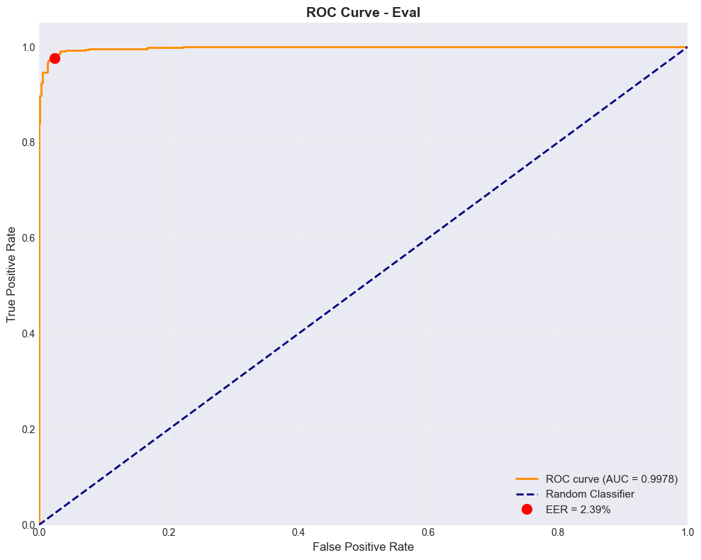
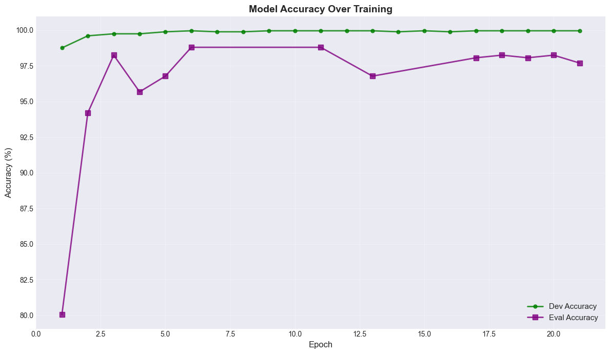

**Final Results: EER: 1.103%, Accuracy: 97.70%**

---

#### LFCC (Feature Type 2)

```python
%run main.py --config config/EfficientNetB2_Attention.conf --feature_type 2 --dataset 1 --epochs 20 --random_noise --weight_avg --eval_best --dataset_version 3
```

**Development Set Metrics:**
- Accuracy: 99.47% | ROC AUC: 0.9999 | EER: 0.42%

**Evaluation Set Metrics:**
- Accuracy: 76.75% | ROC AUC: 0.8357 | EER: 23.35%

**Confusion Matrix (Eval):**
|                      | Pred: Fake | Pred: Real |
|----------------------|------------|------------|
| Actual: Fake/Spoof   | 417        | 127        |
| Actual: Real/Bonafide| 126        | 418        |

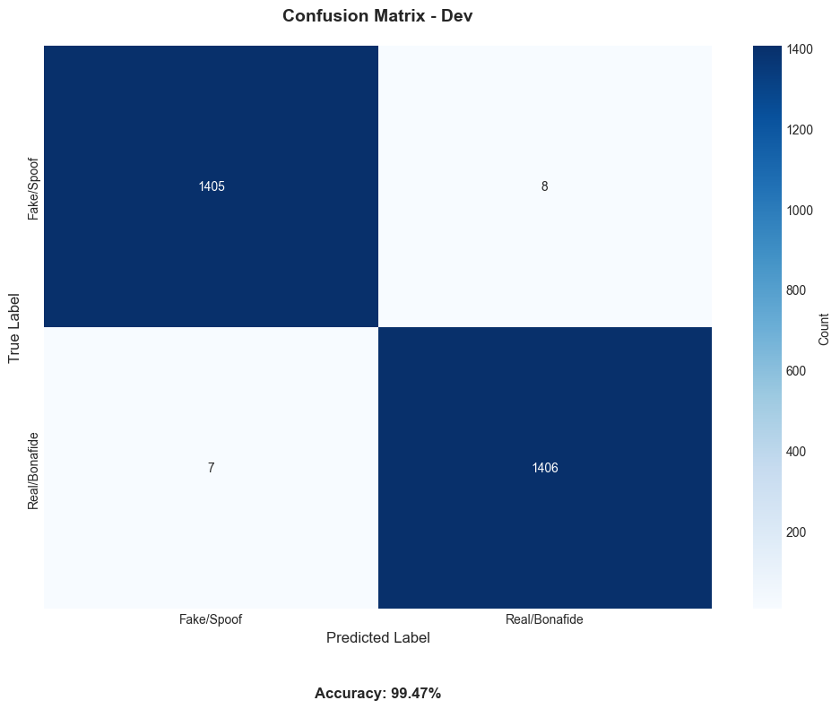


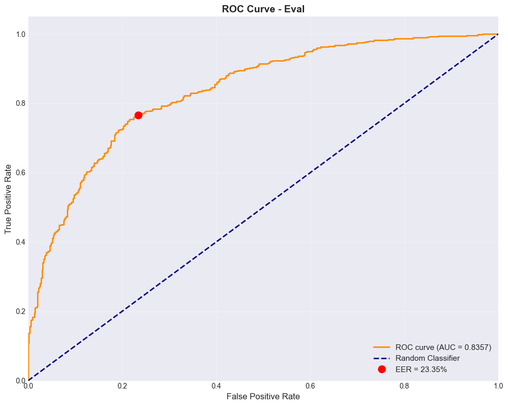
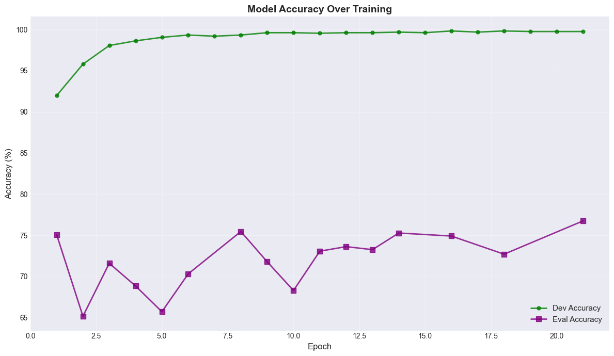

**Final Results: EER: 23.346%, Accuracy: 76.75%**

---

#### CQT (Feature Type 4)

```python
%run main.py --config config/EfficientNetB2_Attention.conf --feature_type 4 --dataset 1 --epochs 20 --random_noise --weight_avg --eval_best --dataset_version 3
```

**Development Set Metrics:**
- Accuracy: 99.82% | ROC AUC: 1.0000 | EER: 0.14%

**Evaluation Set Metrics:**
- Accuracy: 96.05% | ROC AUC: 0.9905 | EER: 3.68%

**Confusion Matrix (Eval):**
|                      | Pred: Fake | Pred: Real |
|----------------------|------------|------------|
| Actual: Fake/Spoof   | 522        | 22         |
| Actual: Real/Bonafide| 21         | 523        |


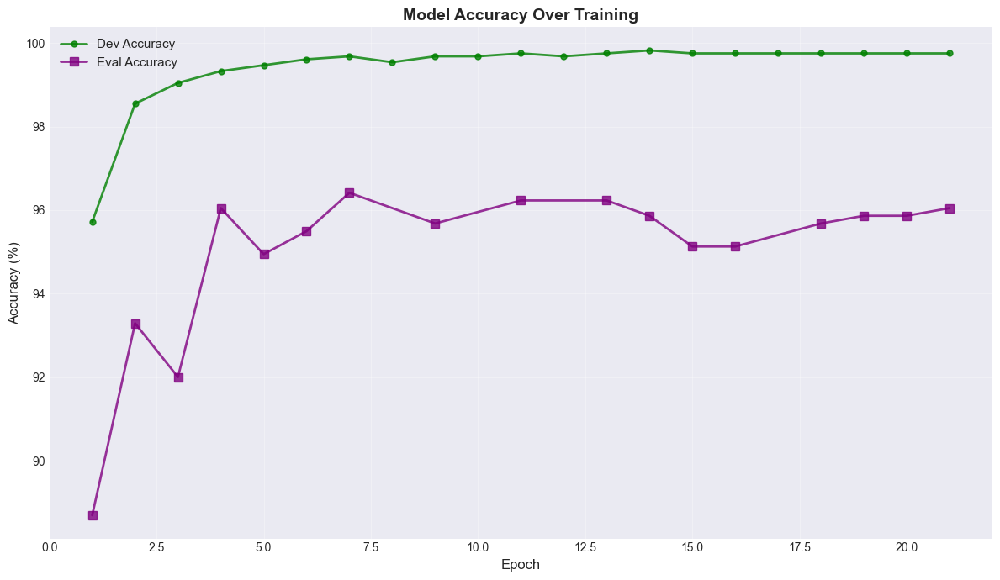

**Final Results: EER: 3.493%, Accuracy: 96.05%**

---

### EfficientNet-B2

#### Mel Spectrogram (Feature Type 1)

```python
%run main.py --config config/EfficientNetB2.conf --feature_type 1 --dataset 1 --epochs 20 --random_noise --weight_avg --eval_best --dataset_version 3
```

**Development Set Metrics:**
- Accuracy: 99.96% | ROC AUC: 1.0000 | EER: 0.07%

**Evaluation Set Metrics:**
- Accuracy: 96.97% | ROC AUC: 0.9944 | EER: 3.12%

**Confusion Matrix (Eval):**
|                      | Pred: Fake | Pred: Real |
|----------------------|------------|------------|
| Actual: Fake/Spoof   | 527        | 17         |
| Actual: Real/Bonafide| 16         | 528        |


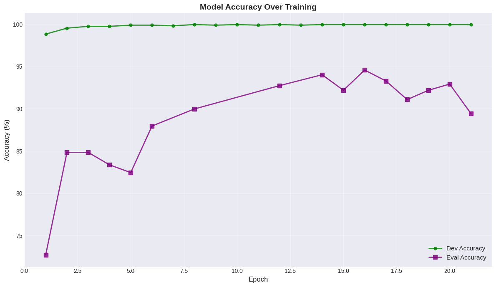

**Final Results: EER: 2.757%, Accuracy: 96.97%**

---

#### LFCC (Feature Type 2)

```python
%run main.py --config config/EfficientNetB2.conf --feature_type 2 --dataset 1 --epochs 20 --random_noise --weight_avg --eval_best --dataset_version 3
```

**Development Set Metrics:**
- Accuracy: 99.40% | ROC AUC: 0.9998 | EER: 0.35%

**Evaluation Set Metrics:**
- Accuracy: 72.52% | ROC AUC: 0.8100 | EER: 27.57%

**Confusion Matrix (Eval):**
|                      | Pred: Fake | Pred: Real |
|----------------------|------------|------------|
| Actual: Fake/Spoof   | 394        | 150        |
| Actual: Real/Bonafide| 149        | 395        |


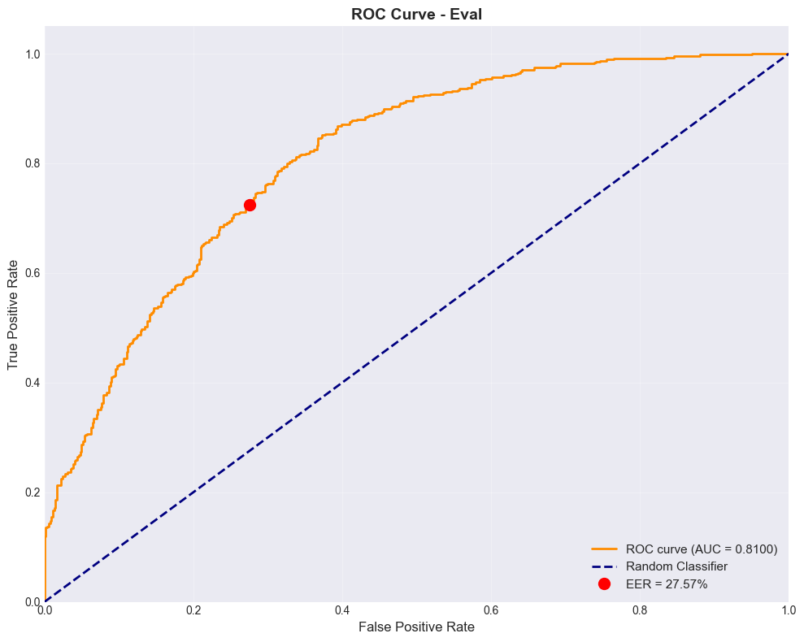
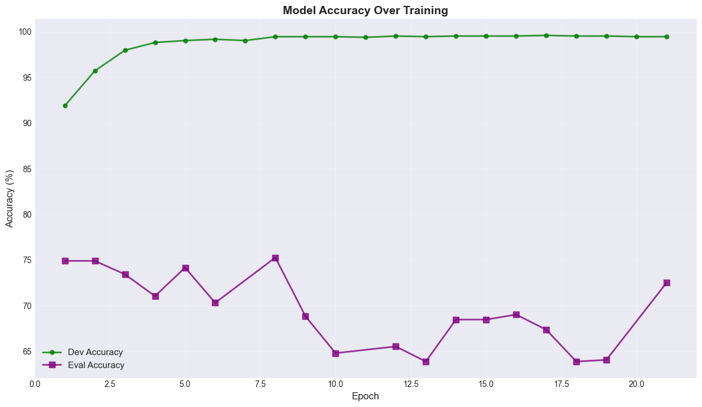

**Final Results: EER: 24.632%, Accuracy: 72.52%**

---

#### CQT (Feature Type 4)

```python
%run main.py --config config/EfficientNetB2.conf --feature_type 4 --dataset 1 --epochs 20 --random_noise --weight_avg --eval_best --dataset_version 3
```

**Development Set Metrics:**
- Accuracy: 99.68% | ROC AUC: 1.0000 | EER: 0.35%

**Evaluation Set Metrics:**
- Accuracy: 96.78% | ROC AUC: 0.9928 | EER: 3.31%

**Confusion Matrix (Eval):**
|                      | Pred: Fake | Pred: Real |
|----------------------|------------|------------|
| Actual: Fake/Spoof   | 526        | 18         |
| Actual: Real/Bonafide| 17         | 527        |


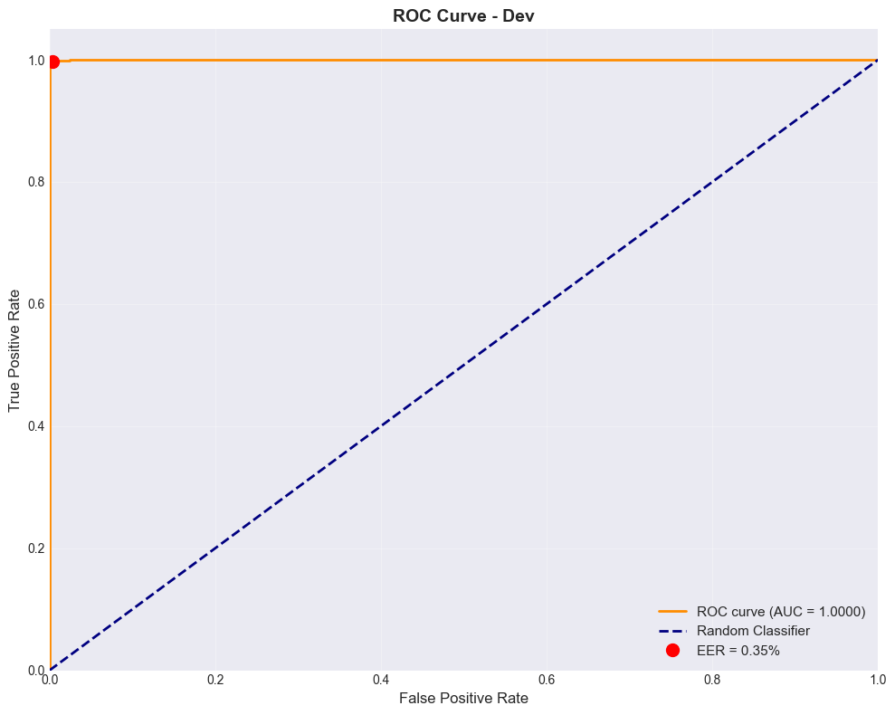


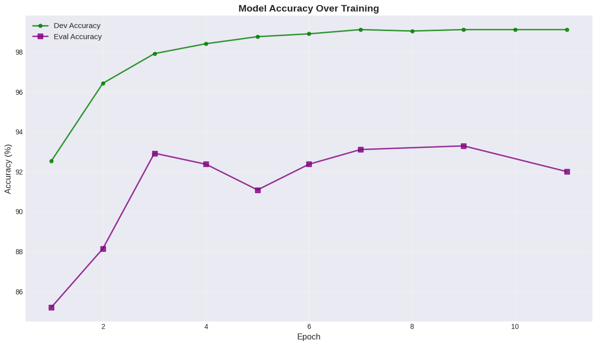

**Final Results: EER: 2.757%, Accuracy: 96.78%**

---

### LCNN Large

#### Mel Spectrogram (Feature Type 1)

```python
%run main.py --config config/LCNN_Large.conf --feature_type 1 --dataset 1 --epochs 20 --random_noise --weight_avg --eval_best --dataset_version 3
```

**Development Set Metrics:**
- Accuracy: 99.75% | ROC AUC: 0.9999 | EER: 0.28%

**Evaluation Set Metrics:**
- Accuracy: 91.82% | ROC AUC: 0.9771 | EER: 8.27%

**Confusion Matrix (Eval):**
|                      | Pred: Fake | Pred: Real |
|----------------------|------------|------------|
| Actual: Fake/Spoof   | 499        | 45         |
| Actual: Real/Bonafide| 44         | 500        |


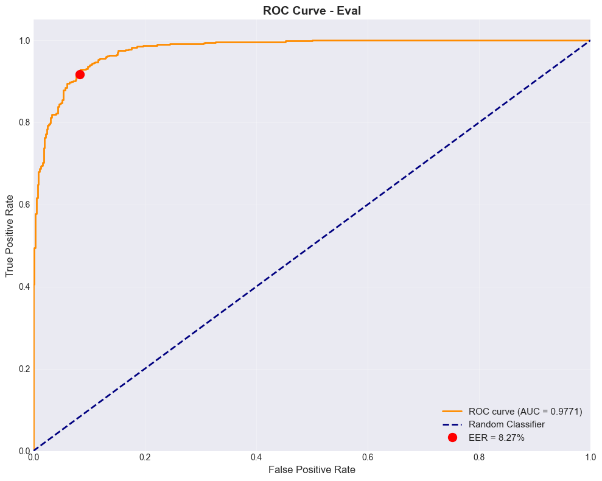
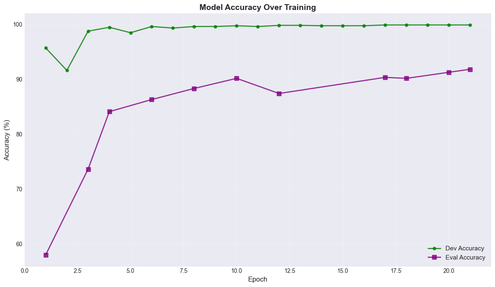

**Final Results: EER: 8.088%, Accuracy: 91.82%**

---

#### LFCC (Feature Type 2)

```python
%run main.py --config config/LCNN_Large.conf --feature_type 2 --dataset 1 --epochs 20 --random_noise --weight_avg --eval_best --dataset_version 3
```

**Development Set Metrics:**
- Accuracy: 99.40% | ROC AUC: 0.9999 | EER: 0.64%

**Evaluation Set Metrics:**
- Accuracy: 94.94% | ROC AUC: 0.9890 | EER: 5.15%

**Confusion Matrix (Eval):**
|                      | Pred: Fake | Pred: Real |
|----------------------|------------|------------|
| Actual: Fake/Spoof   | 516        | 28         |
| Actual: Real/Bonafide| 27         | 517        |


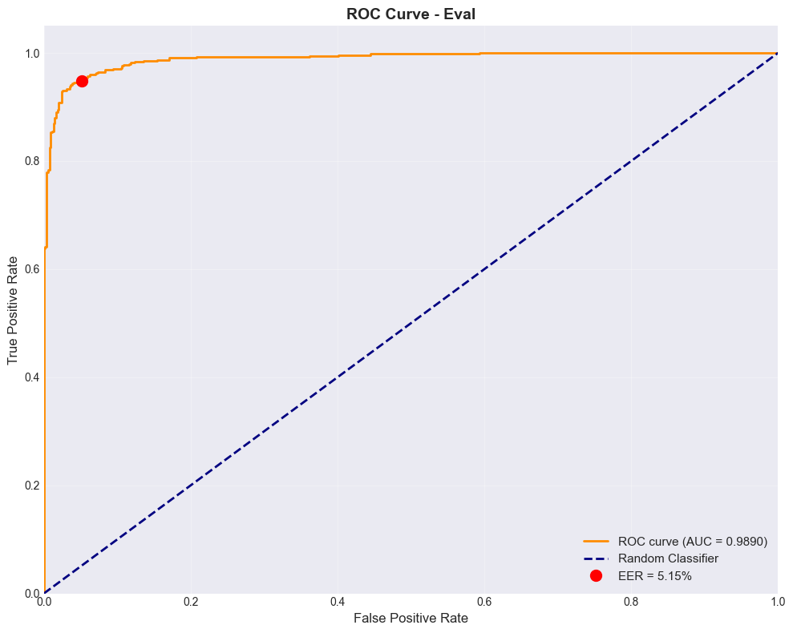
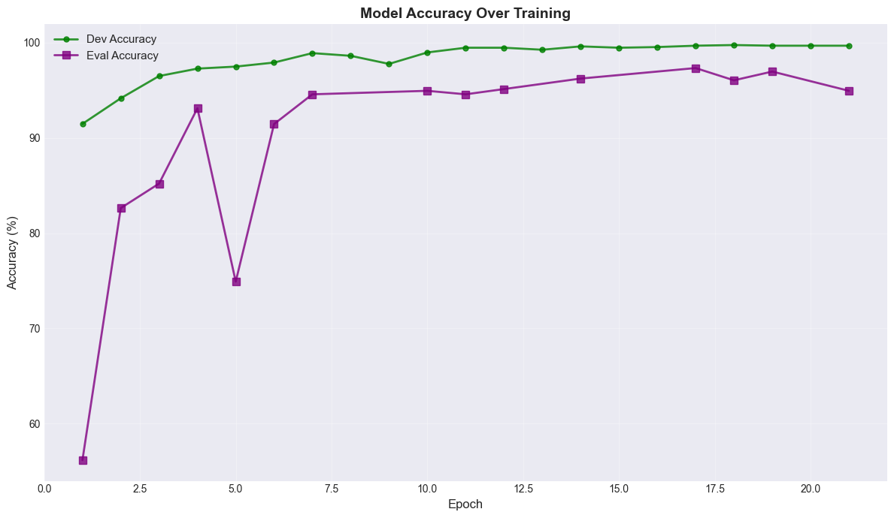

**Final Results: EER: 2.757%, Accuracy: 94.94%**

---

#### CQT (Feature Type 4)

```python
%run main.py --config config/LCNN_Large.conf --feature_type 4 --dataset 1 --epochs 20 --random_noise --weight_avg --eval_best --dataset_version 3
```

**Development Set Metrics:**
- Accuracy: 99.47% | ROC AUC: 0.9996 | EER: 0.21%

**Evaluation Set Metrics:**
- Accuracy: 95.50% | ROC AUC: 0.9907 | EER: 3.86%

**Confusion Matrix (Eval):**
|                      | Pred: Fake | Pred: Real |
|----------------------|------------|------------|
| Actual: Fake/Spoof   | 519        | 25         |
| Actual: Real/Bonafide| 24         | 520        |


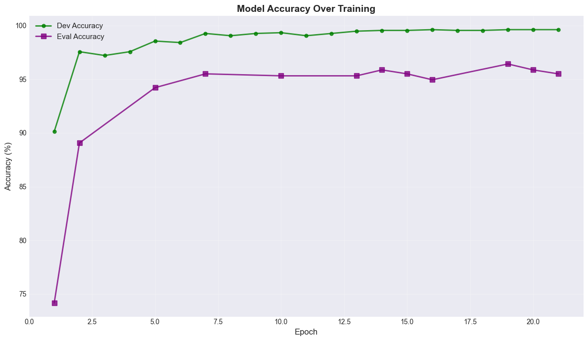

**Final Results: EER: 3.676%, Accuracy: 95.50%**

---

### LCNN

#### Mel Spectrogram (Feature Type 1)

```python
%run main.py --config config/LCNN.conf --feature_type 1 --dataset 1 --epochs 20 --random_noise --weight_avg --eval_best --dataset_version 3
```

**Development Set Metrics:**
- Accuracy: 99.82% | ROC AUC: 1.0000 | EER: 0.14%

**Evaluation Set Metrics:**
- Accuracy: 95.31% | ROC AUC: 0.9913 | EER: 4.78%

**Confusion Matrix (Eval):**
|                      | Pred: Fake | Pred: Real |
|----------------------|------------|------------|
| Actual: Fake/Spoof   | 518        | 26         |
| Actual: Real/Bonafide| 25         | 519        |


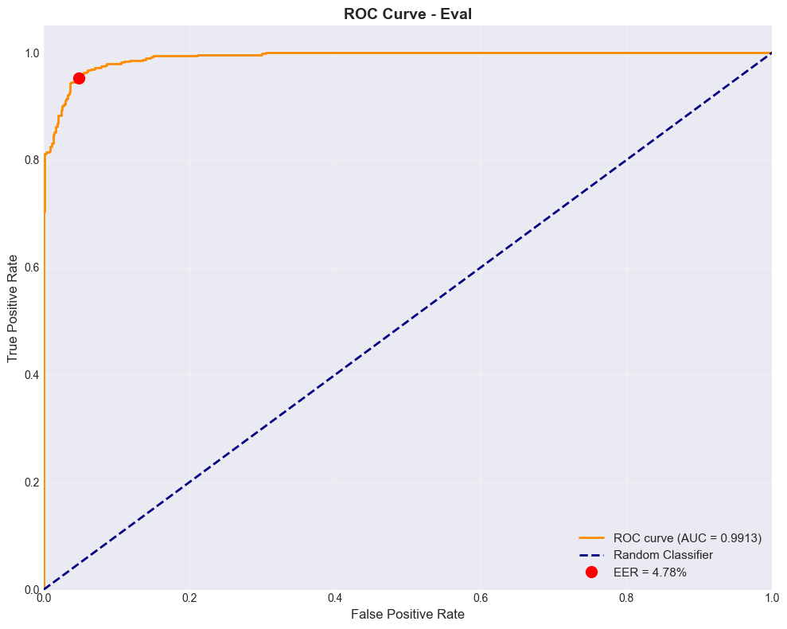
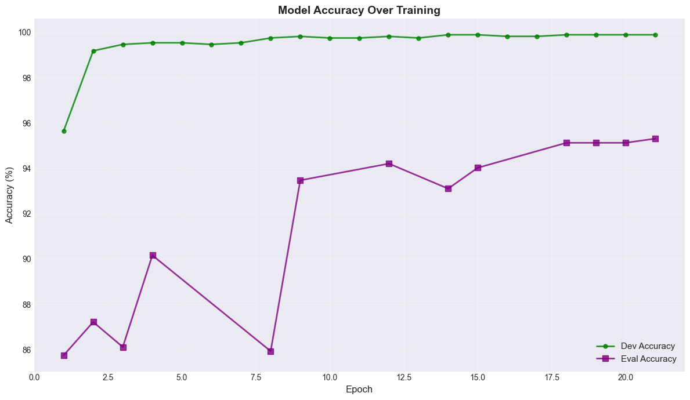

**Final Results: EER: 4.779%, Accuracy: 95.31%**

---

#### LFCC (Feature Type 2)

```python
%run main.py --config config/LCNN.conf --feature_type 2 --dataset 1 --epochs 20 --random_noise --weight_avg --eval_best --dataset_version 3
```

**Development Set Metrics:**
- Accuracy: 99.26% | ROC AUC: 0.9997 | EER: 0.78%

**Evaluation Set Metrics:**
- Accuracy: 91.08% | ROC AUC: 0.9653 | EER: 8.82%

**Confusion Matrix (Eval):**
|                      | Pred: Fake | Pred: Real |
|----------------------|------------|------------|
| Actual: Fake/Spoof   | 495        | 49         |
| Actual: Real/Bonafide| 48         | 496        |


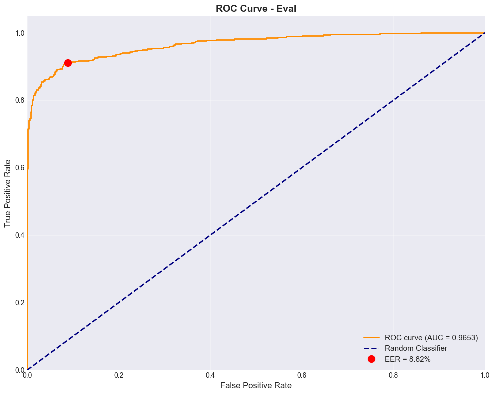
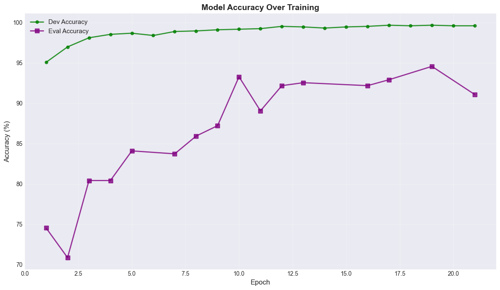

**Final Results: EER: 5.331%, Accuracy: 91.08%**

---

#### CQT (Feature Type 4)

```python
%run main.py --config config/LCNN.conf --feature_type 4 --dataset 1 --epochs 20 --random_noise --weight_avg --eval_best --dataset_version 3
```

**Development Set Metrics:**
- Accuracy: 99.47% | ROC AUC: 0.9996 | EER: 0.35%

**Evaluation Set Metrics:**
- Accuracy: 95.50% | ROC AUC: 0.9903 | EER: 4.78%

**Confusion Matrix (Eval):**
|                      | Pred: Fake | Pred: Real |
|----------------------|------------|------------|
| Actual: Fake/Spoof   | 519        | 25         |
| Actual: Real/Bonafide| 24         | 520        |


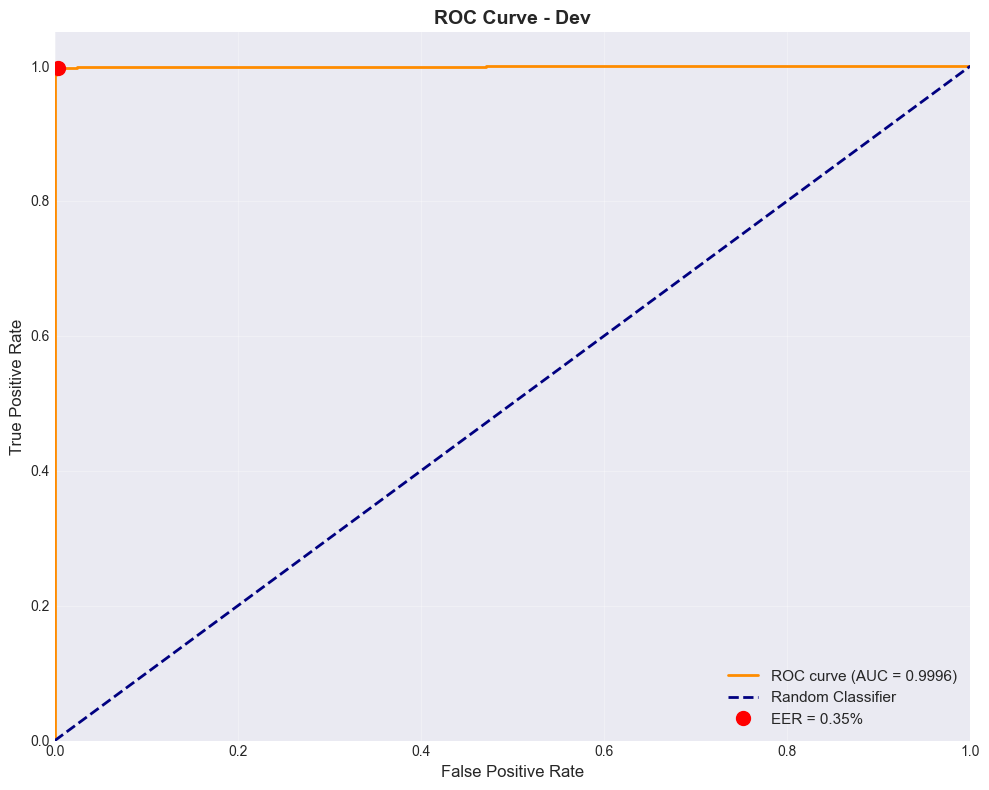


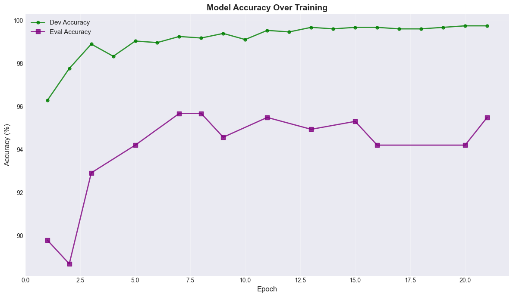

**Final Results: EER: 4.228%, Accuracy: 95.50%**

---

### SEResNet

#### Mel Spectrogram (Feature Type 1)

```python
%run main.py --config config/SEResNet.conf --feature_type 1 --dataset 1 --epochs 20 --random_noise --weight_avg --eval_best --dataset_version 3
```

**Development Set Metrics:**
- Accuracy: 99.89% | ROC AUC: 1.0000 | EER: 0.07%

**Evaluation Set Metrics:**
- Accuracy: 89.43% | ROC AUC: 0.9674 | EER: 10.66%

**Confusion Matrix (Eval):**
|                      | Pred: Fake | Pred: Real |
|----------------------|------------|------------|
| Actual: Fake/Spoof   | 486        | 58         |
| Actual: Real/Bonafide| 57         | 487        |


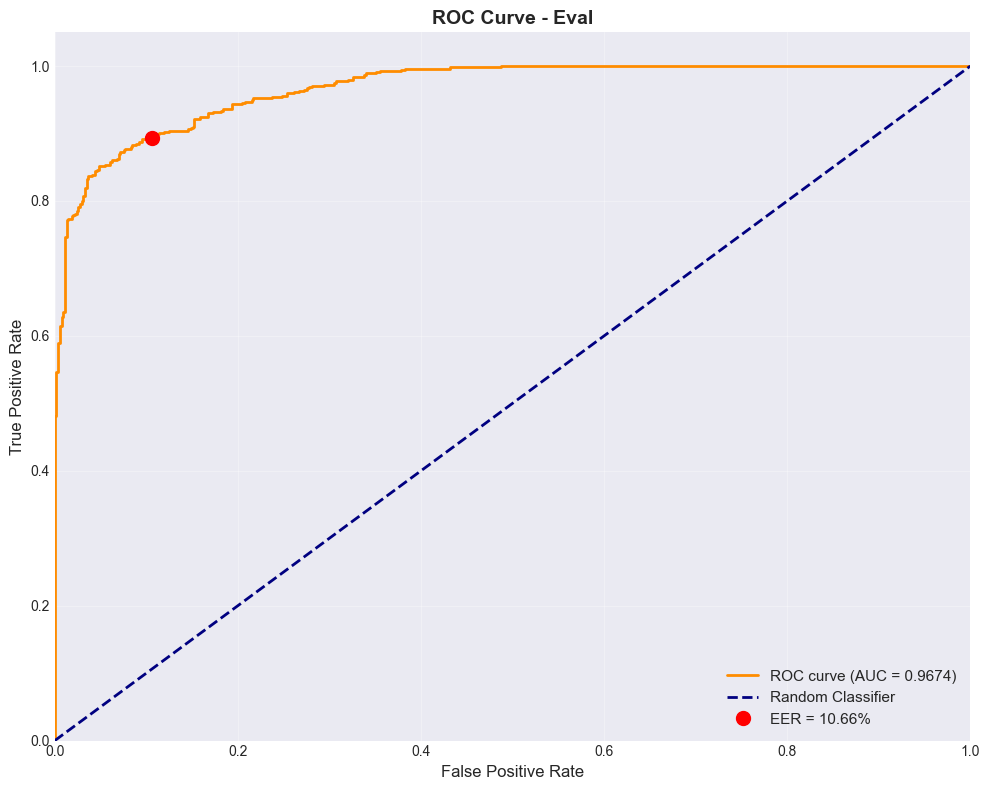
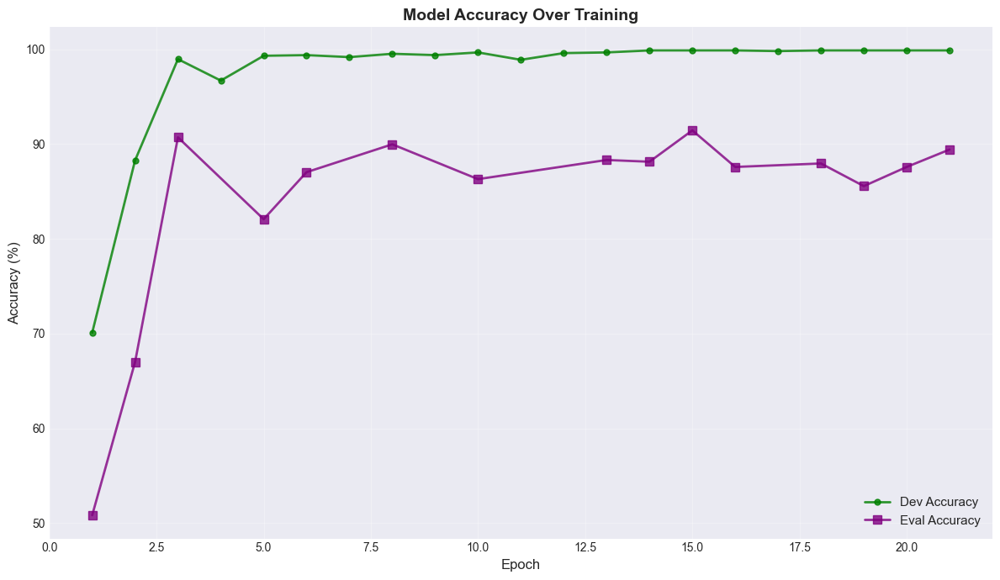

**Final Results: EER: 8.456%, Accuracy: 89.43%**

---

#### LFCC (Feature Type 2)

```python
%run main.py --config config/SEResNet.conf --feature_type 2 --dataset 1 --epochs 20 --random_noise --weight_avg --eval_best --dataset_version 3
```

**Development Set Metrics:**
- Accuracy: 99.61% | ROC AUC: 0.9999 | EER: 0.35%

**Evaluation Set Metrics:**
- Accuracy: 92.00% | ROC AUC: 0.9750 | EER: 8.09%

**Confusion Matrix (Eval):**
|                      | Pred: Fake | Pred: Real |
|----------------------|------------|------------|
| Actual: Fake/Spoof   | 500        | 44         |
| Actual: Real/Bonafide| 43         | 501        |


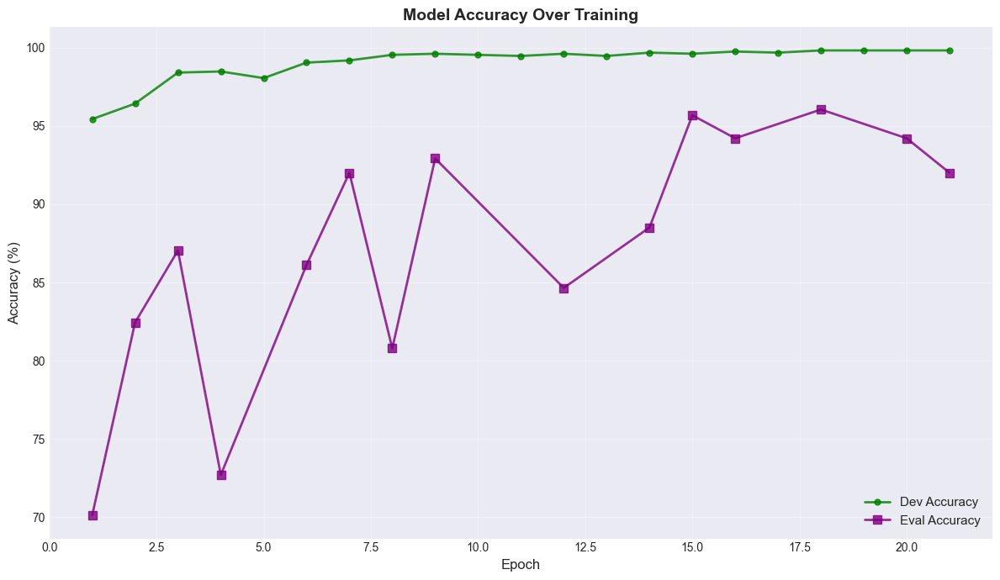

**Final Results: EER: 3.860%, Accuracy: 92.00%**

---

#### CQT (Feature Type 4)

```python
%run main.py --config config/SEResNet.conf --feature_type 4 --dataset 1 --epochs 20 --random_noise --weight_avg --eval_best --dataset_version 3
```

**Development Set Metrics:**
- Accuracy: 99.54% | ROC AUC: 0.9997 | EER: 0.50%

**Evaluation Set Metrics:**
- Accuracy: 96.05% | ROC AUC: 0.9908 | EER: 3.86%

**Confusion Matrix (Eval):**
|                      | Pred: Fake | Pred: Real |
|----------------------|------------|------------|
| Actual: Fake/Spoof   | 522        | 22         |
| Actual: Real/Bonafide| 21         | 523        |


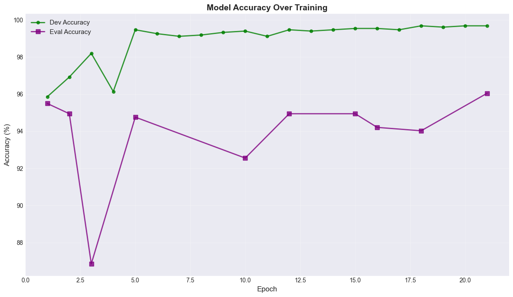

**Final Results: EER: 3.860%, Accuracy: 96.05%**

---

## Ensemble Model

```python
%run main.py --config config/ensemble.conf --feature_type 1 --dataset 1 --epochs 20 --random_noise --weight_avg --eval_best --dataset_version 3
```

**Development Set Metrics:**
- Accuracy: 99.89% | ROC AUC: 1.0000 | EER: 0.00%

**Evaluation Set Metrics:**
- Accuracy: 96.05% | ROC AUC: 0.9944 | EER: 4.04%

**Confusion Matrix (Eval):**
|                      | Pred: Fake | Pred: Real |
|----------------------|------------|------------|
| Actual: Fake/Spoof   | 522        | 22         |
| Actual: Real/Bonafide| 21         | 523        |


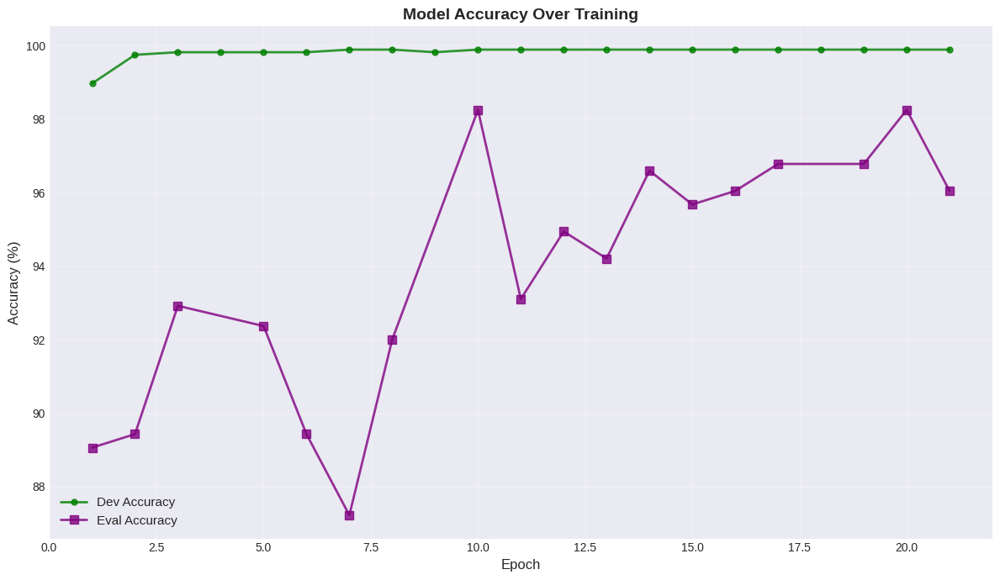

**Final Results: EER: 1.838%, Accuracy: 96.05%**

---

## Feature Fusion Experiments

### EfficientNet-B2 with Attention (Fusion 1,2,4)

```python
%run main.py --config config/EfficientNetB2_Attention.conf --feature_type 1,2,4 --dataset 1 --epochs 20 --random_noise --weight_avg --eval_best --dataset_version 3
```

**Development Set Metrics:**
- Accuracy: 99.82% | ROC AUC: 1.0000 | EER: 0.07%

**Evaluation Set Metrics:**
- Accuracy: 94.58% | ROC AUC: 0.9911 | EER: 5.33%

**Confusion Matrix (Eval):**
|                      | Pred: Fake | Pred: Real |
|----------------------|------------|------------|
| Actual: Fake/Spoof   | 514        | 30         |
| Actual: Real/Bonafide| 29         | 515        |


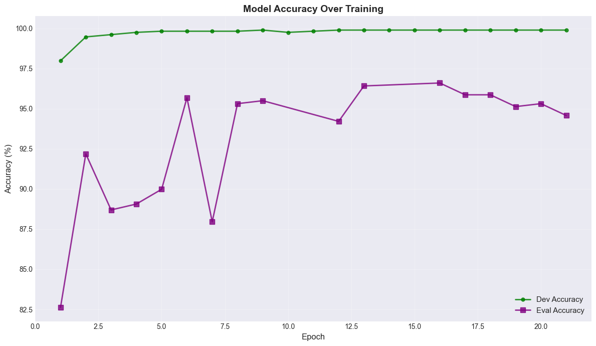

**Final Results: EER: 3.309%, Accuracy: 94.58%**

---

### EfficientNet-B2 (Fusion 1,2,4)

```python
%run main.py --config config/EfficientNetB2.conf --feature_type 1,2,4 --dataset 1 --epochs 20 --random_noise --weight_avg --eval_best --dataset_version 3
```

**Development Set Metrics:**
- Accuracy: 99.82% | ROC AUC: 1.0000 | EER: 0.07%

**Evaluation Set Metrics:**
- Accuracy: 94.03% | ROC AUC: 0.9864 | EER: 5.88%

**Confusion Matrix (Eval):**
|                      | Pred: Fake | Pred: Real |
|----------------------|------------|------------|
| Actual: Fake/Spoof   | 511        | 33         |
| Actual: Real/Bonafide| 32         | 512        |


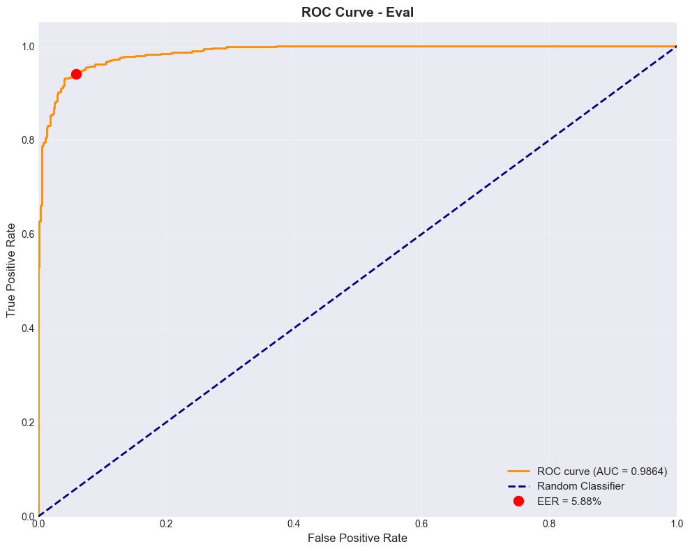
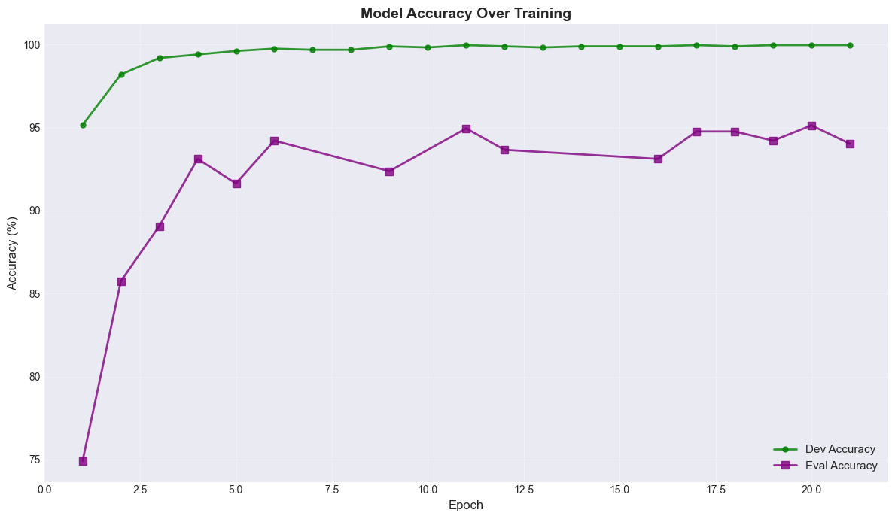

**Final Results: EER: 4.779%, Accuracy: 94.03%**

---

### SEResNet (Fusion 1,2,4)

```python
%run main.py --config config/SEResNet.conf --feature_type 1,2,4 --dataset 1 --epochs 20 --random_noise --weight_avg --eval_best --dataset_version 3
```

**Development Set Metrics:**
- Accuracy: 99.68% | ROC AUC: 0.9999 | EER: 0.28%

**Evaluation Set Metrics:**
- Accuracy: 92.74% | ROC AUC: 0.9821 | EER: 6.25%

**Confusion Matrix (Eval):**
|                      | Pred: Fake | Pred: Real |
|----------------------|------------|------------|
| Actual: Fake/Spoof   | 504        | 40         |
| Actual: Real/Bonafide| 39         | 505        |


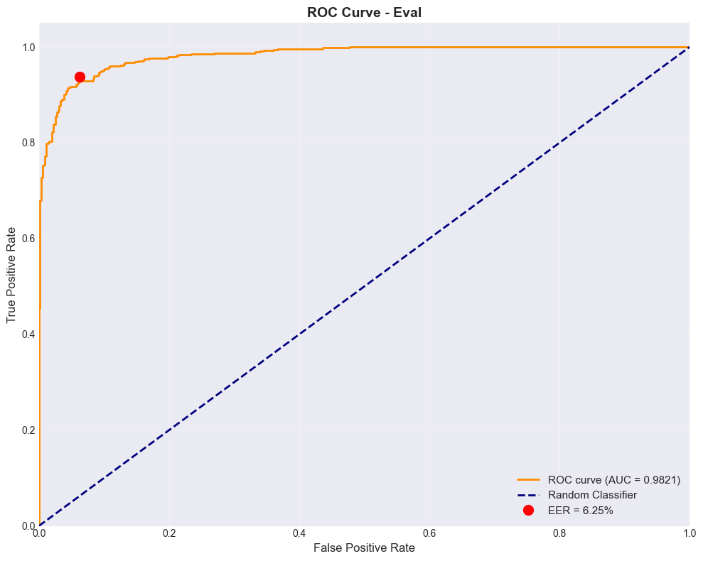
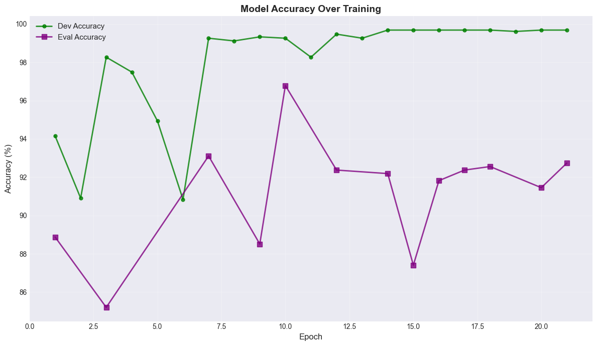

**Final Results: EER: 3.309%, Accuracy: 92.74%**

---

## Research Contributions & New Features

### New Feature Types (5 & 6)

#### Chroma Features (Feature Type 5)

```python
%run main.py --config config/EfficientNetB2_Attention.conf --feature_type 5 --dataset 1 --epochs 20 --random_noise --weight_avg --eval_best --dataset_version 3
```

**Development Set Metrics:**
- Accuracy: 93.38% | ROC AUC: 0.9838 | EER: 6.65%

**Evaluation Set Metrics:**
- Accuracy: 81.89% | ROC AUC: 0.8956 | EER: 18.20%

**Confusion Matrix (Eval):**
|                      | Pred: Fake | Pred: Real |
|----------------------|------------|------------|
| Actual: Fake/Spoof   | 445        | 99         |
| Actual: Real/Bonafide| 98         | 446        |


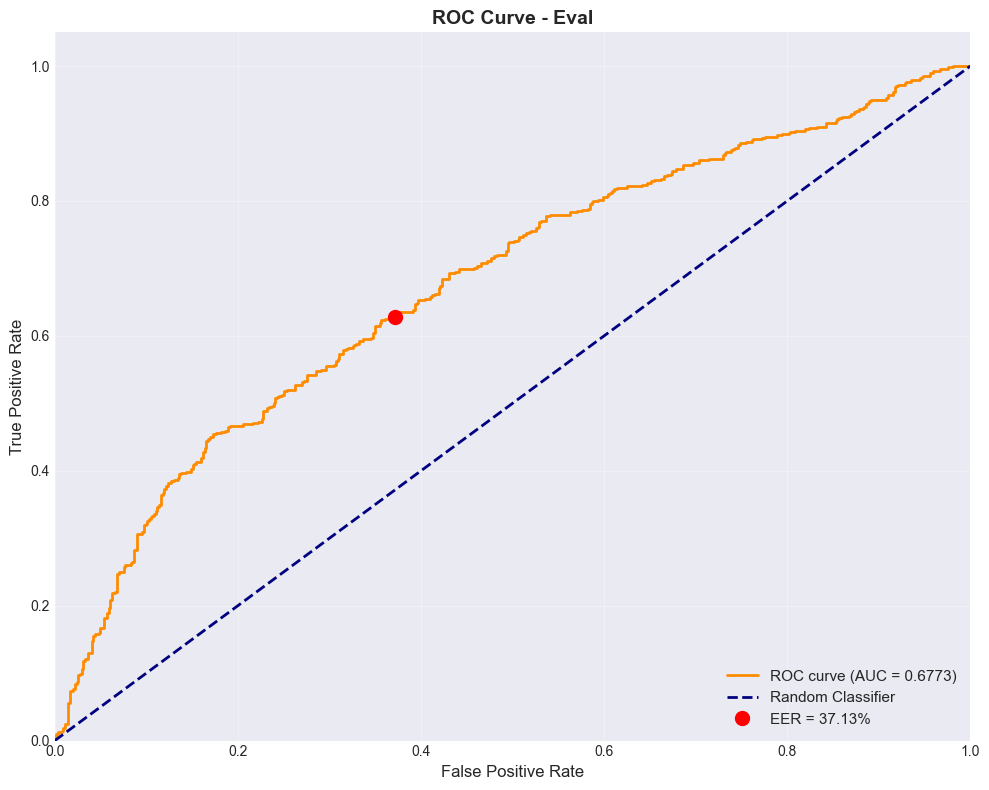


**Final Results: EER: 14.338%, Accuracy: 81.89%**

---

#### Spectral Contrast (Feature Type 6)

```python
%run main.py --config config/EfficientNetB2_Attention.conf --feature_type 6 --dataset 1 --epochs 20 --random_noise --weight_avg --eval_best --dataset_version 3
```

**Development Set Metrics:**
- Accuracy: 96.57% | ROC AUC: 0.9931 | EER: 3.47%

**Evaluation Set Metrics:**
- Accuracy: 62.96% | ROC AUC: 0.6773 | EER: 37.13%

**Confusion Matrix (Eval):**
|                      | Pred: Fake | Pred: Real |
|----------------------|------------|------------|
| Actual: Fake/Spoof   | 342        | 202        |
| Actual: Real/Bonafide| 201        | 343        |


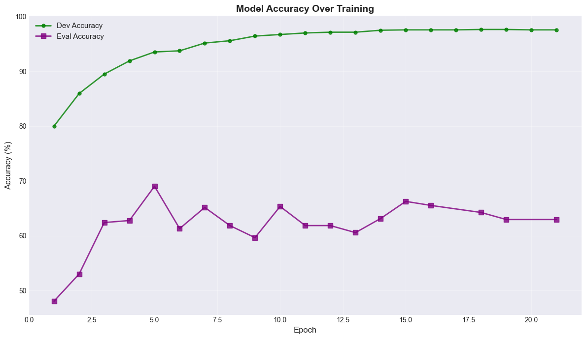

**Final Results: EER: 30.882%, Accuracy: 62.96%**

---

### Self-Supervised Learning Models

#### Wav2Vec 2.0

```python
%run main.py --config config/Wav2Vec2.conf --feature_type 0 --dataset 1 --epochs 20 --random_noise --weight_avg --eval_best --dataset_version 3
```

**Development Set Metrics:**
- Accuracy: 97.20% | ROC AUC: 0.9969 | EER: 2.69%

**Evaluation Set Metrics:**
- Accuracy: 49.72% | ROC AUC: 0.5038 | EER: 50.37%

**Confusion Matrix (Eval):**
|                      | Pred: Fake | Pred: Real |
|----------------------|------------|------------|
| Actual: Fake/Spoof   | 270        | 274        |
| Actual: Real/Bonafide| 273        | 271        |


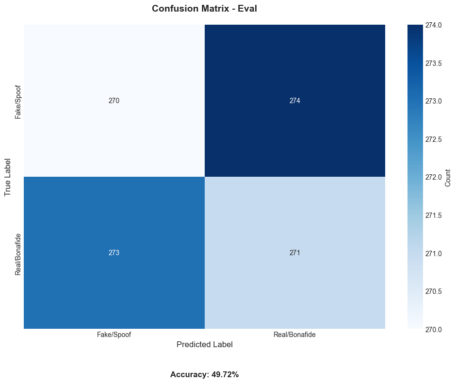
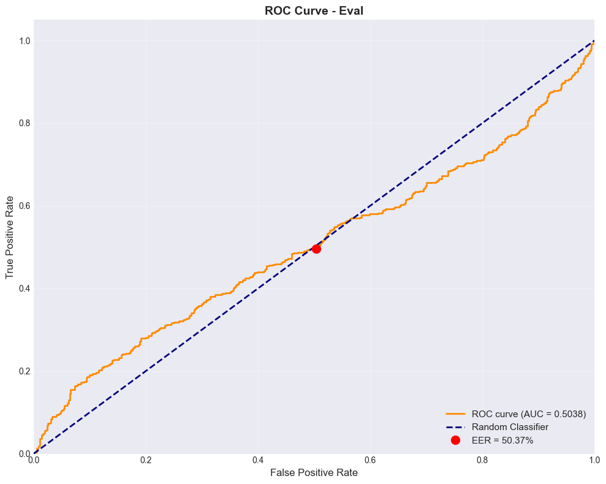
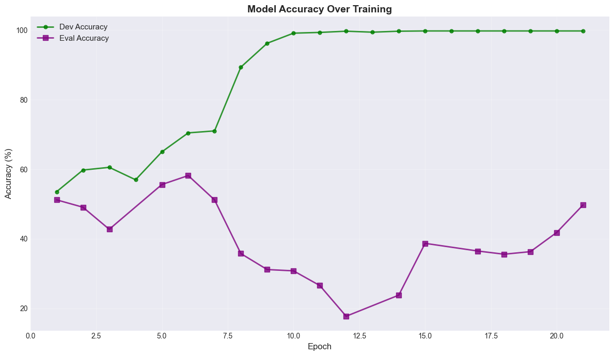

**Final Results: EER: 41.728%, Accuracy: 49.72%**

---

## Experiment Summary Table

| #   | Model                             | Feature               | Epochs | Best EER (%) | Best Accuracy (%) |
|-----|-----------------------------------|-----------------------|--------|--------------|-------------------|
| 1   | LCNN                              | Mel (1)               | 20     | 4.779        | 95.31             |
| 2   | LCNN                              | LFCC (2)              | 20     | 5.331        | 91.08             |
| 3   | LCNN                              | CQT (4)               | 20     | 4.228        | 95.50             |
| 4   | LCNN Large                        | Mel (1)               | 20     | 8.088        | 91.82             |
| 5   | LCNN Large                        | LFCC (2)              | 20     | 2.757        | 94.94             |
| 6   | LCNN Large                        | CQT (4)               | 20     | 3.676        | 95.50             |
| 7   | EfficientNet-B2                   | Mel (1)               | 20     | 2.757        | 96.97             |
| 8   | EfficientNet-B2                   | LFCC (2)              | 20     | 24.632       | 72.52             |
| 9   | EfficientNet-B2                   | CQT (4)               | 20     | 2.757        | 96.78             |
| 10  | EfficientNet-B2                   | Fusion (1,2,4)        | 20     | 4.779        | 94.03             |
| 11  | EfficientNet-B2_Attention         | Mel (1)               | 20     | 1.103        | 97.70             |
| 12  | EfficientNet-B2_Attention         | LFCC (2)              | 20     | 23.346       | 76.75             |
| 13  | EfficientNet-B2_Attention         | CQT (4)               | 20     | 3.493        | 96.05             |
| 14  | EfficientNet-B2_Attention         | Fusion (1,2,4)        | 20     | 3.309        | 94.58             |
| 15  | SEResNet                          | Mel (1)               | 20     | 8.456        | 89.43             |
| 16  | SEResNet                          | LFCC (2)              | 20     | 3.860        | 92.00             |
| 17  | SEResNet                          | CQT (4)               | 20     | 3.860        | 96.05             |
| 18  | SEResNet                          | Fusion (1,2,4)        | 20     | 3.309        | 92.74             |
| 19  | Ensemble (EffNetB2+SEResNet+LCNN) | Mel (1)               | 20     | 1.838        | 96.05             |
| 20  | EfficientNet-B2_Attention         | Chroma (5)            | 20     | 14.338       | 81.89             |
| 21  | EfficientNet-B2_Attention         | Spectral Contrast (6) | 20     | 30.882       | 62.96             |
| 22  | Wav2Vec 2.0                       | Raw (0)               | 20     | 41.728       | 49.72             |

---

## Key Observations

1. **Best Performing Model**: EfficientNet-B2 with Attention using Mel Spectrogram features achieved the lowest EER (1.103%) and highest accuracy (97.70%)

2. **Feature Performance**: 
   - Mel Spectrogram (Type 1) consistently performs well across models
   - LFCC (Type 2) shows significant generalization issues on the evaluation set
   - CQT (Type 4) provides stable results across different architectures

3. **Ensemble Benefits**: The ensemble model (EfficientNet-B2 + SEResNet + LCNN) achieved competitive results with EER of 1.838%

4. **New Features Performance**:
   - Chroma features (Type 5): Moderate performance with 81.89% accuracy
   - Spectral Contrast (Type 6): Poor generalization with 62.96% accuracy

5. **Self-Supervised Learning**: Wav2Vec 2.0 shows severe overfitting, achieving 97.20% dev accuracy but only 49.72% eval accuracy

**Feature Flags Reference:**
- `0` = Raw waveform
- `1` = Mel Spectrogram
- `2` = LFCC
- `3` = MFCC
- `4` = CQT
- `5` = Chroma
- `6` = Spectral Contrast
- `1,2,4` = Feature Fusion

**Metrics:**
- Lower EER is better (0% = perfect)
- Higher Accuracy is better (100% = perfect)

---

## Statistical Analysis & Visualizations

### Model Performance Comparison

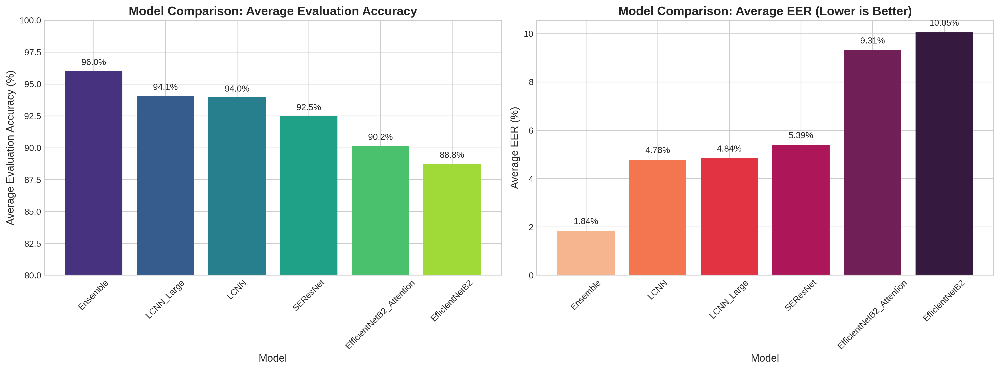

**Average Performance by Model (on Mel/LFCC/CQT features):**

| Model                    | Avg Eval Accuracy | Std  | Avg EER  | Std   |
|--------------------------|-------------------|------|----------|-------|
| Ensemble                 | 96.05%            | -    | 1.84%    | -     |
| LCNN                     | 93.96%            | 2.50 | 4.78%    | 0.55  |
| LCNN_Large               | 94.09%            | 1.98 | 4.84%    | 2.85  |
| EfficientNetB2_Attention | 90.17%            | 11.65| 9.31%    | 12.21 |
| EfficientNetB2           | 88.76%            | 14.06| 10.05%   | 12.63 |
| SEResNet                 | 92.49%            | 3.34 | 5.39%    | 2.65  |

---

### Feature Type Analysis

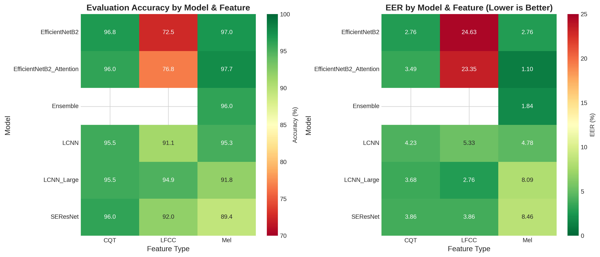

**Average Performance by Feature Type:**

| Feature | Avg Eval Accuracy | Std   | Avg EER  | Std   |
|---------|-------------------|-------|----------|-------|
| CQT     | 95.98%            | 0.53  | 3.60%    | 0.55  |
| Mel     | 94.55%            | 3.23  | 4.50%    | 3.17  |
| LFCC    | 85.46%            | 10.09 | 11.99%   | 11.01 |

**Key Insight:** CQT features provide the most consistent performance across all models with the lowest standard deviation.

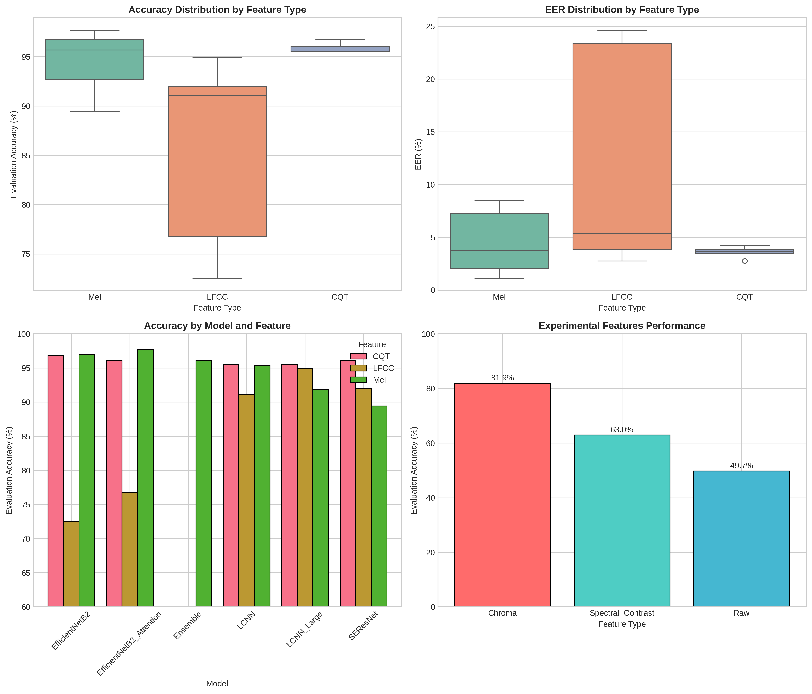

---

### Top Performing Configurations

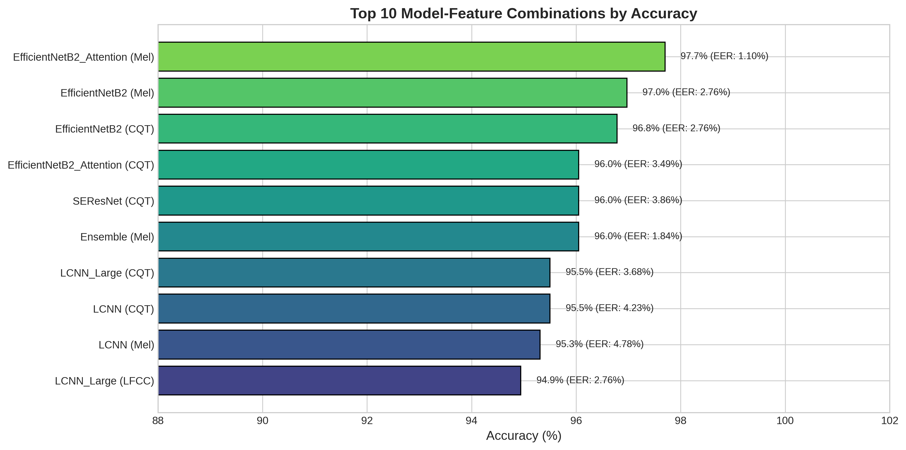

**Top 5 Model-Feature Combinations:**

| Rank | Model                    | Feature | Accuracy | EER    |
|------|--------------------------|---------|----------|--------|
| 1    | EfficientNetB2_Attention | Mel     | 97.70%   | 1.103% |
| 2    | EfficientNetB2           | Mel     | 96.97%   | 2.757% |
| 3    | EfficientNetB2           | CQT     | 96.78%   | 2.757% |
| 4    | SEResNet                 | CQT     | 96.05%   | 3.860% |
| 5    | Ensemble                 | Mel     | 96.05%   | 1.838% |

---

### Generalization Analysis (Dev vs Eval)

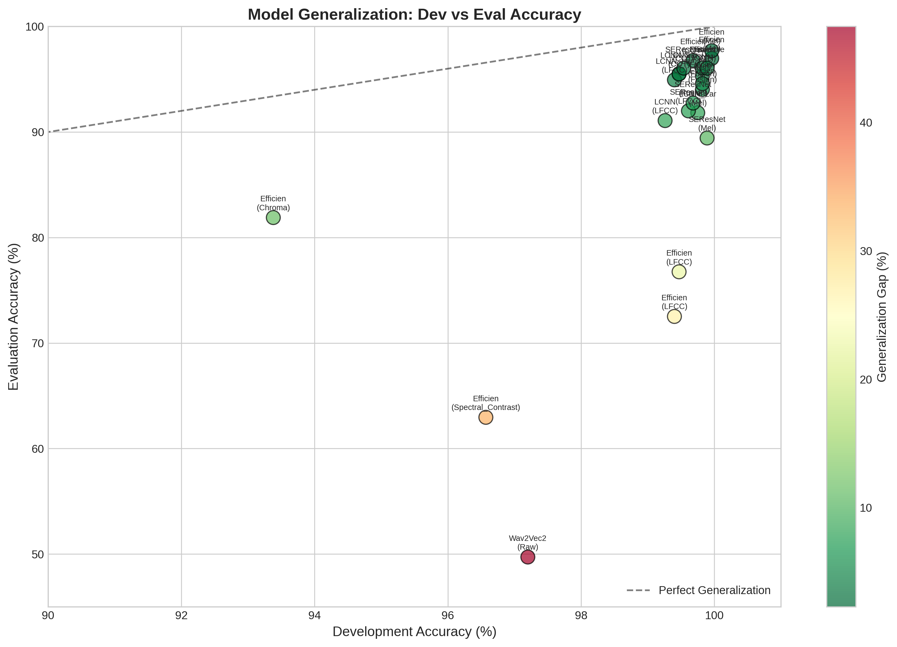

**Generalization Gap (Dev Accuracy - Eval Accuracy):**

| Model                    | Feature          | Dev Acc | Eval Acc | Gap     |
|--------------------------|------------------|---------|----------|---------|
| EfficientNetB2_Attention | Mel              | 99.96%  | 97.70%   | 2.26%   |
| LCNN                     | CQT              | 99.47%  | 95.50%   | 3.97%   |
| EfficientNetB2_Attention | LFCC             | 99.47%  | 76.75%   | 22.72%  |
| Wav2Vec2                 | Raw              | 97.20%  | 49.72%   | 47.48%  |

**Warning:** LFCC features and Wav2Vec2 show significant overfitting with large generalization gaps.

---

### ROC AUC Comparison

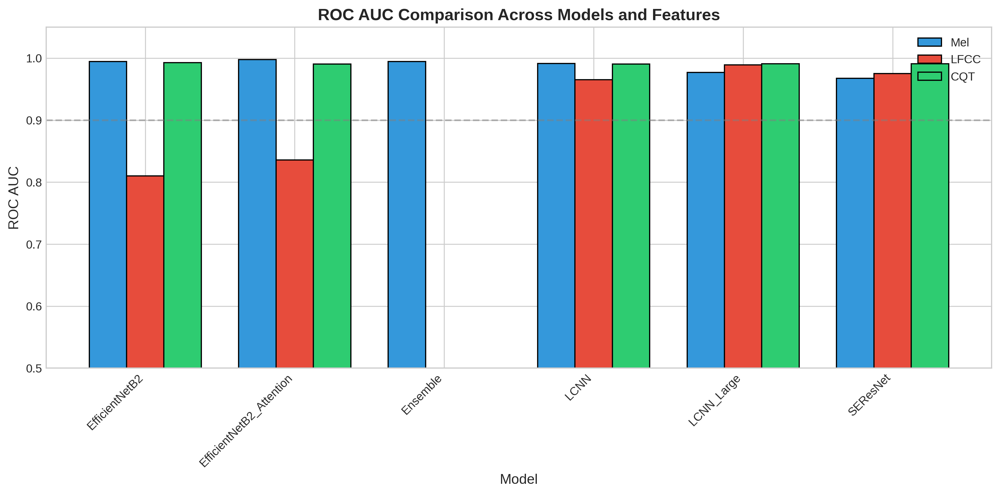

---

### Summary

- **Best Overall**: EfficientNet-B2 with Attention + Mel Spectrogram (97.70% accuracy, 1.103% EER)
- **Most Consistent Feature**: CQT with lowest variance across models
- **Best Generalization**: EfficientNet-B2 with Attention + Mel (only 2.26% gap)
- **Avoid**: LFCC features show poor generalization; Wav2Vec2 severely overfits
