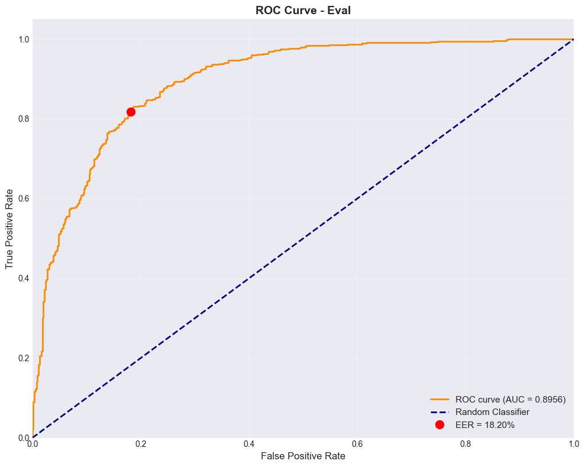
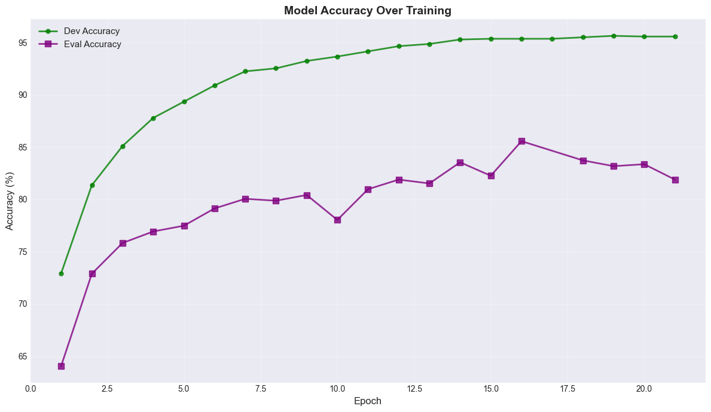
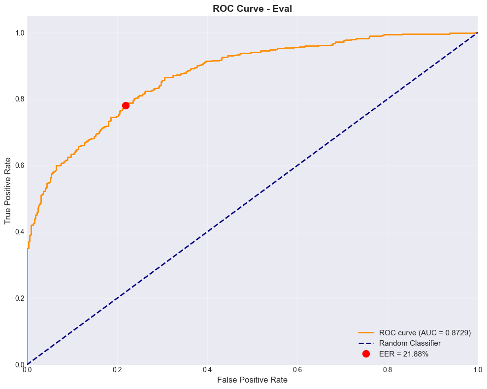
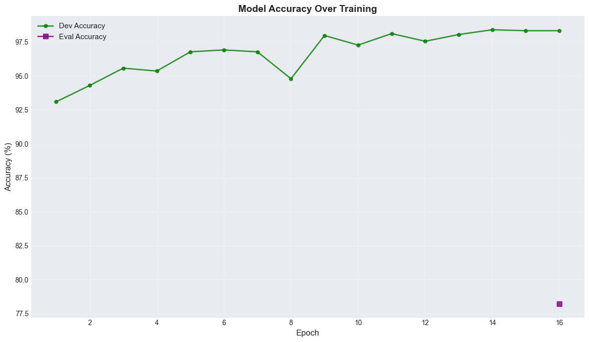
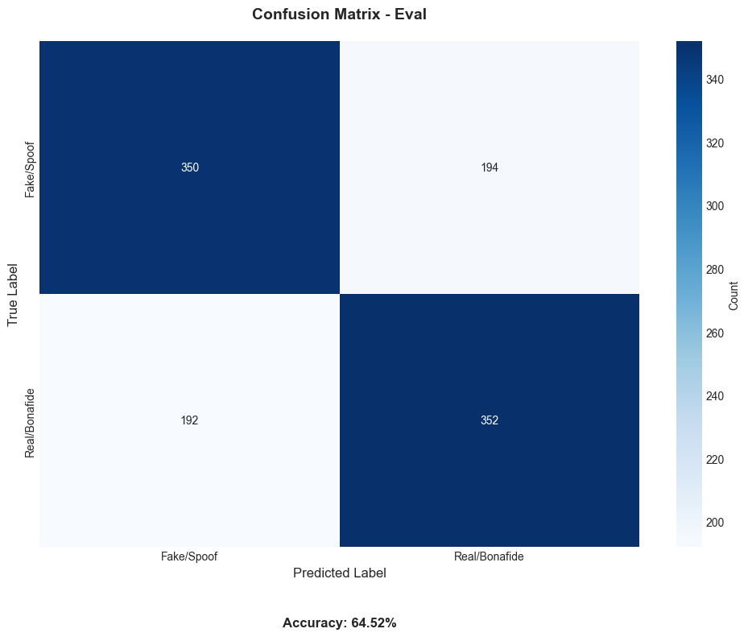
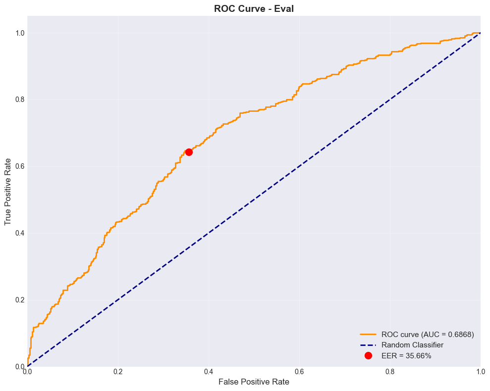
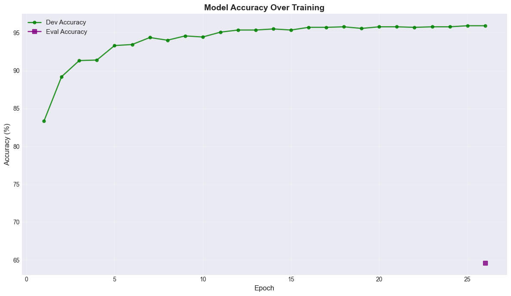

# AI Voice Detection Experiment Results - Evaluation Set

This document presents the **Evaluation** set results for various deep learning models trained to distinguish between fake (AI-generated) and real human speech on the FakeOrReal V3 dataset.

---

## EfficientNet-B2 with Attention

### Feature Type 1 (Mel Spectrogram)

#### Evaluation Set Metrics

| Metric   | Value  |
| -------- | ------ |
| Accuracy | 97.70% |
| ROC AUC  | 0.9978 |
| EER      | 2.39%  |

| Class         | Precision | Recall | F1-Score |
| ------------- | --------- | ------ | -------- |
| Fake/Spoof    | 0.9779    | 0.9761 | 0.9770   |
| Real/Bonafide | 0.9761    | 0.9779 | 0.9770   |

  
   

  

---

### Feature Type 2 (MFCC)

#### Evaluation Set Metrics

| Metric   | Value  |
| -------- | ------ |
| Accuracy | 76.75% |
| ROC AUC  | 0.8357 |
| EER      | 23.35% |

| Class         | Precision | Recall | F1-Score |
| ------------- | --------- | ------ | -------- |
| Fake/Spoof    | 0.7680    | 0.7665 | 0.7672   |
| Real/Bonafide | 0.7670    | 0.7684 | 0.7677   |

  
   

  

---

### Feature Type 4 (CQT)

#### Evaluation Set Metrics

| Metric   | Value  |
| -------- | ------ |
| Accuracy | 96.05% |
| ROC AUC  | 0.9905 |
| EER      | 3.68%  |

| Class         | Precision | Recall | F1-Score |
| ------------- | --------- | ------ | -------- |
| Fake/Spoof    | 0.9613    | 0.9596 | 0.9604   |
| Real/Bonafide | 0.9596    | 0.9614 | 0.9605   |

  
   

  

---

## EfficientNet-B2 (Without Attention)

### Feature Type 1 (Mel Spectrogram)

#### Evaluation Set Metrics

| Metric   | Value  |
| -------- | ------ |
| Accuracy | 96.97% |
| ROC AUC  | 0.9944 |
| EER      | 3.12%  |

| Class         | Precision | Recall | F1-Score |
| ------------- | --------- | ------ | -------- |
| Fake/Spoof    | 0.9705    | 0.9688 | 0.9696   |
| Real/Bonafide | 0.9688    | 0.9706 | 0.9697   |

  
   

  

---

### Feature Type 2 (MFCC)

#### Evaluation Set Metrics

| Metric   | Value  |
| -------- | ------ |
| Accuracy | 72.52% |
| ROC AUC  | 0.8100 |
| EER      | 27.57% |

| Class         | Precision | Recall | F1-Score |
| ------------- | --------- | ------ | -------- |
| Fake/Spoof    | 0.7256    | 0.7243 | 0.7249   |
| Real/Bonafide | 0.7248    | 0.7261 | 0.7254   |

  
   

  

---

### Feature Type 4 (CQT)

#### Evaluation Set Metrics

| Metric   | Value  |
| -------- | ------ |
| Accuracy | 96.78% |
| ROC AUC  | 0.9928 |
| EER      | 3.31%  |

| Class         | Precision | Recall | F1-Score |
| ------------- | --------- | ------ | -------- |
| Fake/Spoof    | 0.9687    | 0.9669 | 0.9678   |
| Real/Bonafide | 0.9670    | 0.9688 | 0.9679   |

  
   

  

---

## LCNN Large

### Feature Type 1 (Mel Spectrogram)

#### Evaluation Set Metrics

| Metric   | Value  |
| -------- | ------ |
| Accuracy | 91.82% |
| ROC AUC  | 0.9771 |
| EER      | 8.27%  |

| Class         | Precision | Recall | F1-Score |
| ------------- | --------- | ------ | -------- |
| Fake/Spoof    | 0.9190    | 0.9173 | 0.9181   |
| Real/Bonafide | 0.9174    | 0.9191 | 0.9183   |

  
   

  

---

### Feature Type 2 (MFCC)

#### Evaluation Set Metrics

| Metric   | Value  |
| -------- | ------ |
| Accuracy | 84.01% |
| ROC AUC  | 0.9244 |
| EER      | 15.99% |

| Class         | Precision | Recall | F1-Score |
| ------------- | --------- | ------ | -------- |
| Fake/Spoof    | 0.8401    | 0.8382 | 0.8391   |
| Real/Bonafide | 0.8384    | 0.8401 | 0.8392   |

  
   

  

---

### Feature Type 4 (CQT)

#### Evaluation Set Metrics

| Metric   | Value  |
| -------- | ------ |
| Accuracy | 94.12% |
| ROC AUC  | 0.9867 |
| EER      | 5.88%  |

| Class         | Precision | Recall | F1-Score |
| ------------- | --------- | ------ | -------- |
| Fake/Spoof    | 0.9412    | 0.9393 | 0.9402   |
| Real/Bonafide | 0.9394    | 0.9412 | 0.9403   |

  
   

  

---

## LCNN

### Feature Type 1 (Mel Spectrogram)

#### Evaluation Set Metrics

| Metric   | Value  |
| -------- | ------ |
| Accuracy | 92.56% |
| ROC AUC  | 0.9791 |
| EER      | 7.44%  |

| Class         | Precision | Recall | F1-Score |
| ------------- | --------- | ------ | -------- |
| Fake/Spoof    | 0.9256    | 0.9239 | 0.9247   |
| Real/Bonafide | 0.9240    | 0.9257 | 0.9248   |

  
   

  

---

### Feature Type 2 (MFCC)

#### Evaluation Set Metrics

| Metric   | Value  |
| -------- | ------ |
| Accuracy | 91.08% |
| ROC AUC  | 0.9653 |
| EER      | 8.82%  |

| Class         | Precision | Recall | F1-Score |
| ------------- | --------- | ------ | -------- |
| Fake/Spoof    | 0.9116    | 0.9099 | 0.9108   |
| Real/Bonafide | 0.9101    | 0.9118 | 0.9109   |

  
   

  

---

### Feature Type 4 (CQT)

#### Evaluation Set Metrics

| Metric   | Value  |
| -------- | ------ |
| Accuracy | 95.50% |
| ROC AUC  | 0.9903 |
| EER      | 4.78%  |

| Class         | Precision | Recall | F1-Score |
| ------------- | --------- | ------ | -------- |
| Fake/Spoof    | 0.9558    | 0.9540 | 0.9549   |
| Real/Bonafide | 0.9541    | 0.9559 | 0.9550   |

  
   

  

---

## SEResNet

### Feature Type 1 (Mel Spectrogram)

#### Evaluation Set Metrics

| Metric   | Value  |
| -------- | ------ |
| Accuracy | 89.43% |
| ROC AUC  | 0.9674 |
| EER      | 10.66% |

| Class         | Precision | Recall | F1-Score |
| ------------- | --------- | ------ | -------- |
| Fake/Spoof    | 0.8950    | 0.8934 | 0.8942   |
| Real/Bonafide | 0.8936    | 0.8952 | 0.8944   |

  
   

  

---

### Feature Type 2 (MFCC)

#### Evaluation Set Metrics

| Metric   | Value  |
| -------- | ------ |
| Accuracy | 92.00% |
| ROC AUC  | 0.9750 |
| EER      | 8.09%  |

| Class         | Precision | Recall | F1-Score |
| ------------- | --------- | ------ | -------- |
| Fake/Spoof    | 0.9208    | 0.9191 | 0.9200   |
| Real/Bonafide | 0.9193    | 0.9210 | 0.9201   |

  
   

  

---

### Feature Type 4 (CQT)

#### Evaluation Set Metrics

| Metric   | Value  |
| -------- | ------ |
| Accuracy | 93.20% |
| ROC AUC  | 0.9815 |
| EER      | 6.80%  |

| Class         | Precision | Recall | F1-Score |
| ------------- | --------- | ------ | -------- |
| Fake/Spoof    | 0.9320    | 0.9301 | 0.9311   |
| Real/Bonafide | 0.9302    | 0.9320 | 0.9311   |

  
   

  

---

## SENet

### Feature Type 1 (Mel Spectrogram)

#### Evaluation Set Metrics

| Metric   | Value  |
| -------- | ------ |
| Accuracy | 89.71% |
| ROC AUC  | 0.9655 |
| EER      | 10.29% |

| Class         | Precision | Recall | F1-Score |
| ------------- | --------- | ------ | -------- |
| Fake/Spoof    | 0.8978    | 0.8960 | 0.8969   |
| Real/Bonafide | 0.8962    | 0.8978 | 0.8970   |

  
   

  

---

### Feature Type 2 (MFCC)

#### Evaluation Set Metrics

| Metric   | Value  |
| -------- | ------ |
| Accuracy | 92.37% |
| ROC AUC  | 0.9750 |
| EER      | 7.72%  |

| Class         | Precision | Recall | F1-Score |
| ------------- | --------- | ------ | -------- |
| Fake/Spoof    | 0.9244    | 0.9228 | 0.9236   |
| Real/Bonafide | 0.9229    | 0.9246 | 0.9237   |

  
   

  

---

### Feature Type 4 (CQT)

#### Evaluation Set Metrics

| Metric   | Value  |
| -------- | ------ |
| Accuracy | 93.20% |
| ROC AUC  | 0.9802 |
| EER      | 6.80%  |

| Class         | Precision | Recall | F1-Score |
| ------------- | --------- | ------ | -------- |
| Fake/Spoof    | 0.9320    | 0.9301 | 0.9311   |
| Real/Bonafide | 0.9302    | 0.9320 | 0.9311   |

  
   

  

---

## Additional Feature Experiments (EfficientNet-B2 with Attention)

### Feature Type 5

#### Evaluation Set Metrics

| Metric   | Value  |
| -------- | ------ |
| Accuracy | 81.89% |
| ROC AUC  | 0.8956 |
| EER      | 18.20% |

| Class         | Precision | Recall | F1-Score |
| ------------- | --------- | ------ | -------- |
| Fake/Spoof    | 0.8195    | 0.8180 | 0.8188   |
| Real/Bonafide | 0.8183    | 0.8199 | 0.8191   |

  
   

  

---

### Feature Type 6

#### Evaluation Set Metrics

| Metric   | Value  |
| -------- | ------ |
| Accuracy | 62.96% |
| ROC AUC  | 0.6773 |
| EER      | 37.13% |

| Class         | Precision | Recall | F1-Score |
| ------------- | --------- | ------ | -------- |
| Fake/Spoof    | 0.6298    | 0.6287 | 0.6293   |
| Real/Bonafide | 0.6294    | 0.6305 | 0.6299   |

  
   

  

---

## RawNet3 (Raw Waveform)

#### Evaluation Set Metrics

| Metric   | Value  |
| -------- | ------ |
| Accuracy | 78.12% |
| ROC AUC  | 0.8729 |
| EER      | 21.88% |

| Class         | Precision | Recall | F1-Score |
| ------------- | --------- | ------ | -------- |
| Fake/Spoof    | 0.7812    | 0.7812 | 0.7812   |
| Real/Bonafide | 0.7812    | 0.7812 | 0.7812   |

  
   

  

---

## SimpleCNN (Raw Waveform)

#### Evaluation Set Metrics

| Metric   | Value  |
| -------- | ------ |
| Accuracy | 64.52% |
| ROC AUC  | 0.6868 |
| EER      | 35.66% |

| Class         | Precision | Recall | F1-Score |
| ------------- | --------- | ------ | -------- |
| Fake/Spoof    | 0.6458    | 0.6434 | 0.6446   |
| Real/Bonafide | 0.6447    | 0.6471 | 0.6459   |

  
   

  

---

## Summary Table (Eval)

| Model                       | Feature Type    | Eval Accuracy | Eval EER  | Eval ROC AUC |
| --------------------------- | --------------- | ------------- | --------- | ------------ |
| EfficientNet-B2 + Attention | Mel Spectrogram | **97.70%**    | **2.39%** | 0.9978       |
| EfficientNet-B2 + Attention | MFCC            | 76.75%        | 23.35%    | 0.8357       |
| EfficientNet-B2 + Attention | CQT             | 96.05%        | 3.68%     | 0.9905       |
| EfficientNet-B2             | Mel Spectrogram | 96.97%        | 3.12%     | 0.9944       |
| EfficientNet-B2             | MFCC            | 72.52%        | 27.57%    | 0.8100       |
| EfficientNet-B2             | CQT             | 96.78%        | 3.31%     | 0.9928       |
| LCNN Large                  | Mel Spectrogram | 91.82%        | 8.27%     | 0.9771       |
| LCNN Large                  | MFCC            | 84.01%        | 15.99%    | 0.9244       |
| LCNN Large                  | CQT             | 94.12%        | 5.88%     | 0.9867       |
| LCNN                        | Mel Spectrogram | 92.56%        | 7.44%     | 0.9791       |
| LCNN                        | MFCC            | 91.08%        | 8.82%     | 0.9653       |
| LCNN                        | CQT             | 95.50%        | 4.78%     | 0.9903       |
| SEResNet                    | Mel Spectrogram | 89.43%        | 10.66%    | 0.9674       |
| SEResNet                    | MFCC            | 92.00%        | 8.09%     | 0.9750       |
| SEResNet                    | CQT             | 93.20%        | 6.80%     | 0.9815       |
| SENet                       | Mel Spectrogram | 89.71%        | 10.29%    | 0.9655       |
| SENet                       | MFCC            | 92.37%        | 7.72%     | 0.9750       |
| SENet                       | CQT             | 93.20%        | 6.80%     | 0.9802       |
| RawNet3                     | Raw Waveform    | 78.12%        | 21.88%    | 0.8729       |
| SimpleCNN                   | Raw Waveform    | 64.52%        | 35.66%    | 0.6868       |

**Best performing model:** EfficientNet-B2 with Attention using Mel Spectrogram features achieved the highest evaluation accuracy (97.70%) and lowest EER (2.39%).
