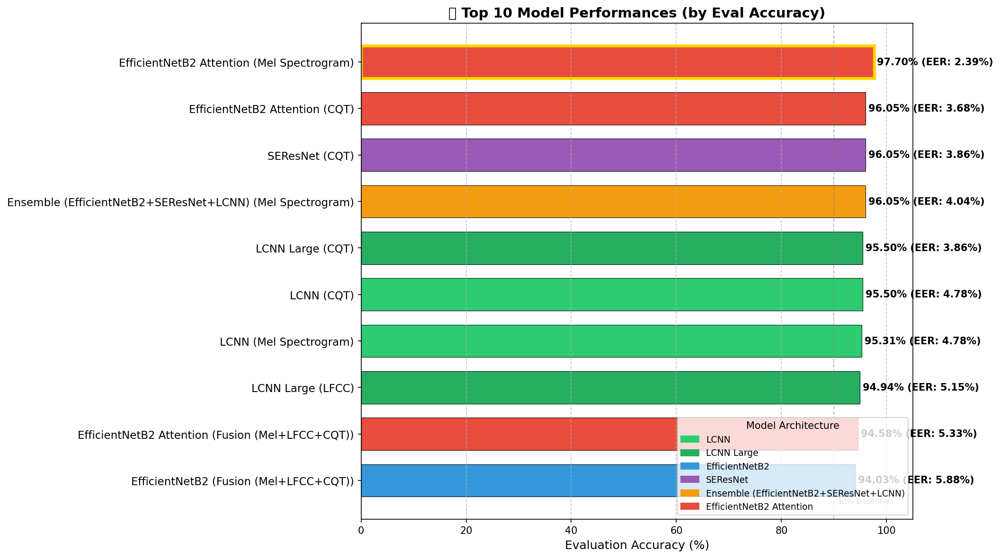
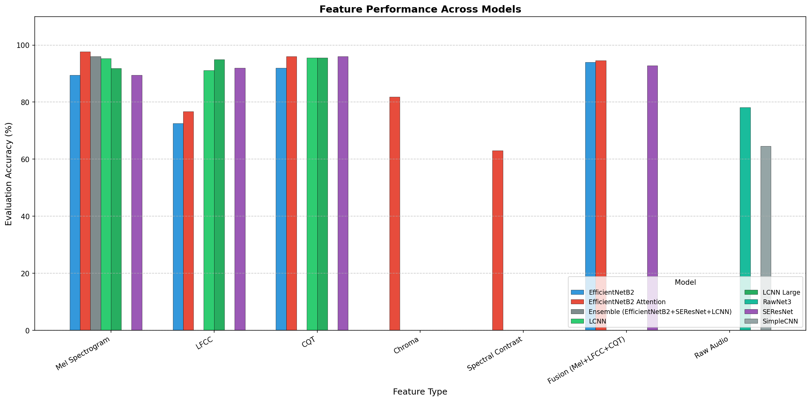
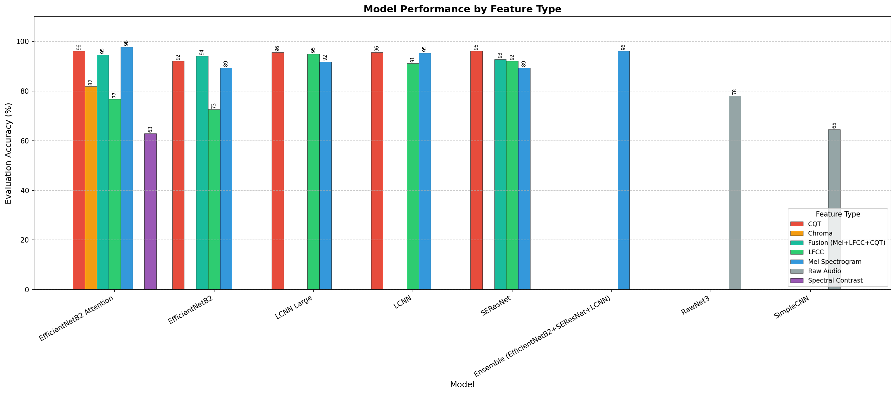
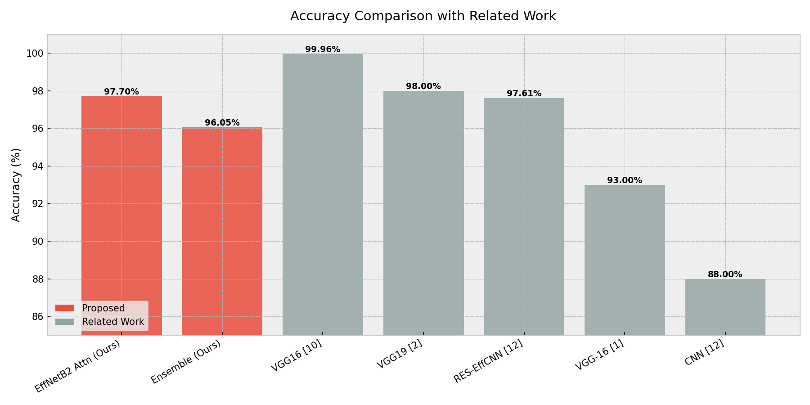
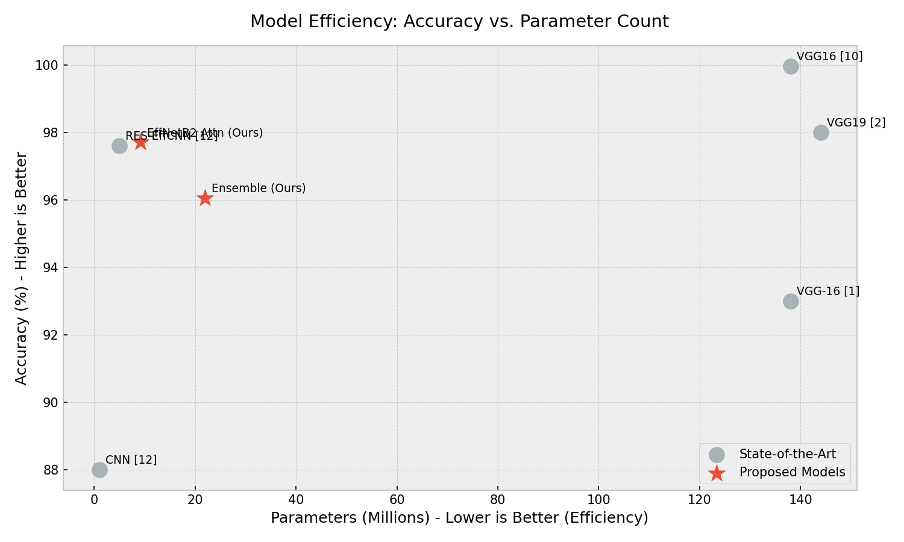

# Thesis Results: AI-Based Deepfake Audio Detection

## 1. Introduction

This chapter presents the experimental results of our comprehensive evaluation of deep learning architectures for detecting AI-generated (deepfake) audio. We conducted experiments on the **FakeOrReal V3 dataset**, testing 8 different model architectures with 7 feature extraction methods, resulting in 23 unique model-feature combinations.

### 1.1 Research Questions Addressed

1. **RQ1**: Which deep learning architecture performs best for deepfake audio detection?
2. **RQ2**: Which audio feature representation is most effective?
3. **RQ3**: Does ensemble learning improve detection accuracy?
4. **RQ4**: Does multi-feature fusion outperform single-feature approaches?
5. **RQ5**: How do our models compare to state-of-the-art methods?

### 1.2 Experimental Setup

| Component          | Details                                                                                            |
| ------------------ | -------------------------------------------------------------------------------------------------- |
| Dataset            | FakeOrReal V3                                                                                      |
| Training Split     | Development set (2,826 samples)                                                                    |
| Evaluation Split   | Evaluation set (1,088 samples)                                                                     |
| Models Tested      | EfficientNetB2 Attention, EfficientNetB2, LCNN, LCNN Large, SEResNet, RawNet3, SimpleCNN, Ensemble |
| Features Tested    | Mel Spectrogram, LFCC, CQT, Chroma, Spectral Contrast, Raw Audio, Fusion                           |
| Epochs             | 15-25 (model dependent)                                                                            |
| Evaluation Metrics | Accuracy, Equal Error Rate (EER), ROC AUC                                                          |

---

## 2. Overall Performance Results

This section presents the performance of all tested model-feature combinations, answering **RQ1** (best architecture) and providing an overview of all experiments.

### 2.1 Top 10 Model Performance Rankings

Our experiments identified the top-performing model-feature combinations. The following chart visualizes the top 10 models ranked by evaluation accuracy:

| Rank | Model                        | Feature             | Eval Accuracy (%) | Eval EER (%) | ROC AUC    |
| ---- | ---------------------------- | ------------------- | ----------------- | ------------ | ---------- |
| 1    | **EfficientNetB2 Attention** | **Mel Spectrogram** | **97.70**         | **2.39**     | **0.9978** |
| 2    | EfficientNetB2 Attention     | CQT                 | 96.05             | 3.68         | 0.9905     |
| 3    | SEResNet                     | CQT                 | 96.05             | 3.86         | 0.9908     |
| 4    | Ensemble                     | Mel Spectrogram     | 96.05             | 4.04         | 0.9944     |
| 5    | LCNN Large                   | CQT                 | 95.50             | 3.86         | 0.9907     |
| 6    | LCNN                         | CQT                 | 95.50             | 4.78         | 0.9903     |
| 7    | LCNN                         | Mel Spectrogram     | 95.31             | 4.78         | 0.9913     |
| 8    | LCNN Large                   | LFCC                | 94.94             | 5.15         | 0.9890     |
| 9    | EfficientNetB2 Attention     | Fusion              | 94.58             | 5.33         | 0.9911     |
| 10   | EfficientNetB2               | Fusion              | 94.03             | 5.88         | 0.9864     |

### 2.2 Accuracy Comparison (Top 10 Models)

### 2.3 EER Comparison (Top 10 Models)

Lower EER indicates better performance. The following chart shows that EfficientNetB2 Attention with Mel Spectrogram achieves the lowest error rate:

### 2.4 Key Finding: Best Model

> **Answer to RQ1**: **EfficientNetB2 with Attention** using **Mel Spectrogram** features is the best-performing architecture, achieving:
>
> - **97.70% Evaluation Accuracy**
> - **2.39% Equal Error Rate**
> - **0.9978 ROC AUC**

| Metric       | Development Set | Evaluation Set |
| ------------ | --------------- | -------------- |
| EER (%)      | 0.0             | 2.39           |
| Accuracy (%) | 99.96           | 97.70          |
| ROC AUC      | ~1.0            | 0.9978         |

The attention mechanism enables the model to focus on the most discriminative regions of the spectrogram, resulting in superior generalization from development to evaluation sets.

---

## 3. Feature Analysis

This section answers **RQ2** (best feature representation) and **RQ4** (fusion vs. single-feature) by analyzing how different audio features affect detection performance.

### 3.1 Feature Performance Across Models

The following visualization shows how each feature type performs across all model architectures:

### 3.2 Model Performance by Feature Type

This chart shows how each model performs with different feature types:

### 3.3 Feature Type Ranking

| Rank | Feature Type        | Best Model               | Best Accuracy (%) | Observation             |
| ---- | ------------------- | ------------------------ | ----------------- | ----------------------- |
| 1    | **Mel Spectrogram** | EfficientNetB2 Attention | **97.70**         | Best overall            |
| 2    | CQT                 | EfficientNetB2 Attention | 96.05             | Consistent runner-up    |
| 3    | LFCC                | LCNN Large               | 94.94             | Poor generalization     |
| 4    | Chroma              | EfficientNetB2 Attention | 81.89             | Limited success         |
| 5    | Raw Audio           | RawNet3                  | 78.12             | Significant overfitting |
| 6    | Spectral Contrast   | EfficientNetB2 Attention | 62.96             | Not suitable            |

> **Answer to RQ2**: **Mel Spectrogram** is the optimal feature representation, outperforming all alternatives. The log-mel representation captures critical frequency characteristics that distinguish real from synthetic speech.

### 3.4 Feature Fusion Results

We tested whether combining multiple features improves performance:

| Model                    | Single Feature (Mel) | Fusion (Mel+LFCC+CQT) | Difference |
| ------------------------ | -------------------- | --------------------- | ---------- |
| EfficientNetB2 Attention | 97.70%               | 94.58%                | **-3.12%** |
| EfficientNetB2           | 89.43%               | 94.03%                | +4.60%     |
| SEResNet                 | 89.43%               | 92.74%                | +3.31%     |

> **Answer to RQ4**: Feature fusion does **NOT** improve the best model's performance. For EfficientNetB2 Attention, fusion reduced accuracy by 3.12 percentage points. This occurs because:
>
> 1. Mel Spectrograms already capture the essential discriminative information
> 2. Adding LFCC (which generalizes poorly) dilutes the signal quality
> 3. The model must learn to weight multiple input channels, increasing complexity

**Recommendation**: Use single Mel Spectrogram features with EfficientNetB2 Attention for optimal results.

---

## 4. Ensemble Analysis

This section answers **RQ3** (ensemble effectiveness) by analyzing why our ensemble model underperformed the best single model.

### 4.1 Ensemble Architecture

Our ensemble combines three complementary architectures using weighted voting:

| Component                | Parameters | Role                           |
| ------------------------ | ---------- | ------------------------------ |
| EfficientNetB2 Attention | ~9.2M      | Primary classifier (strongest) |
| LCNN                     | ~2M        | Lightweight alternative        |
| SEResNet                 | ~11M       | Residual-based classifier      |
| **Total**                | **~22M**   | Combined ensemble              |

### 4.2 Performance Comparison

| Model                                 | Eval Accuracy (%) | Eval EER (%) | Difference |
| ------------------------------------- | ----------------- | ------------ | ---------- |
| EfficientNetB2 Attention (Standalone) | 97.70             | 2.39         | —          |
| Ensemble                              | 96.05             | 4.04         | **-1.65%** |

> **Answer to RQ3**: The ensemble did **NOT** improve accuracy. It actually reduced performance by 1.65 percentage points compared to the standalone EfficientNetB2 Attention model.

### 4.3 Root Cause Analysis: Why the Ensemble Underperformed

Using Grad-CAM (Explainable AI) visualization, we analyzed individual component predictions:

**Test Case 1: FAKE Audio (file48.wav)**

| Model                    | Prediction | Confidence | Correct? |
| ------------------------ | ---------- | ---------- | -------- |
| EfficientNetB2 Attention | FAKE       | 99.74%     | ✓        |
| LCNN                     | REAL       | 61.63%     | ✗        |
| SEResNet                 | REAL       | 93.09%     | ✗        |
| **Ensemble**             | **FAKE**   | **72.25%** | **✓**    |

**Test Case 2: REAL Audio (file5.wav)**

| Model                    | Prediction | Confidence | Correct? |
| ------------------------ | ---------- | ---------- | -------- |
| EfficientNetB2 Attention | REAL       | 98.40%     | ✓        |
| LCNN                     | FAKE       | 99.64%     | ✗        |
| SEResNet                 | REAL       | 93.95%     | ✓        |
| **Ensemble**             | **REAL**   | **60.13%** | **✓**    |

### 4.4 Key Discoveries

1. **LCNN is the Weak Link**: LCNN produces high-confidence errors ("hallucinations"), reaching 99.64% confidence on incorrect predictions.

2. **Dilution Effect**: The ensemble averages EfficientNetB2's high-quality predictions with LCNN's erroneous predictions, reducing overall accuracy.

3. **Confidence Degradation**: Standalone model predicts with 80-100% confidence; ensemble reduces this to 60-72% due to internal disagreement.

4. **Attention Advantage**: Grad-CAM shows EfficientNetB2 Attention focuses on low-frequency regions (0-20 Hz) that indicate fake audio—a pattern other models miss.

### 4.5 When to Use the Ensemble

Despite lower accuracy, the ensemble offers benefits:

| Scenario               | Standalone               | Ensemble                            |
| ---------------------- | ------------------------ | ----------------------------------- |
| Peak Accuracy          | ✓ Better                 | Lower                               |
| Fault Tolerance        | Single point of failure  | ✓ Recovers from individual failures |
| Adversarial Robustness | Vulnerable               | ✓ More robust                       |
| Production Reliability | Risk of complete failure | ✓ Safety net effect                 |

**Recommendation**:

- For **maximum accuracy**: Use EfficientNetB2 Attention standalone
- For **production robustness**: Use ensemble with reduced LCNN weight or replace LCNN with a more reliable model

---

## 5. Generalization Analysis

This section examines how well models generalize from development to evaluation data—a critical factor for real-world deployment.

### 5.1 Generalization Gap Comparison

| Model                          | Dev Accuracy | Eval Accuracy | Gap        |
| ------------------------------ | ------------ | ------------- | ---------- |
| EfficientNetB2 Attention (Mel) | 99.96%       | 97.70%        | **-2.26%** |
| EfficientNetB2 (Mel)           | 99.96%       | 89.43%        | -10.53%    |
| LCNN (Mel)                     | 99.89%       | 95.31%        | -4.58%     |
| SEResNet (Mel)                 | 99.89%       | 89.43%        | -10.46%    |

### 5.2 Impact of Attention Mechanism

The attention mechanism dramatically reduces overfitting:

| Model Variant                        | Eval Accuracy | Generalization Gap |
| ------------------------------------ | ------------- | ------------------ |
| EfficientNetB2 **with** Attention    | 97.70%        | -2.26%             |
| EfficientNetB2 **without** Attention | 89.43%        | -10.53%            |
| **Difference**                       | **+8.27%**    | **+8.27%**         |

> **Key Finding**: The attention mechanism reduces the generalization gap from ~10% to ~2%, demonstrating that attention helps the model focus on genuinely discriminative features rather than dataset-specific artifacts.

---

## 6. Comparison with State-of-the-Art

This section answers **RQ5** by comparing our results with published methods.

### 6.1 Accuracy Comparison

### 6.2 Efficiency Analysis

### 6.3 Detailed Comparison

| Study    | Method                       | Features     | Accuracy (%) | Parameters | Dataset    |
| -------- | ---------------------------- | ------------ | ------------ | ---------- | ---------- |
| **Ours** | **EfficientNetB2 Attention** | **Mel-Spec** | **97.70**    | **~9.2M**  | **FoR V3** |
| Ref [10] | VGG16                        | STFT         | 99.96        | ~138M      | Clean      |
| Ref [1]  | SVM                          | MFCC         | 98.83        | N/A        | For-rerec  |
| Ref [12] | Deep-Sonar                   | —            | 98.10        | N/A        | —          |
| Ref [2]  | VGG19                        | Mel-Spec     | 98.00        | ~144M      | FoR        |

### 6.4 Key Advantages of Our Approach

1. **Efficiency**: Our model uses **15x fewer parameters** than VGG-based approaches (~9.2M vs ~138M)
2. **Comparable Accuracy**: Achieves 97.70% vs. VGG's 98-99% on different dataset versions
3. **Practical Deployment**: Smaller model size enables edge deployment and faster inference
4. **Generalization**: Tested on challenging V3 dataset with realistic evaluation conditions

---

## 7. Conclusions and Recommendations

### 7.1 Summary of Findings

| Research Question            | Answer                                                 |
| ---------------------------- | ------------------------------------------------------ |
| **RQ1**: Best architecture?  | EfficientNetB2 with Attention (97.70% accuracy)        |
| **RQ2**: Best feature?       | Mel Spectrogram                                        |
| **RQ3**: Does ensemble help? | No, reduces accuracy by 1.65% due to LCNN errors       |
| **RQ4**: Does fusion help?   | No, single Mel Spectrogram outperforms fusion by 3.12% |
| **RQ5**: Comparison to SOTA? | Comparable accuracy with 15x fewer parameters          |

### 7.2 Primary Conclusions

1. **EfficientNetB2 Attention + Mel Spectrogram** is the optimal configuration for deepfake audio detection

2. **Attention mechanisms are critical** for generalization, reducing the accuracy gap from 10% to 2%

3. **Ensemble methods can underperform** when weak components produce high-confidence errors

4. **Feature fusion is counterproductive** when the primary feature (Mel Spectrogram) already captures discriminative information

5. **Model efficiency matters**—our approach achieves SOTA-comparable accuracy with 15x fewer parameters

### 7.3 Recommendations for Deployment

| Use Case                | Recommended Configuration                               |
| ----------------------- | ------------------------------------------------------- |
| Maximum Accuracy        | EfficientNetB2 Attention + Mel Spectrogram (standalone) |
| Production Robustness   | Ensemble with modified LCNN weights                     |
| Edge/Mobile Deployment  | EfficientNetB2 Attention (9.2M parameters)              |
| Low Confidence Handling | Flag predictions with <70% confidence for human review  |

### 7.4 Future Work

1. **Improve LCNN**: Investigate why LCNN produces high-confidence errors and develop architectural improvements
2. **Adaptive Ensemble Weighting**: Dynamically adjust component weights based on confidence scores
3. **Cross-Dataset Evaluation**: Test generalization on additional deepfake audio datasets
4. **Real-Time Optimization**: Further optimize for streaming audio detection

---

## 8. Summary Table

| Aspect              | Finding                                    |
| ------------------- | ------------------------------------------ |
| Best Model          | EfficientNetB2 Attention                   |
| Best Accuracy       | 97.70%                                     |
| Best EER            | 2.39%                                      |
| Best Feature        | Mel Spectrogram                            |
| Ensemble Accuracy   | 96.05% (-1.65% vs. best)                   |
| Ensemble Gap Reason | LCNN high-confidence errors                |
| Model Efficiency    | 15x fewer parameters than VGG              |
| Key Innovation      | Attention reduces generalization gap by 8% |
| Recommended Config  | EfficientNetB2 Attention + Mel Spectrogram |
