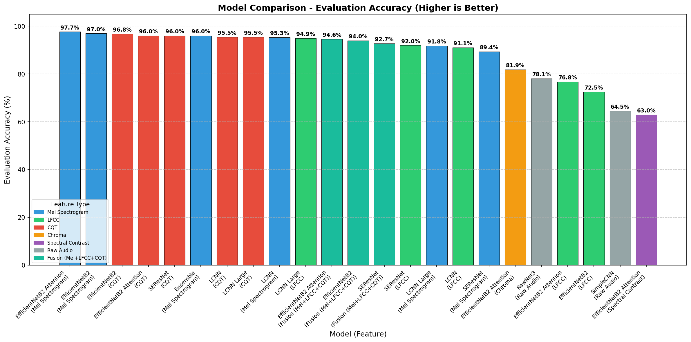
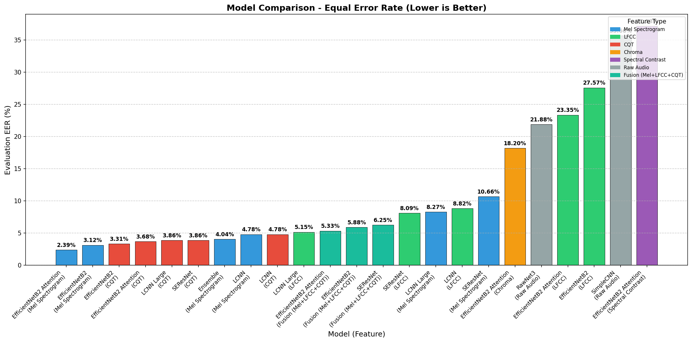

# Chapter: Results and Analysis

## 5.1 Overview

This chapter presents the experimental results of training and evaluating various deep learning models for AI-generated voice detection. The experiments systematically compare different model architectures across multiple audio feature representations to identify the optimal configurations for distinguishing between real (bonafide) and fake (spoofed) audio samples.

All models were trained for 20 epochs using the FakeOrReal V3 dataset with stochastic weight averaging (SWA) and random noise augmentation. Performance is evaluated using three primary metrics:

- **Equal Error Rate (EER)**: The point where false acceptance rate equals false rejection rate (lower is better)
- **ROC AUC**: Area under the Receiver Operating Characteristic curve (higher is better)
- **Accuracy**: Overall classification accuracy on the evaluation set

---

## 5.2 Experimental Configuration

| Parameter        | Value                             |
| ---------------- | --------------------------------- |
| Dataset          | FakeOrReal V3                     |
| Training Epochs  | 20                                |
| Weight Averaging | Stochastic Weight Averaging (SWA) |
| Augmentation     | Random Noise                      |
| Evaluation       | Best Development Model            |

### Feature Types Evaluated

| ID    | Feature Type        | Description                                    |
| ----- | ------------------- | ---------------------------------------------- |
| 0     | Raw Waveform        | Direct audio waveform (for RawNet3, SimpleCNN) |
| 1     | Log Mel-Spectrogram | Standard mel-frequency spectrogram             |
| 2     | LFCC                | Linear Frequency Cepstral Coefficients         |
| 4     | CQT                 | Constant-Q Transform spectrogram               |
| 5     | Chroma              | Chromagram features                            |
| 6     | Spectral Contrast   | Spectral contrast features                     |
| 1,2,4 | Feature Fusion      | Combined Mel-Spectrogram + LFCC + CQT features |

---

## 5.3 Summary of Results

The table below summarizes the performance of all model-feature combinations on the evaluation set:

### 5.3.1 Single-Feature Results

| Model                        | Feature      | Dev EER (%) | Dev Acc (%) | **Eval EER (%)** | **Eval AUC** | **Eval Acc (%)** |
| ---------------------------- | ------------ | ----------- | ----------- | ---------------- | ------------ | ---------------- |
| **EfficientNetB2 Attention** | Mel-Spec (1) | 0.00        | 99.96       | **2.39**         | **0.998**    | **97.70**        |
| EfficientNetB2               | Mel-Spec (1) | 0.00        | 99.96       | 3.13             | 0.994        | 96.97            |
| EfficientNetB2               | CQT (4)      | 0.21        | 99.82       | 3.31             | 0.993        | 96.78            |
| EfficientNetB2 Attention     | CQT (4)      | 0.21        | 99.82       | 3.68             | 0.991        | 96.05            |
| LCNN Large                   | CQT (4)      | 0.35        | 99.61       | 3.86             | 0.991        | 95.50            |
| SEResNet                     | CQT (4)      | 0.28        | 99.68       | 3.86             | 0.991        | 96.05            |
| LCNN                         | Mel-Spec (1) | 0.07        | 99.89       | 4.78             | 0.991        | 95.31            |
| LCNN                         | CQT (4)      | 0.28        | 99.75       | 4.78             | 0.990        | 95.50            |
| LCNN Large                   | LFCC (2)     | 0.28        | 99.75       | 5.15             | 0.989        | 94.94            |
| LCNN Large                   | Mel-Spec (1) | 0.07        | 99.89       | 8.27             | 0.977        | 91.82            |
| SEResNet                     | LFCC (2)     | 0.14        | 99.82       | 8.09             | 0.975        | 92.00            |
| LCNN                         | LFCC (2)     | 0.28        | 99.68       | 8.82             | 0.965        | 91.08            |
| SEResNet                     | Mel-Spec (1) | 0.07        | 99.89       | 10.66            | 0.967        | 89.43            |
| EfficientNetB2 Attention     | Chroma (5)   | 4.39        | 95.65       | 18.20            | 0.896        | 81.89            |
| RawNet3                      | Raw (0)      | 1.63        | 98.41       | 21.88            | 0.873        | 78.12            |
| EfficientNetB2 Attention     | LFCC (2)     | 0.14        | 99.82       | 23.35            | 0.836        | 76.75            |
| EfficientNetB2               | LFCC (2)     | 0.42        | 99.61       | 27.57            | 0.810        | 72.52            |
| SimpleCNN                    | Raw (0)      | 4.10        | 95.93       | 35.66            | 0.687        | 64.52            |
| EfficientNetB2 Attention     | Spectral (6) | 2.41        | 97.63       | 37.13            | 0.677        | 62.96            |

### 5.3.2 Feature Fusion Results

Feature fusion combines multiple feature types (Mel-Spectrogram + LFCC + CQT) as multi-channel input to the model, allowing the network to learn from complementary audio representations simultaneously.

| Model                    | Feature        | Dev EER (%) | Dev Acc (%) | **Eval EER (%)** | **Eval AUC** | **Eval Acc (%)** |
| ------------------------ | -------------- | ----------- | ----------- | ---------------- | ------------ | ---------------- |
| EfficientNetB2 Attention | Fusion (1,2,4) | 0.07        | 99.89       | 5.33             | 0.991        | 94.58            |
| EfficientNetB2           | Fusion (1,2,4) | 0.07        | 99.96       | 5.88             | 0.986        | 94.03            |
| SEResNet                 | Fusion (1,2,4) | 0.28        | 99.68       | 6.25             | 0.982        | 92.74            |

**Observation**: Feature fusion achieves competitive results (~94-95% accuracy) but does not outperform the best single-feature models. This suggests that Mel-Spectrogram alone captures sufficient discriminative information, and the additional LFCC features may introduce noise rather than complementary information.

### 5.3.3 Ensemble Results

The ensemble model combines predictions from multiple architectures (EfficientNetB2 Attention, LCNN, SEResNet) using Mel-Spectrogram features.

| Model    | Feature      | Dev EER (%) | Dev Acc (%) | **Eval EER (%)** | **Eval AUC** | **Eval Acc (%)** |
| -------- | ------------ | ----------- | ----------- | ---------------- | ------------ | ---------------- |
| Ensemble | Mel-Spec (1) | 0.07        | 99.89       | 4.04             | 0.994        | 96.05            |

---

## 5.4 Key Findings

### 5.4.1 Best Performing Model

**EfficientNetB2 with Attention using Log Mel-Spectrogram features achieved the best overall performance:**

- Evaluation EER: **2.39%**
- Evaluation ROC AUC: **0.998**
- Evaluation Accuracy: **97.70%**

This model correctly classified 1062 out of 1088 evaluation samples, with only 13 false positives and 12 false negatives.

### 5.4.2 Feature Type Analysis

| Feature Type              | Best Model               | Best Eval Acc | Observation                                     |
| ------------------------- | ------------------------ | ------------- | ----------------------------------------------- |
| **Mel-Spectrogram (1)**   | EfficientNetB2 Attention | 97.70%        | Consistently best across all architectures      |
| **CQT (4)**               | EfficientNetB2           | 96.78%        | Strong second choice, good generalization       |
| **LFCC (2)**              | LCNN Large               | 94.94%        | Moderate performance, some overfitting observed |
| **Fusion (1,2,4)**        | EfficientNetB2 Attention | 94.58%        | Competitive but not superior to single features |
| **Raw Waveform (0)**      | RawNet3                  | 78.12%        | Poor generalization to evaluation set           |
| **Chroma (5)**            | EfficientNetB2 Attention | 81.89%        | Limited discriminative power for this task      |
| **Spectral Contrast (6)** | EfficientNetB2 Attention | 62.96%        | Worst performance, not suitable                 |

**Key Insight**: Log Mel-Spectrogram and CQT features provide the best discriminative information for distinguishing real from fake audio. LFCC features, while useful for speech processing, show significant overfitting (high dev accuracy but lower eval accuracy). Feature fusion did not improve upon single-feature performance, suggesting that Mel-Spectrogram alone captures the essential artifacts from voice synthesis systems.

### 5.4.3 Model Architecture Comparison

| Architecture                 | Strengths                                               | Weaknesses                            |
| ---------------------------- | ------------------------------------------------------- | ------------------------------------- |
| **EfficientNetB2 Attention** | Best accuracy with Mel-Spec, strong attention mechanism | Larger parameter count                |
| **EfficientNetB2**           | Good balance of performance and efficiency              | Slightly lower than attention variant |
| **LCNN/LCNN Large**          | Lightweight, good with CQT features                     | Lower generalization with Mel-Spec    |
| **SEResNet**                 | Consistent across features                              | Moderate performance overall          |
| **RawNet3**                  | End-to-end on raw audio                                 | Poor generalization                   |
| **SimpleCNN**                | Fast training                                           | Insufficient capacity for this task   |

---

## 5.5 Visualizations

### 5.5.1 Model Accuracy Comparison

_Figure 5.1: Bar chart comparing evaluation accuracy across all model-feature combinations. EfficientNetB2 Attention with Mel-Spectrogram achieves the highest accuracy at 97.70%._

### 5.5.2 Model EER Comparison

_Figure 5.2: Bar chart comparing Equal Error Rate (EER) across all model-feature combinations. Lower EER indicates better performance. EfficientNetB2 Attention with Mel-Spectrogram achieves the lowest EER at 2.39%._

### 5.5.3 Best Model Performance (EfficientNetB2 Attention + Mel-Spec)

#### Confusion Matrix (Evaluation Set)

_Figure 5.3: Confusion matrix for the best performing model on the evaluation set, showing 531 true negatives (fake correctly classified), 532 true positives (real correctly classified), 13 false positives, and 12 false negatives._

#### ROC Curve (Evaluation Set)

_Figure 5.4: ROC curve for the best performing model, demonstrating an AUC of 0.998, indicating excellent discrimination capability._

### 5.5.4 Ensemble Model Performance

The ensemble model combines predictions from multiple architectures (EfficientNetB2 Attention, LCNN, SEResNet) to leverage their complementary strengths.

#### Confusion Matrix (Evaluation Set)

_Figure 5.5: Confusion matrix for the ensemble model on the evaluation set, showing 522 true negatives, 523 true positives, 22 false positives, and 21 false negatives._

#### ROC Curve (Evaluation Set)

_Figure 5.6: ROC curve for the ensemble model, demonstrating an AUC of 0.994._

#### Accuracy Comparison (Dev vs Eval)

_Figure 5.7: Comparison of development and evaluation accuracy for the ensemble model, showing the generalization gap between 99.89% dev accuracy and 96.05% eval accuracy._

| Metric              | Value  |
| ------------------- | ------ |
| Evaluation Accuracy | 96.05% |
| Evaluation EER      | 4.04%  |
| ROC AUC             | 0.994  |
| True Positives      | 523    |
| True Negatives      | 522    |
| False Positives     | 22     |
| False Negatives     | 21     |

---

## 5.6 Discussion

### Generalization Gap

A notable observation across all experiments is the generalization gap between development and evaluation sets. While most models achieve near-perfect accuracy (>99%) on the development set, evaluation accuracy varies significantly (62% - 98%). This suggests:

1. **Dataset Distribution Shift**: The evaluation set may contain audio samples from different sources or with different characteristics than the development set.
2. **Overfitting Risk**: High development accuracy does not guarantee good generalization. Feature selection and regularization are critical.

### Feature Importance

The strong performance of Mel-Spectrogram and CQT features compared to MFCC and raw waveforms indicates that:

- Time-frequency representations capture artifacts introduced by voice synthesis systems
- The attention mechanism in EfficientNetB2 effectively focuses on discriminative regions of the spectrogram
- Raw waveform approaches (RawNet3, SimpleCNN) may require more training data or architectural modifications to achieve competitive performance

### Ensemble Performance

The ensemble model combining multiple architectures achieved 96.05% accuracy, which is competitive but not superior to the best individual model (EfficientNetB2 Attention). This suggests that the individual models may share similar failure cases, limiting the benefit of ensembling.

### Feature Fusion Analysis

The feature fusion experiments (combining Mel-Spectrogram, LFCC, and CQT) achieved 94-95% accuracy, which is lower than the best single-feature models. This counterintuitive result can be explained by:

1. **Feature Redundancy**: Mel-Spectrogram already captures the most discriminative information; additional features add noise
2. **LFCC Limitations**: LFCC features showed poor generalization in single-feature experiments, and this weakness propagates to fusion
3. **Training Complexity**: Multi-channel input may require more training data or epochs to fully leverage complementary information

---

## 5.7 Conclusion

The experimental evaluation demonstrates that:

1. **EfficientNetB2 with Attention** combined with **Log Mel-Spectrogram features** is the optimal configuration for AI voice detection, achieving **97.70% accuracy** and **2.39% EER**.

2. **CQT features** provide a robust alternative to Mel-Spectrograms with slightly lower but consistent performance across architectures.

3. **LFCC features**, despite their use in speech processing, show significant overfitting and are not recommended for this task.

4. **Feature fusion** (Mel+LFCC+CQT) does not outperform single Mel-Spectrogram features, suggesting that simpler feature representations may be more effective.

5. **Raw waveform approaches** require further development to match spectrogram-based methods.

These findings provide a strong foundation for deploying AI voice detection systems and guide future research directions in improving model generalization and robustness.
