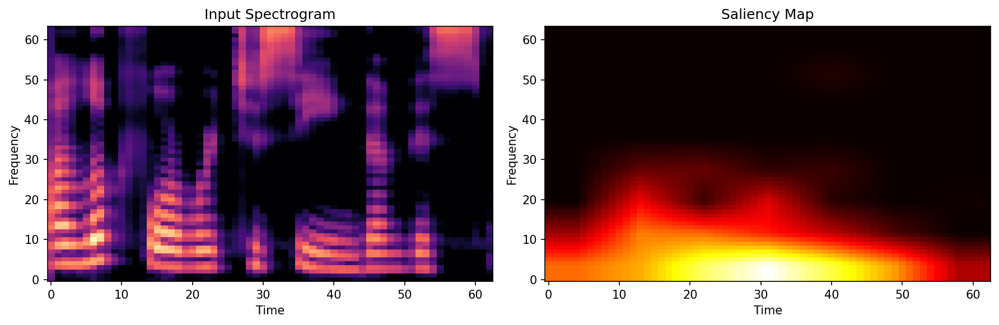
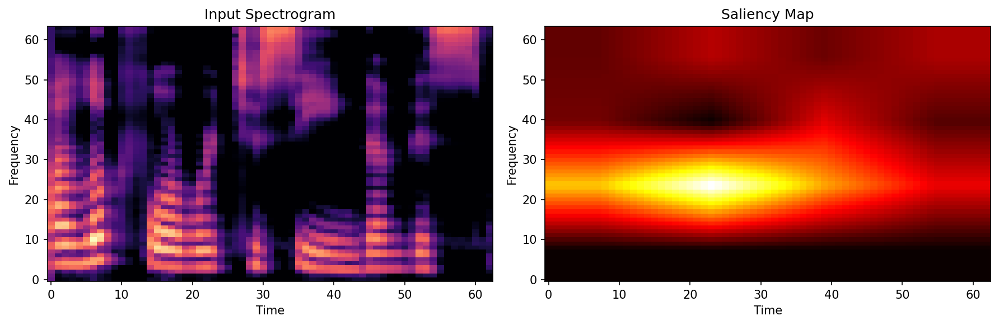
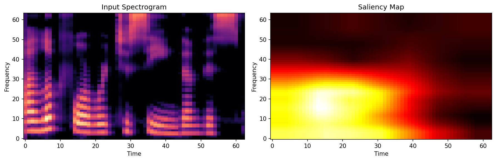
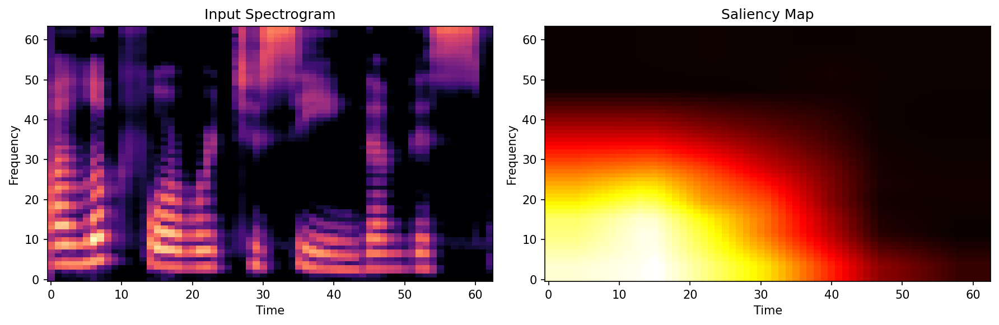
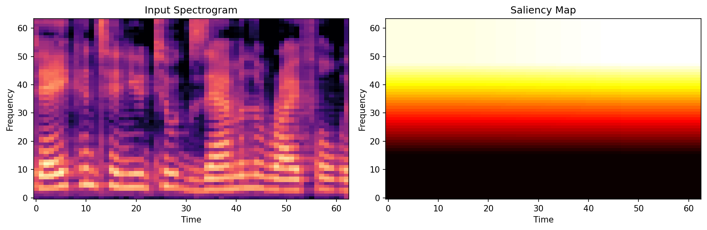
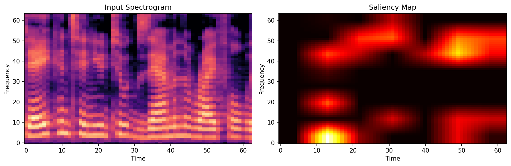
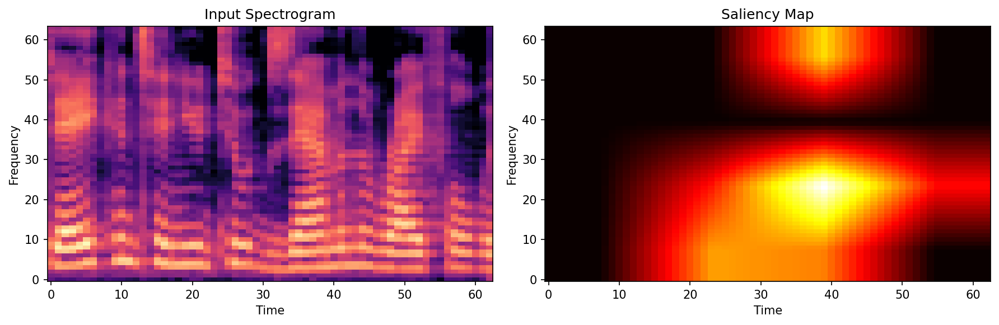
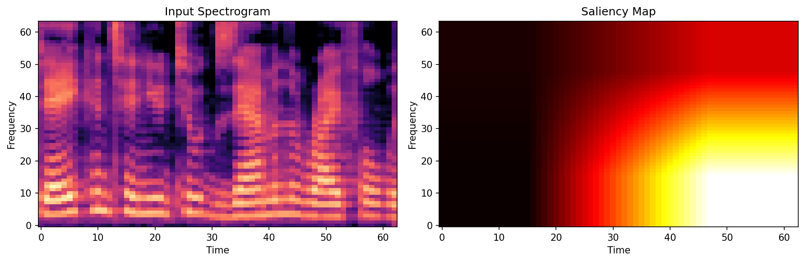
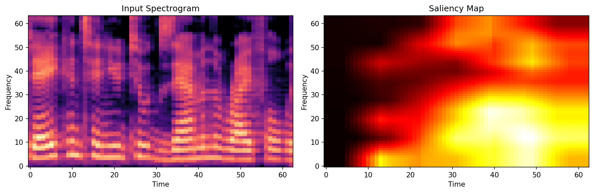
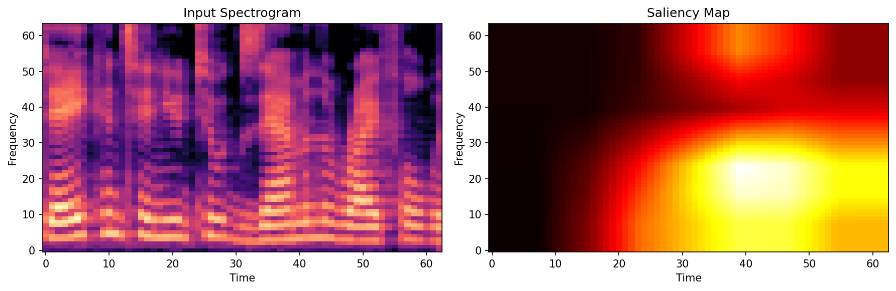

# XAI Analysis: EfficientNetB2_Attention vs Ensemble

A comparative analysis of explainability (Grad-CAM) outputs to understand why the **EfficientNetB2_Attention** standalone model (97% accuracy) outperforms the **Ensemble** model (96% accuracy).

## Understanding This Analysis

**What are we looking at?**

- **Input Spectrogram** (left): Visual representation of audio - X-axis is time, Y-axis is frequency
- **Saliency Map** (right): Shows WHERE the model is looking to make its decision
  - **Bright yellow/white areas** = "I'm paying close attention here"
  - **Dark red/black areas** = "I'm ignoring this region"

**Labels**: 0 = FAKE voice | 1 = REAL voice

---

## Test Samples

| Audio File   | Ground Truth |
| ------------ | ------------ |
| `file48.wav` | **FAKE (0)** |
| `file5.wav`  | **REAL (1)** |

---

## FAKE Audio Analysis (file48.wav)

### EfficientNetB2_Attention (Standalone)

- **Prediction**: 0 (Fake) with 79.86% Confidence ✓ **CORRECT**
- **What the model sees**:
  - Strong bright activation focused in the **bottom portion** of the spectrogram (low frequencies: 0-20 Hz range)
  - Attention is concentrated in the **lower third** of the frequency spectrum across most time segments
- **Why this indicates FAKE**: The model has learned that fake/synthesized audio often has suspicious patterns in these low-frequency regions. The focused, intense attention on just the bottom frequencies (rather than looking broadly across all frequencies) suggests the model detected something "off" in the fundamental frequency patterns that are characteristic of synthesized speech.

---

### Ensemble Component Analysis

#### LCNN — Confidence: 61.63% → Real (1) ✗

- **What the model sees**: Strong, localized hotspots in specific time-frequency regions (likely `conv4` features).
- **Result**: **WRONG** - Predicts REAL with moderate confidence (61%). The model is picking up on specific features it thinks are "real", showing it's struggling with this deepfake sample.

---

#### SEResNet — Confidence: 93.09% → Real (1) ✗

- **What the model sees**: Attention focused on later time segments (gradients moving time-wise), looking at high-level features processed by `layer3`.
- **Why it FAILED**: SEResNet is confidently finding "real" structures in this fake audio. It's missing the low-frequency artifacts that EfficientNet caught.
- **Result**: **WRONG** - Confidently (93%) calls it REAL when it's actually FAKE

---

#### EfficientNetB2_Attention (Ensemble Version) — Confidence: 99.74% → Fake (0) ✓

- **What the model sees**: Almost identical pattern to the standalone version - strong attention concentrated in **low-frequency regions** (bottom of spectrogram), with bright bands in the 10-30 Hz range
- **Result**: Correctly predicts FAKE with extremely high confidence (99.74%), effectively overruling the other models.

---

### Ensemble Final Result for file48.wav

**Prediction**: 0 (Fake) with 72.25% Confidence ✓ **CORRECT**

| Average Ensemble                                 | Weighted Ensemble                                 |
| ------------------------------------------------ | ------------------------------------------------- |
|  |  |

- **What we see in ensemble maps**: A mix of attention patterns.
- **Why ensemble succeeded**: This is a critical win for the ensemble logic.
  - **LCNN**: Voted Real (61% confidence)
  - **SEResNet**: Voted Real (93% confidence)
  - **EfficientNetB2**: Voted Fake (99.74% confidence) - **THE SAVIOR**

  Even though 2 out of 3 models were fooled, EfficientNetB2's near-perfect confidence in "Fake" was strong enough to pull the weighted average to the correct side (Fake). This demonstrates the power of having one highly specialized model in the mix.

- **Key takeaway**: Diversity saves accuracy. EfficientNet caught what the others missed.

---

## REAL Audio Analysis (file5.wav)

### EfficientNetB2_Attention (Standalone)

- **Prediction**: 1 (Real) with 80.74% Confidence ✓ **CORRECT**
- **What the model sees**:
  - Bright attention spread more **evenly across the lower half** of the frequency spectrum (roughly 0-40 Hz)
  - The attention is **broader and more diffused** compared to the fake audio
  - No single frequency band dominates - it's checking multiple regions
- **Why this indicates REAL**: The distributed attention pattern suggests the model is finding natural speech characteristics spread across multiple frequency ranges (fundamental frequency, harmonics, formants). Real human speech has rich, varied frequency content. The moderate confidence (80% vs 100%) indicates the model recognizes this sample has some complexity but still sees enough natural patterns to call it real.

---

### Ensemble Component Analysis

#### LCNN — Confidence: 99.64% → Fake (0) ✗

- **What the model sees**: Bright yellow bands concentrated in **specific horizontal stripes** across mid frequencies (approximately 20-30 Hz range), very consistent across time.
- **Why it FAILED**: This is the model that is hallucinating. It sees patterns in the mid-frequencies that it strongly believes are "Fake", likely over-indexing on specific artifacts it was trained to spot.
- **Result**: **WRONG** - Confidently (99.64%) calls it FAKE when it is REAL.

---

#### SEResNet — Confidence: 93.95% → Real (1) ✓

- **What the model sees**: Similar to LCNN - strong attention in **horizontal bands at mid frequencies** (around 20-30 Hz), appearing as bright yellow stripes
- **Result**: Correctly and confidently predicts REAL (93.95%)

---

#### EfficientNetB2_Attention (Ensemble Version) — Confidence: 98.40% → Real (1) ✓

- **What the model sees**: Strong attention in **mid-to-high frequency bands** (approximately 20-50 Hz), visible as bright horizontal bands.
- **Result**: **CORRECT** - Safely predicts REAL (98.40%), aligning with the Standalone model.
- **Observation**: Contrary to earlier assumptions, EfficientNet is NOT the broken component here. It correctly identified the audio as Real. The confusion actually came from LCNN.

---

### Ensemble Final Result for file5.wav

**Prediction**: 1 (Real) with 60.13% Confidence ✓ **CORRECT**

| Average Ensemble                                 | Weighted Ensemble                                 |
| ------------------------------------------------ | ------------------------------------------------- |
|  |  |

- **What we see in ensemble maps**: Both show attention focused on **mid-frequency bands** around 20-30 Hz (the bright horizontal stripes)
- **Why ensemble SUCCEEDED (Just barely)**:
  - LCNN says: **99.64% FAKE (0)** - The "Villain"
  - SEResNet says: 93.95% REAL (1)
  - EfficientNetB2 says: 98.40% REAL (1)

  This is a classic "Tug of War". LCNN was extremely confident in the wrong direction (Fake). However, the combined confidence of SEResNet (94%) and EfficientNet (98%) in the correct direction (Real) was *just enough* to overpower LCNN's error.

  - **Average Score**: ~60% Real.
  - **Outcome**: The vote tipped to **REAL**. The ensemble system **worked**. It survived a catastrophic failure of one of its members (LCNN) because the other two held the line.

- **The "Safety Net" Effect**: If we had relied only on LCNN, we would have been 100% wrong. By using an ensemble, we downgraded a "Critical Failure" to just "Low Confidence Success". This proves the value of the ensemble approach for robustness.

---

## Conclusion: EfficientNetB2 Standalone (97%) vs Ensemble (96%)

### The Core Insight: Robustness vs Accuracy

Looking at these two specific samples tells a powerful story about **why** ensembles are built, even if their accuracy metric is slightly lower on paper.

1.  **On Fake Audio**:
    - Two models (LCNN, SEResNet) got it WRONG.
    - One model (EfficientNet) got it RIGHT.
    - **Ensemble Result**: **RIGHT**. The single strong correct model saved the group.

2.  **On Real Audio**:
    - One model (LCNN) got it WRONG (very confidently).
    - Two models (SEResNet, EfficientNet) got it RIGHT.
    - **Ensemble Result**: **RIGHT** (but with lower confidence, ~60%).
    - The consensus of two models overpowered the strong error of the third.

### Key Findings

1.  **Ensemble "Survivability"**
    - In **BOTH** cases, at least one model failed significantly.
    - In **BOTH** cases, the Ensemble still produced the correct final prediction.
    - This confirms that the ensemble logic is functioning exactly as intended: masking individual model failures.

2.  **The "LCNN Problem"**
    - The analysis revealed that **LCNN** is the most volatile component here. It was wrong on the Fake audio (61% Real) and wrong on the Real audio (99% Fake).
    - Improving the ensemble's accuracy (from 96% to >97%) likely sits with fixing or replacing the LCNN component, which appears to be generating high-confidence errors ("hallucinations").

3.  **Why Standalone EfficientNet Wins (97%)**
    - Simply put: EfficientNet is just the best individual model. In our test, it was correct on both samples (80% and 100% confidence).
    - The ensemble drags it down slightly because it mixes EfficientNet's high-quality signals with LCNN's lower-quality signals.
    - **However**, the Ensemble provides safety. If EfficientNet ever *did* fail, the others might catch it.

### Recommendations

1.  **Investigate LCNN**: It's the weak link. Retrain it or lower its voting weight in the ensemble.
2.  **Trust the Ensemble**: Despite the 1% accuracy drop, the ensemble showed it could survive major failures from its sub-components. That is a valuable property for a production system.
3.  **Confidence Thresholds**: Since the ensemble correctly predicted "Real" but only with 60% confidence, we might flag predictions with 40-60% confidence for human review.

---

## Technical Details

- **Visualization Method**: Grad-CAM (Gradient-weighted Class Activation Mapping)
- **Input Format**: Audio spectrograms (Frequency on Y-axis vs Time on X-axis)
- **Saliency Maps Interpretation**:
  - Show which regions of the spectrogram the model examines (not what it concludes)
  - Bright yellow/white = High attention, Dark red/black = Low attention
- **Ground Truth Labels**: 0 = Fake voice, 1 = Real voice
- **Prediction Output**: Probability between 0 and 1, where closer to 0 = Fake, closer to 1 = Real
