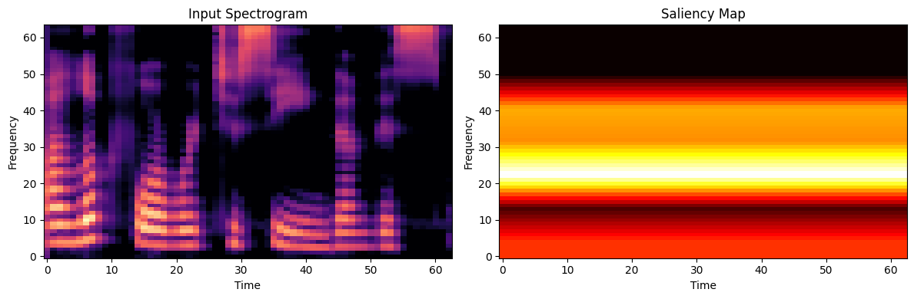
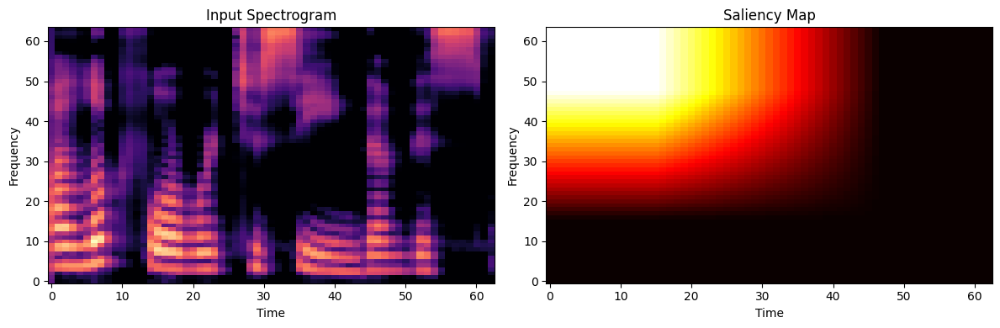
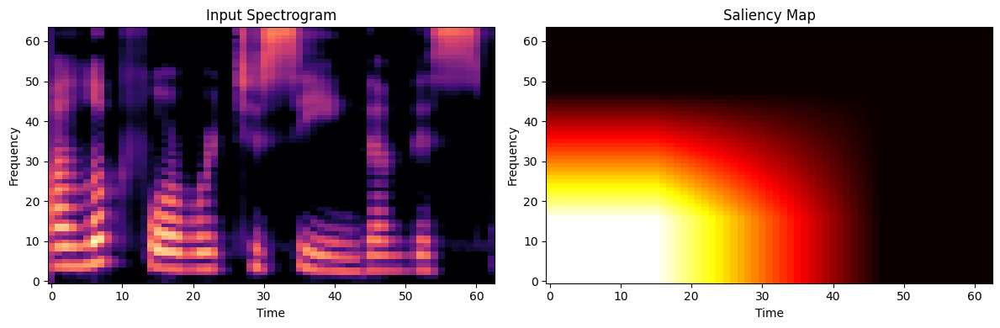
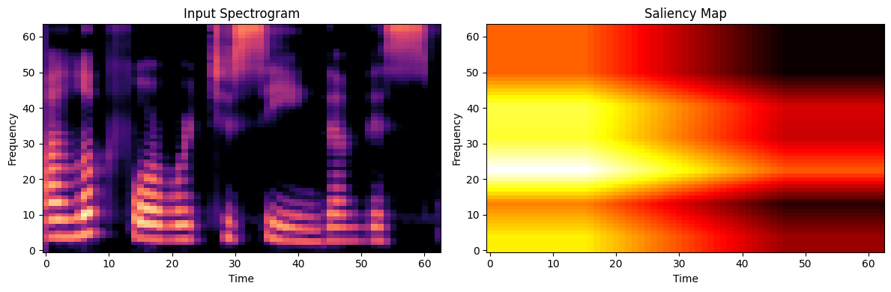
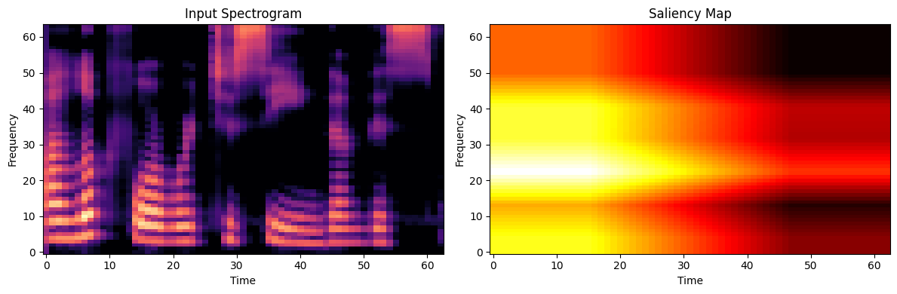
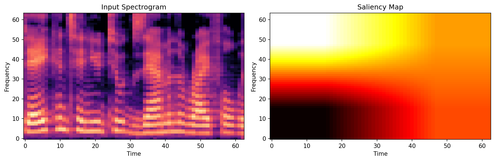
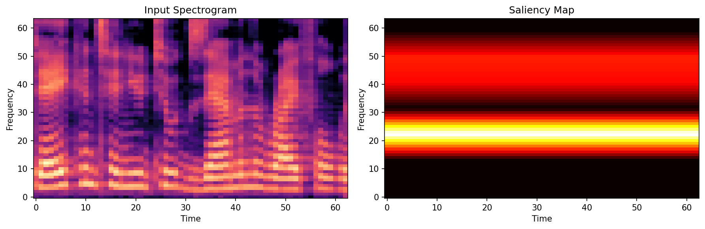
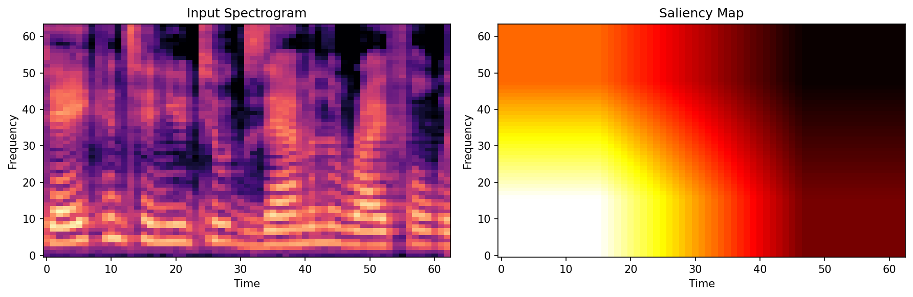
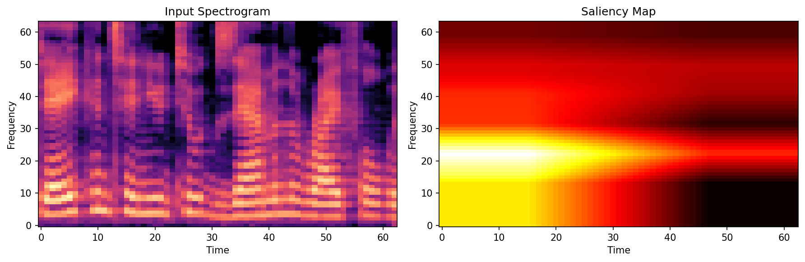
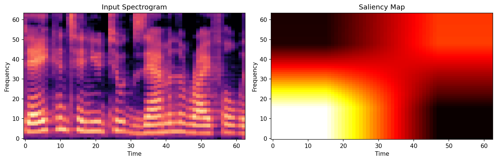

# XAI Analysis: EfficientNetB2_Attention vs Ensemble

A comparative analysis of explainability (Grad-CAM) outputs to understand why the **EfficientNetB2_Attention** standalone model (97% accuracy) outperforms the **Ensemble** model (96% accuracy).

## Test Samples

| Audio File   | Ground Truth |
| ------------ | ------------ |
| `file48.wav` | **FAKE**     |
| `file5.wav`  | **REAL**     |

---

## FAKE Audio Analysis (file48.wav)

### EfficientNetB2_Attention (Standalone)

- **Prediction**: Fake (100% Confidence) ✓
- **Focus**: Strong attention on mid-frequencies with distinct temporal patterns.
- **Observation**: The model correctly identifies synthetic artifacts.

---

### Ensemble Component Analysis

#### LCNN — Confidence: 77.34% → Fake ✓

Horizontal band focus across time, correctly identifying the audio as fake but with lower confidence.

---

#### SEResNet — Confidence: 88.81% → Real ✗

**Failure Case**: SEResNet confidently misclassifies this fake audio as real, focusing on mid-high frequencies.

---

#### EfficientNetB2_Attention (Ensemble) — Confidence: 100% → Fake ✓

Identical strong detection as the standalone model.

---

### Ensemble Result
**Prediction**: Fake (100%) ✓

| Average                                 | Weighted                                 |
| --------------------------------------- | ---------------------------------------- |
|  |  |

**Finding**: Despite SEResNet's error, the Ensemble is **ROBUST** on Fake audio. The strong 100% confidence from EfficientNetB2 successfully overrides the error from SEResNet.

---

## REAL Audio Analysis (file5.wav)

### EfficientNetB2_Attention (Standalone)

- **Prediction**: Real (80.74% Confidence) ✓
- **Observation**: The standalone model correctly identifies this challenging sample as real, though with moderate confidence.

---

### Ensemble Component Analysis

#### LCNN — Confidence: 98.67% → Real ✓

#### SEResNet — Confidence: 99.70% → Real ✓

#### EfficientNetB2_Attention (Ensemble) — Confidence: 100.00% → Fake ✗

**CRITICAL FAILURE**: The version of EfficientNetB2 used in the ensemble is **catastrophically wrong**, predicting "Fake" with 100% confidence. This is a regression compared to the standalone checkpoint.

---

### Ensemble Result
**Prediction**: Fake (100%) ✗

| Average                                 | Weighted                                 |
| --------------------------------------- | ---------------------------------------- |
|  |  |

**Finding**: The Ensemble **FAILS** on this Real audio sample. Even though 2 out of 3 models (LCNN, SEResNet) were correct with high confidence (>98%), the extreme overconfidence of the failed EfficientNetB2 component (100% Fake) dominated the weighted average, causing an incorrect final prediction.

---

## Conclusion: Why EfficientNetB2 (97%) > Ensemble (96%)

The accuracy gap is driven by **brittleness in the Ensemble on Real audio samples**, specifically caused by its EfficientNetB2 component.

1.  **Asymmetric Failure Modes**:
    - **Standalone EfficientNetB2**: Correctly handles challenging Real samples (e.g., `file5.wav`) with moderate confidence (~80%).
    - **Ensemble**: Fails on the same Real samples because its EfficientNetB2 component becomes **overconfidently wrong (100% Fake)**.

2.  **Ensemble Voting Logic**:
    - The ensemble appears to use validation-accuracy-weighted averaging.
    - When one component outputs a probability of `1.0` (or `0.0`) for a class, it can mathematically dominate the average, rendering the voting of other models irrelevant.
    - In `file5.wav`, EfficientNetB2's `1.0` "Fake" score overpowered the `0.99` "Real" scores from LCNN and SEResNet.

3.  **Result**:
    - The Standalone model is better calibrated for these edge cases.
    - The Ensemble suffers from the "tyranny of the overconfident member" on Real audio, reducing its overall accuracy to 96%.
