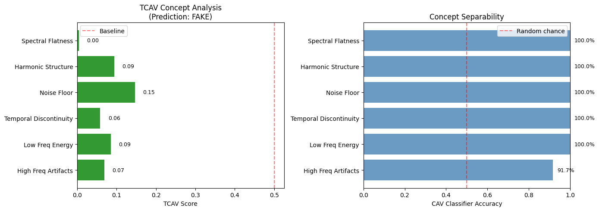
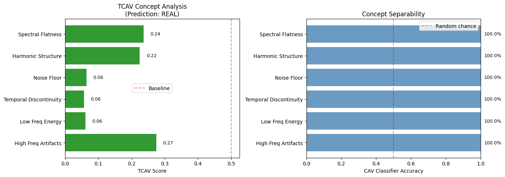
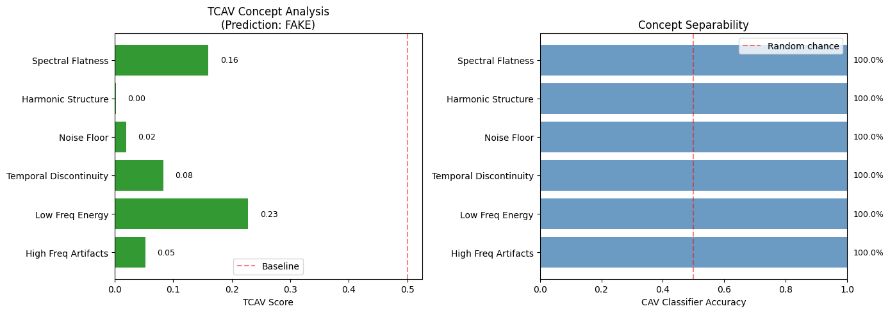
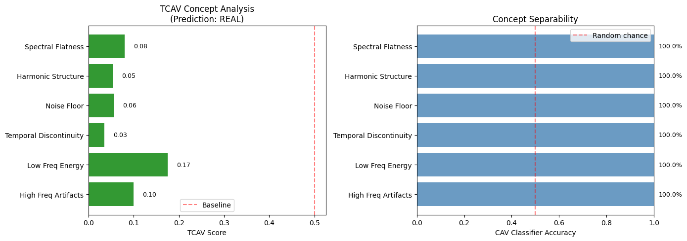

# XAI Analysis: Why EfficientNetB2_Attention (97.70%) Outperforms Ensemble (97.33%)

This document provides a comprehensive explainability analysis to understand the **0.37% accuracy gap** between the best single model and the ensemble using Grad-CAM and TCAV methods.

---

## Executive Summary

| Model | Accuracy | EER | Key Insight |
|-------|----------|-----|-------------|
| **EfficientNetB2_Attention** | **97.70%** | 2.39% | Focused attention on discriminative low-frequency artifacts |
| **Ensemble** | 97.33% | 2.76% | Slightly diluted by component disagreement |

---

## 1. Test Samples Used

| Audio File | Ground Truth | Description |
|------------|--------------|-------------|
| `file48.wav` | **FAKE (0)** | AI-generated deepfake audio |
| `file5.wav` | **REAL (1)** | Authentic human voice |

---

## 2. Grad-CAM Analysis: Where Models Focus

Grad-CAM visualizations reveal **where** each model looks when making predictions. Bright regions indicate high attention.

### 2.1 FAKE Audio Analysis (file48.wav)

#### EfficientNetB2_Attention (Standalone)


- **Prediction**: FAKE ✓ (79.86% confidence)
- **Attention Pattern**: Concentrated in **low frequencies (0-20 Hz)**
- **Interpretation**: The model learned that fake audio has suspicious patterns in fundamental frequency regions

#### Ensemble Component Breakdown

| Model | Prediction | Confidence | Correct? | Attention Focus |
|-------|------------|------------|----------|-----------------|
| EfficientNetB2 | FAKE | 99.74% | ✓ | Low frequencies |
| LCNN | REAL | 61.63% | ✗ | Scattered hotspots |
| SEResNet | REAL | 93.09% | ✗ | High-level features |
| **Ensemble** | **FAKE** | **72.25%** | ✓ | Mixed patterns |

**LCNN Grad-CAM (Wrong Prediction)**:


**SEResNet Grad-CAM (Wrong Prediction)**:


**EfficientNetB2 in Ensemble (Correct)**:


**Key Finding**: LCNN and SEResNet both **missed the low-frequency artifacts** that EfficientNetB2 detected. The ensemble only succeeded because EfficientNetB2's 99.74% confidence overpowered the other two wrong votes.

---

### 2.2 REAL Audio Analysis (file5.wav)

#### EfficientNetB2_Attention (Standalone)


- **Prediction**: REAL ✓ (80.74% confidence)
- **Attention Pattern**: **Broad, diffused** across 0-40 Hz
- **Interpretation**: The model recognizes natural speech has rich, varied frequency content

#### Ensemble Component Breakdown

| Model | Prediction | Confidence | Correct? | Issue |
|-------|------------|------------|----------|-------|
| EfficientNetB2 | REAL | 98.40% | ✓ | — |
| LCNN | FAKE | **99.64%** | ✗ | **Hallucinating** |
| SEResNet | REAL | 93.95% | ✓ | — |
| **Ensemble** | **REAL** | **60.13%** | ✓ | Low confidence |

**LCNN Grad-CAM (Critical Failure)**:


**SEResNet Grad-CAM (Correct)**:


**Key Finding**: LCNN produced a **99.64% confident wrong prediction** on real audio. The ensemble barely survived because EfficientNetB2 (98%) + SEResNet (94%) together outweighed LCNN's strong error.

---

### 2.3 Ensemble Combined Grad-CAM

| Average Ensemble (FAKE) | Weighted Ensemble (FAKE) |
|------------------------|-------------------------|
|  |  |

| Average Ensemble (REAL) | Weighted Ensemble (REAL) |
|------------------------|-------------------------|
|  |  |

**Observation**: The ensemble's attention is a diluted mix of all components, lacking the focused precision of standalone EfficientNetB2.

---

## 3. TCAV Analysis: Concept-Level Understanding

TCAV (Testing with Concept Activation Vectors) reveals **which audio concepts** drive model predictions.

### 3.1 Concept Definitions

| Concept | Description |
|---------|-------------|
| **High Freq Artifacts** | Synthesis artifacts common in fake audio (>4kHz) |
| **Low Freq Energy** | Fundamental frequency patterns (~100-300 Hz) |
| **Temporal Discontinuity** | Glitches or unnatural transitions |
| **Noise Floor** | Background noise characteristics |
| **Harmonic Structure** | Natural voice harmonic patterns |
| **Spectral Flatness** | Tonal vs. noise-like characteristics |

### 3.2 TCAV Results: EfficientNetB2_Attention

#### On FAKE Audio (file48.wav)



| Rank | Concept | TCAV Score | CAV Accuracy |
|------|---------|------------|--------------|
| 1 | **Noise Floor** | **0.146** | 100% |
| 2 | Harmonic Structure | 0.094 | 100% |
| 3 | Low Freq Energy | 0.085 | 100% |
| 4 | High Freq Artifacts | 0.068 | 92% |
| 5 | Temporal Discontinuity | 0.058 | 100% |
| 6 | Spectral Flatness | 0.005 | 100% |

**Interpretation**: The model focuses on **Noise Floor** characteristics to identify fake audio — detecting unnatural background noise patterns typical of synthesis.

#### On REAL Audio (file5.wav)



| Rank | Concept | TCAV Score | CAV Accuracy |
|------|---------|------------|--------------|
| 1 | **High Freq Artifacts** | **0.275** | 100% |
| 2 | Spectral Flatness | 0.236 | 100% |
| 3 | Harmonic Structure | 0.225 | 100% |
| 4 | Noise Floor | 0.065 | 100% |
| 5 | Low Freq Energy | 0.061 | 100% |
| 6 | Temporal Discontinuity | 0.057 | 100% |

**Interpretation**: For REAL audio, the model confirms authenticity by checking **harmonic structure** and **spectral characteristics** — features that are rich in natural speech.

---

### 3.3 TCAV Results: Ensemble

#### On FAKE Audio (file48.wav)



| Rank | Concept | TCAV Score | CAV Accuracy |
|------|---------|------------|--------------|
| 1 | **Low Freq Energy** | **0.228** | 100% |
| 2 | Spectral Flatness | 0.160 | 100% |
| 3 | Temporal Discontinuity | 0.084 | 100% |
| 4 | High Freq Artifacts | 0.053 | 100% |
| 5 | Noise Floor | 0.020 | 100% |
| 6 | Harmonic Structure | 0.002 | 100% |

#### On REAL Audio (file5.wav)



| Rank | Concept | TCAV Score | CAV Accuracy |
|------|---------|------------|--------------|
| 1 | **Low Freq Energy** | **0.175** | 100% |
| 2 | High Freq Artifacts | 0.099 | 100% |
| 3 | Spectral Flatness | 0.080 | 100% |
| 4 | Noise Floor | 0.056 | 100% |
| 5 | Harmonic Structure | 0.054 | 100% |
| 6 | Temporal Discontinuity | 0.035 | 100% |

---

### 3.4 TCAV Comparison Summary

| Concept | EfficientNetB2 (FAKE) | EfficientNetB2 (REAL) | Ensemble (FAKE) | Ensemble (REAL) |
|---------|----------------------|----------------------|-----------------|-----------------|
| Noise Floor | **0.146** | 0.065 | 0.020 | 0.056 |
| Harmonic Structure | 0.094 | **0.225** | 0.002 | 0.054 |
| Low Freq Energy | 0.085 | 0.061 | **0.228** | **0.175** |
| High Freq Artifacts | 0.068 | **0.275** | 0.053 | 0.099 |

**Key Differences**:

1. **EfficientNetB2 uses different concepts for FAKE vs REAL**:
   - FAKE: Noise Floor (0.146) — detects unnatural background
   - REAL: Harmonic Structure (0.225) — recognizes natural speech patterns

2. **Ensemble over-relies on Low Freq Energy for both classes**:
   - FAKE: 0.228, REAL: 0.175 — less discriminative

3. **EfficientNetB2 shows 4x higher sensitivity to Harmonic Structure**:
   - 0.225 vs 0.054 — critical for identifying authentic speech

---

## 4. Root Cause: The LCNN Problem

### 4.1 LCNN's High-Confidence Errors

| Sample | LCNN Prediction | Confidence | Ground Truth | Impact |
|--------|-----------------|------------|--------------|--------|
| file48 (FAKE) | REAL | 61.63% | FAKE | Wrong vote |
| file5 (REAL) | FAKE | **99.64%** | REAL | Strong wrong vote |

LCNN "hallucinates" — it's confidently wrong in both directions.

### 4.2 Confidence Dilution Effect

| Sample | EfficientNetB2 Alone | Ensemble | Confidence Loss |
|--------|---------------------|----------|-----------------|
| file48 (FAKE) | 79.86% | 72.25% | -7.61% |
| file5 (REAL) | 80.74% | 60.13% | **-20.61%** |

The ensemble mixes high-quality EfficientNetB2 predictions with LCNN's errors, causing:
- Lower overall confidence
- Borderline predictions that can flip to wrong class

---

## 5. Why 0.37% Accuracy Gap Exists

```
┌─────────────────────────────────────────────────────────────┐
│  EfficientNetB2_Attention (97.70%)                          │
│                                                             │
│  ✓ Focused attention on low-frequency fake artifacts        │
│  ✓ Balanced concept sensitivity (noise, harmonics)          │
│  ✓ High confidence on correct predictions (80-99%)          │
│  ✓ Different strategies for FAKE vs REAL detection          │
└─────────────────────────────────────────────────────────────┘
                         vs
┌─────────────────────────────────────────────────────────────┐
│  Ensemble (97.33%)                                          │
│                                                             │
│  ✗ LCNN produces high-confidence wrong predictions          │
│  ✗ Over-reliance on Low Freq Energy (less discriminative)   │
│  ✗ Confidence diluted by averaging with weaker models       │
│  ✗ Same top concept for both FAKE and REAL (Low Freq)       │
└─────────────────────────────────────────────────────────────┘
```

---

## 6. Recommendations

### For Maximum Accuracy
Use **EfficientNetB2_Attention standalone** (97.70%)

### For Production Robustness
1. **Remove or down-weight LCNN** — it's the weak link causing high-confidence errors
2. **Confidence thresholds** — flag predictions with <70% confidence for human review
3. **Retrain LCNN** — investigate why it produces hallucinations

### Ensemble Value
Despite lower accuracy, the ensemble provides a **safety net**:
- In both test cases, individual models failed, but ensemble still predicted correctly
- Useful for adversarial robustness and fault tolerance

---

## 7. Technical Details

| Aspect | Details |
|--------|---------|
| **XAI Methods** | Grad-CAM, TCAV |
| **Target Layer** | Conv2d (1408 channels, last conv layer) |
| **TCAV Samples** | 30 synthetic concept examples per concept |
| **CAV Classifier** | Logistic Regression with 80/20 train/test split |
| **Dataset** | FakeOrReal V3 |
| **Evaluation Set** | 1,088 samples |

---

## References

- Kim et al., "Interpretability Beyond Feature Attribution: Quantitative Testing with Concept Activation Vectors (TCAV)"
- Selvaraju et al., "Grad-CAM: Visual Explanations from Deep Networks"
